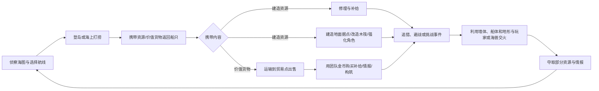
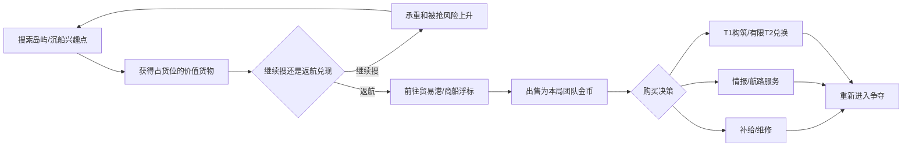
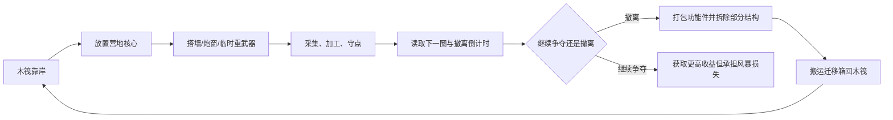

# 海战大逃杀玩法设计总纲

> 项目：OceanAdventure  
> 文档定位：玩法立项、原型制作、数值讨论与内容排期的上层设计依据  
> 版本：0.1（概念验证建议稿）  
> 核心类型：休闲 TopDown / 角色直控 / 海战 / 建造 / PvPvE / 单局成长 / 大逃杀

## 0. 执行摘要

本项目最有辨识度的体验，不应只是“把陆地大逃杀搬到海上”，也不应走高操作压力的拟真航海路线，而应是：

> 玩家以 TopDown 方式直接操控角色，在岛上采集、战斗和搭建无屋顶据点，再回到可扩建的木筏上安装船体与功能件；整个移动基地在不断恶化的海况中进入约 20 分钟的轻量 PvPvE 生存决战。

核心循环可以成立，但必须补齐三个关键张力：

1. **采集时暴露，运输时担险，升级时下注**：资源不是捡到即变强；资源装在船舱里，可被击沉后夺取，玩家需要在修理、弹药和永久升级之间取舍。
2. **角色、建筑与木筏是一套连续空间**：玩家始终直接操控角色；登岛采集、地面建造、甲板战斗和船体改造使用统一交互与资源，不切成彼此割裂的小游戏。
3. **风暴把经营局收束成决战局**：安全海域持续缩小，后期资源点减少、领航目标集中，领先者被“通缉”，落后者仍有伏击和夺船翻盘的空间。

休闲化不等于没有决策，而是减少机械负担：自动拾取同类材料、宽容交互距离、清楚的弹道预览、少量资源类型、短建造时间、低惩罚的早期失败，以及不会被屋顶遮挡的稳定 TopDown 视野。

建议的首个产品目标：

| 项目 | 建议 |
| --- | --- |
| 主模式 | 建议先做 8 支双人船队，共 16 人；验证后再扩容 |
| 原型模式 | 8–12 人单排，每人一艘简化船 |
| 单局时长 | 18–22 分钟，目标约 20 分钟，硬上限约 21 分钟 |
| 战场结构 | 有边界、可读、由 Seed 组装的群岛战场，而非真正无限地图 |
| 胜利条件 | 最后一支仍有存活船员的队伍；超时进入风眼据点决胜 |
| 局内成长 | 地面建筑、木筏结构、船体模块、武器、航行能力、角色装备全部单局重置 |
| 局外成长 | 外观、图鉴、任务、熟练度与玩法教学，不出售数值优势 |
| 核心差异点 | “可扩建木筏是移动基地，岛上无屋顶墙阵是临时据点”，击沉不一定等于立刻淘汰 |
| 木筏承载 | 离散吨位 + 浮力容量 + 推力效率；超载先降机动，不因一次建造突然沉没 |
| 失船处理 | 船先失能再沉没；存活队伍有一次团队救生筏和基础船重建机会，不会被锁死在岛上 |
| 多船与装配 | 每队可保存多个船芯/装配蓝图，但同时只激活 1 艘完整主船；船的功能由配件自然形成，可额外拥有 1 艘受限辅助艇 |
| 战局收束 | 优先验证“灯塔迁徙制”：逐阶段减少可用群岛，建筑转为可受损、可搬迁的结构套件；传统圆形毒圈保留为 A/B 对照或硬核限时玩法 |
| 建筑核心 | 系统内部为建筑锚核、玩家看到的是据点战旗；每面战旗对应一座连续连接的岛屿建筑，队伍开局保底 1 面，P1 最多再获得 1 面扩展战旗 |
| 船体核心 | 玩家侧表现为主舵台，系统侧是不可随意拆卸的舵芯总成；统一承担操船入口、船体网格根节点、归属与夺船交互，推进与实际舵叶仍是独立可损部件 |
| 核心属性 | 木筏核心和建筑核心均有固定基础属性、公开等级与 1 个横向特性槽；核心数量决定载体/据点数量，核心等级决定容量，特性决定用途，不使用随机词条或直接武器增伤 |
| 局内搜打撤经济 | 搜刮兴趣点获得价值货物，实体运输到贸易点出售为本局团队金币，再购买补给、情报、T1构筑和服务；金币与战斗物品在对局结束时清空 |

### 0.1 已确认的硬约束

以下内容视为当前设计前提，不再作为开放问题：

- 游戏定位为休闲 PvPvE 大逃杀，降低瞄准、拾取、建造和精确操船的操作压力。
- 玩家始终以 TopDown 方式直接操控角色，角色可以在地面、木筏和浅水区域行动。
- 每支队伍开局拥有一艘初始小船，每队同时只能登记一艘主船；失去主船不等于队伍立即淘汰。
- 玩家能在地面建造建筑，也能在木筏网格上扩展甲板并安装结构/功能件。
- 所有建筑都没有房顶，不支持二层或多层玩法，保证人物和战场始终可见。
- 普通墙体对敌我双方都阻挡弹道；唯一例外是有明确朝向和归属的单向射击窗，它会为友方由内向外的炮弹/弹道自动开启，但继续阻挡并承受敌方来弹。
- 武器明确分为轻型与重型：轻型武器由角色随身装备；重型武器可以用自带支架直接部署在合法地面，也可以安装在建筑火力位或木筏上，不要求先有建筑核心或地基，且拥有明显更高的输出、破坏和区域压制能力。
- 玩家战斗装备固定为 2 个轻型武器槽、1 个投掷物槽、1 个补给品槽和 1 个护甲槽；采集、建造、修理、弹药、材料与重型武器部署套件不占用这五个槽位。
- 一局目标时长约 20 分钟，所有节奏、地图、成长和资源量以此为硬预算。

## 1. 设计支柱

所有系统和内容都应服务以下四个支柱。如果一个功能不强化其中任何一项，应延后或删除。

### 1.1 每一次靠岸都是风险决策

- 岛上物资密度高，但离船后会失去机动性和部分火力。
- 船停泊后在远处可见，其他玩家可以封锁港口、偷袭或登船。
- 高价值岛应有多个登陆点和至少一条撤退路线，避免单点堵门。
- 玩家进入岛内前应能根据地标判断“这里可能产什么”，而不是完全盲搜。

### 1.2 船既是武器，也是生命线

- 船承担移动、储物、升级、修理、复活/救援和远程火力功能。
- 船被打残后仍应存在“弃船、抢船、救援、反登船”的故事空间。
- 船的操控、射界和损伤状态必须容易读取，不能只是一条大血条。

### 1.3 强者更显眼，弱者仍能翻盘

- 击杀和高阶升级会提高“恶名/热度”，在地图上暴露大致位置。
- 高阶资源主要来自公开事件、精英海兽和玩家战利品，领先者必须继续冒险。
- 淘汰敌人只回收其部分库存，避免赢家滚雪球过快。
- 落后者通过伏击、环境、登船夺取和猎杀通缉目标翻盘，而不是获得无条件伤害加成。

### 1.4 20 分钟内不断升级冲突密度

- 前期给路线选择，中期制造相遇，后期强制正面决战。
- 不允许长时间无目标航行、无限绕圈或躲在风暴边缘苟活。
- 每 2–4 分钟应出现一次明确的局势变化：风暴预报、公开事件、升级节点或区域关闭。

## 2. 玩家体验目标

### 2.1 核心体验承诺

玩家扮演的不是守在一栋永久房屋里的生存者，而是一支驾驶自制木筏、不断登陆群岛并插旗建立前进据点的海上冒险队。每局约 20 分钟内，玩家应反复经历“侦察航线—夺取资源—插旗建造—守住收益—打包迁徙—改造木筏—争夺下一座灯塔”，并感到自己的船、建筑套件、角色装备和战术选择一直在共同成长。

核心体验必须同时满足以下承诺：

1. **插旗即建立归属**：玩家部署锚旗箱后，据点战旗作为第一块核心地基升起，建造边界、队伍归属和扩建方向立即清晰可见。
2. **建筑有阶段价值**：一座小型据点应足以帮助队伍完成一次采集、加工、岸防或事件争夺，而不是刚建成就因系统规则失去作用。
3. **迁徙保留投入**：灯塔阶段淘汰地点优势，但不直接删除完好的核心与建筑套件；玩家付出打包时间、货位、航行风险和受损维修成本，将成长带到下一座群岛。
4. **攻击建筑确实有收益**：墙体、旗座和重型设施都能被敌人破坏；核心失稳提供抢修窗口，但失败后会留下受损套件、破损扩展核心和可争夺战利品。
5. **木筏是整局主基地**：岛上战旗据点服务一个阶段，木筏保存长期火力、运输、储物和构筑方向；玩家始终需要考虑据点离船多远、能否撤回以及如何把收益装船。
6. **失败不等于停止游戏**：失旗、失去扩展核心或主船失能都会造成明显损失，但玩家仍有抢修、打包残件、使用救生筏、夺船和重建基础船的翻盘路线。

### 2.2 建造与战斗感受

- **建造是布局决策，不是拼手速**：玩家从核心地基四边向外搭建单层结构，用有限墙体、门、单向窗、功能件和一门重型武器解决当前地形问题。
- **一核一建筑容易理解**：所有结构都能追溯到一面据点战旗；捡到第二个锚旗箱意味着多一个小型据点位置，而不是获得无限墙体和材料。
- **两个据点产生分工**：玩家可以建立岛内资源据点和岸边防御据点，但两者共享队伍总结构预算，并增加打包与运输负担。
- **遮挡规则始终可信**：普通墙体对敌我双方都阻挡弹道；只有朝向正确的友方单向射击窗会自动放行由内向外的炮弹。视觉、准星和伤害结果必须一致。
- **轻重武器职责明确**：轻型武器让角色保持移动、登船和近距离反制能力；可直接架设在地面或安装在船上的重型武器负责破墙、压制和对舰输出，但受架设、射界、慢弹道、装填、承重和操作者约束。
- **核心是战术目标而非删除按钮**：进攻者需要先破坏外围墙体、接近锚旗座并维持压制；核心被打空后先进入失稳，不能远程命中旗帜就让整栋建筑瞬间消失。
- **TopDown 战场始终可读**：没有屋顶、天花板和二层；战旗、队伍纹样、墙体方向、炮窗内外、重型武器射界和核心状态都能在当前镜头中快速识别。

### 2.3 20 分钟情绪曲线

| 阶段 | 玩家主要感受 | 代表性行为 |
| --- | --- | --- |
| `0–4 分钟` 建立立足点 | 好奇、快速拥有、低压成长 | 驾驶初始木筏靠岸，拾取首批资源，插下基础战旗并完成第一座小型建筑 |
| `4–9 分钟` 第一次迁徙 | 路线选择、风险预判 | 根据下一组灯塔打包据点，拖钓或打捞补给，决定安全航线还是争夺扩展锚旗箱 |
| `9–14 分钟` 构筑成形 | 专精、对抗、战利品诱惑 | 将木筏发展为重炮、高速、补给或均衡构筑，建立第二功能据点并与玩家/PvE交火 |
| `14–18 分钟` 群岛汇聚 | 压迫、守成与舍弃 | 多队争夺最后活跃群岛，破墙、抢修旗座、夺取扩展核心，并判断带走什么、放弃什么 |
| `18–20 分钟` 海冠决战 | 清晰、高强度、必须行动 | 用此前保存的套件构筑最后阵地，通过舰炮、登岛和轻武器争夺王冠灯塔或淘汰敌队 |

每 2–4 分钟至少发生一次能改变计划的事件，例如获得扩展战旗、发现高价值鱼群、船体关键部件受损、灯塔阶段切换、敌方据点暴露或公开事件开启。航行可以提供拖钓、漂流物资和路线判断，但不能成为长时间没有决策的空白。

### 2.4 玩家应能讲出的故事

- “我们在岛内插旗建了资源站，第二面旗留在岸边架炮，敌船来时刚好替我们争取了装船时间。”
- “灯塔即将失活，我们冒险守到加工结束；虽然外围墙被打坏，最后还是把战旗和受损炮窗带回了船。”
- “敌人破墙冲进来把旗座打到半旗，我们在失稳倒计时最后几秒修好核心，然后从侧门反击。”
- “我们抢到了扩展锚旗箱，却因为木筏太重放弃第二门炮，改成高速运输构筑赶往下一片群岛。”
- “船沉了，但我们用救生筏带着最后一箱建筑套件登陆，在海冠灯塔旁重新插旗并完成翻盘。”
- “我们打海怪暴露位置，虽然拿到传奇火炮和风暴核心，却在回航时被两队夹击，只能舍弃资源保船。”

### 2.5 不希望出现的体验

- 前十分钟只是在砍树、开箱或直线航行，没有遇到威胁，也没有改变路线的理由。
- 玩家刚搭好建筑，系统边界便从正中切过并永久删除完整核心、功能件和全部建造投入。
- 战旗只是装饰，玩家不知道它决定建造范围、结构归属、设施状态还是胜利目标。
- 远处攻击旗布或细旗杆就让核心爆炸、整栋建筑同一帧消失，防守方没有破墙、抢修或撤收机会。
- 核心成为纯滚雪球资源；领先队伍靠无限捡旗铺满岛屿，同时获得更多墙、炮台和生产设施。
- 两座据点变成重复劳动；双人队整局都在两地维修、拆墙和搬箱，反而没有时间航行与交战。
- 自动回收让防守方在敌人攻破前无损收走全部建筑，使进攻、破墙和压制没有战利品收益。
- 普通墙能偶尔被友方或敌方弹道穿透，或者视觉低墙允许瞄准墙后单位但实际判定完全不同。
- 开局两分钟被高级武器秒杀，或船被一轮集火直接删除，且无法理解伤害来源、修理、弃船或反击窗口。
- 岛上战斗和海战像两套互不相关的游戏，角色装备、建筑套件、船体构筑和掠夺资源不能互相转化。
- 获胜的最优策略是留在失活群岛躲藏，不探索、不升级、不争夺灯塔也能稳定进入决赛。
- 局外付费或长期养成直接增加船体血量、武器伤害、核心数量、建筑预算或资源效率。

## 3. 核心循环

### 3.1 单局主循环



这个循环中最重要的不是“采到多少”，而是四次决策：

1. **去哪采**：安全但贫瘠，还是危险但高产。
2. **怎么花**：立即修船保命，补弹药继续战斗，还是存资源升阶。
3. **何时打**：满载时撤退，还是赌一次击杀把收益扩大。
4. **何时兑现**：带着价值货物继续搜索，还是改变航线前往岛站/漂流商船出售并购买当前最需要的能力。

### 3.2 分钟级循环

理想情况下，玩家每 45–90 秒至少完成一次可感知的行动：发现地标、拾取一组资源、放下一段墙、扩建一格木筏、遭遇敌人、处理船损、完成升级或改变航线。若玩家连续两分钟只按住移动键，地图密度或导航反馈就需要调整。

### 3.3 局外循环

```text
完成对局
→ 获得航海日志经验、任务进度、外观货币
→ 解锁船只/武器的教学、图鉴、外观和横向玩法选项
→ 选择下一局挑战与外观配置
→ 再次匹配
```

局外系统的目标是提供追求和教学，不是让老玩家带着数值优势进入比赛。

## 4. 单局结构与节奏

### 4.1 推荐阶段

| 阶段 | 时间 | 安全海域 | 玩家主要行为 | 系统推动 |
| --- | ---: | ---: | --- | --- |
| 启航期 | 0–1.5 分钟 | 100% | 选航线、拿第一批补给、识别邻近队伍 | 出生点分散；首圈与风向公开 |
| 发育期 | 1.5–6 分钟 | 约 72% | 登岛采集、搜索低/中价值货物、首次兑现、搭建掩体与扩建木筏 | 小型海兽/沉船；基础贸易开放；下一圈提前预告 |
| 争夺期 | 6–11 分钟 | 约 42% | 抢占资源岛与贸易航线、形成船只流派、攻破敌方墙阵 | 1–2 个公开事件；漂流商船启航；恶名系统启用 |
| 猎杀期 | 11–16 分钟 | 约 20% | T2决策、护送/抢夺高价值货箱、围堵航道 | 高价值 Boss 或军械船；最后完整购买窗口；边缘岛关闭 |
| 决战期 | 16–19 分钟 | 约 7% | 高频船战、破墙、登船、完成最后出售与应急补给 | 贸易逐步关闭、补给减少、逃逸路线关闭 |
| 骤死期 | 19–20 分钟 | 单一风眼 | 无法继续躲藏，围绕目标决胜 | 风暴高压；中央信标可占领胜利 |

安全区比例是首轮测试起点，需根据船速、地图尺度和平均交战时间迭代。

### 4.2 开局方式

不建议照搬跳伞，也不建议把玩家直接放到岛上或空旷海中央。主模式推荐“**战术海图选择出生航道 → 全队出生在近岸初始木筏 → 自主选择第一座岛**”。

| 方案 | 优点 | 主要问题 | 结论 |
| --- | --- | --- | --- |
| 直接出生在岛上 | 立刻采集、角色移动教学最快 | 初始船位置和归属尴尬；出生岛资源差直接决定开局；玩家容易把游戏理解为陆地生存 | 仅适合教学或特殊模式 |
| 出生在空旷海中的木筏 | 第一秒建立船只身份和航线选择 | 前段可能只有无聊航行，看不到资源和目标 | 不采用空旷海版本 |
| 跳伞降落 | 落点自由、玩家熟悉大逃杀语言、冲突分布直观 | 玩家和初始船分离；高价值岛抢跳决定雪球；TopDown 空降操作价值有限；第一批资源难以自然回到移动基地 | 不作为主模式开局 |
| 近岸木筏出生 | 船与角色从一开始就是整体；有路线选择；10–20 秒内进入采集 | 需要生成器保证可见岛屿、航道公平和初期保护 | **推荐主方案** |

推荐具体流程：

1. 对局开始前用约 15–20 秒展示本局群岛、当前风向、第一安全区和各出生航道的资源倾向。
2. 队伍选择外圈航道入口；热门程度只显示“冷门/普通/热门”，不公开具体队伍数量和身份。
3. 全队角色直接站在绑定本队的 T0 初始木筏甲板上，主舵台与船芯合并成的“舵芯总成”、基础货舱和队伍归属从第一秒可见。
4. 每个入口正前方或左右两侧至少有两种首航选择：10–20 秒可达的低风险基础岛，以及约 20–35 秒可达的高风险高收益路线。
5. 起始船、弹药、基础工具和紧急修理物资完全相同；出生差异来自路线选择，不来自初始数值。
6. 出生入口之间保留最短安全距离，目标是约 60–90 秒后可以发生主动争夺，但不在前 20 秒被敌方重炮直接覆盖。
7. 出生航道保护持续约 60 秒，队伍主动造成伤害时立即解除；保护只避免开局摧毁/夺船，不妨碍采集和主动离开。

这个方案保留了跳伞真正有价值的部分——开局观察地图、判断热门区、选择安全或激进路线——同时避免玩家落在岛上后把自己的核心木筏留在远处无人看守。

如果后续确实需要更强的“投放仪式感”，可以让母舰、风暴潮或大型运输船把完整小队连同折叠木筏投放到出生航道；视觉上有开局演出，玩法上仍然是船和玩家一起进入战场，不使用角色单独跳伞。

### 4.3 结束条件

正常情况：最后一支仍有存活船员的队伍获胜。

为防止游泳躲藏、墙后拖延或两船无限绕圈，19 分钟后进入骤死，目标在约 20 分钟结束，极端情况不超过约 21 分钟：

- 风眼外伤害快速递增，修理效率降低。
- 中央信标在持续占领 30 秒后直接获胜；被攻击或离开范围会暂停，不清空全部进度。
- 若仍超时，按“存活船员数 → 信标进度 → 船体有效耐久”依次判定；总伤害只作为最后兜底，避免鼓励无意义刷伤害。

## 5. 地图与航海空间

### 5.1 有限战场，而非无限世界

现有 Ocean Chunk 技术适合生成海域底座，但大逃杀必须有清晰边界、可学习地标和可控节奏。建议每局通过 Seed 从预制岛屿、航道和事件槽位组装一个**有限群岛战场**：

- 对局边界外始终是致命风暴，不继续生成可探索收益。
- Seed 决定布局变化，但重要地标采用手工制作模板，保证战术质量。
- 小地图从开局可见大地形；岛内宝箱、敌人和精确资源位置需要侦察。
- 圈型生成必须校验可航行连通性，不得产生只有一条狭窄出口的必死区域。

### 5.2 地图内容配比（首版建议）

| 内容 | 每局数量 | 作用 |
| --- | ---: | --- |
| 出生航道 | 8–12 | 按实际队伍数生成并保留少量空航道，分散开局并表达路线选择 |
| 小型资源岛 | 8–12 | 1–2 分钟快速搜集，提供基础材料 |
| 中型战术岛 | 4–6 | 有制高点、炮台或升级设施，容纳小规模角色战 |
| 高价值地标 | 2–3 | 稀有模块与公开冲突中心 |
| 沉船/漂流物带 | 6–10 | 不登岛的补给路径，暴露在开阔水域 |
| 鱼群/钓鱼点 | 4–8 | 填充航行空档并补充食物、医疗与少量杂物 |
| 海兽巢穴 | 2–4 | PvE 风险收益点 |
| 航道瓶颈 | 3–5 | 制造伏击，但每处至少有一条成本更高的绕行路线 |

### 5.3 岛屿设计原则

- 从登陆点到核心资源的往返时间建议为 45–90 秒。
- 小型岛至少有 2 个可用登陆点，中型与高价值岛至少有 3 个进攻方向；资源中心不直接被单一高点完全覆盖。
- 岛上高价值区应让停泊的船进入被侦察或炮击风险。
- 灌木、洞穴等隐蔽空间只提供短时脱离视线，不支持长期完全隐身。
- 角色离船过远时给予清晰的风暴、船袭和撤离提示，但不自动传送。

### 5.4 风向、海况与可读性

风向可以增加航线策略，但第一版不要做写实航海：

- 顺风提供约 10%–15% 航速增益，逆风造成不超过 10% 的惩罚。
- 风向每个阶段最多改变一次，并提前 60 秒预报。
- 暴风浪影响转向和射击应以固定、可预测的节奏表现，不能随机让炮弹失效。
- 浅滩、暗礁和危险水域必须在海面、地图和音效上同时可读。

### 5.5 随机生成的基本原则：随机结果必须服从体验契约

大逃杀地图不能用一层噪声同时决定岛屿、资源、出生点和毒圈。推荐采用四层随机结构：

| 层级 | 是否随机 | 内容 |
| --- | --- | --- |
| 体验契约 | 固定 | 对局时长、首次资源时间、出生公平、航道连通、登陆点数量、资源上下限、圈型可达性 |
| 战术骨架 | 受约束生成 | 出生扇区、航线图、普通/争夺/高价值节点、风暴阶段和终局类型 |
| 内容模板 | 从人工模板池选择 | 岛屿轮廓、港湾、资源区、建造区、PvE 场地、固定掩体和地标 |
| 局部装饰 | 可较自由随机 | 植被、石块、小型漂流物、非关键视觉细节和不影响碰撞的装饰 |

生成顺序必须是“先玩法图，再摆岛，再填资源，最后装饰”，而不是先随机出一张漂亮海图，再尝试把玩法硬塞进去。任何 Seed 只要违反一项硬约束就直接废弃或回退到安全模板。

### 5.6 航线图与海域连通约束

先把战场抽象成节点和航线：出生航道、普通资源岛、争夺岛、高价值事件、重建海岸和终局区是节点；可航行水路是边。生成器先保证图成立，再把节点映射为世界坐标。

| 体验指标 | 首轮约束建议 |
| --- | --- |
| 出生点到首个有效资源 | T0 小船航行 15–30 秒 |
| 相邻有效节点之间 | T0 小船航行 20–45 秒 |
| 任意连续空海航程 | 通常不超过 60 秒 |
| 两个敌对出生点直接接触 | 最短满速航行不少于 60 秒，且出生区之间无重炮直线射界 |
| 普通节点出口 | 至少 2 条可航路线 |
| 高价值节点出口 | 至少 3 条可航路线，不能只有一个必经峡口 |
| 航道最窄处 | 不低于支持的最大合法木筏宽度约 1.5 倍 |
| 转向水域 | 关键港湾提供约 2–2.5 倍最大合法船长的回转空间 |

- 所有存活区域必须连到当前和下一安全区，不能因浅滩、岛链或碰撞生成封闭水盆。
- 出生航道、全部阶段圈心、基础/高阶关键资源、世界事件和基础船重建岸线必须位于同一个“主海域连通分量”内；不可连通内湖只能承载可选支线内容。
- 瓶颈可以制造伏击，但必须有一条更慢或更危险的替代路线。
- 风向只能改变路线效率，不能让唯一离岛路线在逆风时无法按预警时间逃出。
- 用最重、最宽、最低推重比的合法玩家木筏验证航道，不只用初始小船验证。
- 救生筏从每座可建岛的任一主要海岸出发，都必须能到达开放水域，不能被浅滩和礁石困住。
- 每个刻意保留的次级内湖至少标记两个折叠艇部署/回收岸点或一组成对船运设施；如果没有合法进入和离开方式，该水域只能作为纯视觉区域，不能放置资源和任务。
- 每条通过验收的航线边保存可航中心走廊、最小水深、最小净宽、最小转弯半径、入口方向和适用船型档位，为运行时航线引导提供可靠数据；不能只保存一条不考虑船宽的视觉样条线。
- 若从任一活跃据点到下一活跃群岛无法为当前允许的最大木筏和救生筏分别生成至少一条合法安全航线，则该灯塔序列或 Seed 验收失败。

### 5.7 出生公平约束

地图不必镜像，但每支队伍的“机会预算”必须处于同一档位：

- 出生点按外圈扇区或蓝噪声分散，不允许两个队伍被随机到同一小岛两侧立即贴脸。
- 每个出生扇区至少提供两条首航选择：一条低风险基础资源路线，一条更暴露但收益更高的争夺路线。
- 各队到第一份基础资源、第一座可建岛和第一个 T1 机会的预计时间差建议不超过 15 秒或 20%。
- 出生扇区的保证资源应足够完成约两次基础修理、4 段普通墙，并推进至少一条 T1 选择；但不能直接生成 T2、风暴核心或完整重炮堡垒。
- 出生点之间不能有清晰直线舰炮射界；最近敌人、最近资源与下一圈方向不能同时落在同一条无掩护航线上。
- 若某出生扇区因圈位置天然更远，应通过更早的预报、顺风航线或等价基础资源补偿，而不是暗中提高该队伤害或掉率。

公平评价使用“可获得机会”而不是“箱子数量”：两座岛即使各有十个资源点，如果一座需要两倍搬运时间或只有一个易被封锁的码头，它们也不等价。

### 5.8 资源生成约束

#### 保底、上限与风险分层

| 资源层级 | 生成约束 |
| --- | --- |
| 出生保底 | 每个出生扇区都有完整基础材料组合，不依赖击杀或 PvE |
| 普通资源 | 支撑修理、墙体、弹药和首个 T1；在多个岛和漂流带都有替代来源 |
| 中阶资源 | 分布在至少 3 个不同方向的争夺节点，任何单队不能无接触包揽全部 |
| 高阶资源 | 只出现在公开事件、精英 PvE、通缉奖励或高价值地标；出生区禁止生成 |
| 风暴核心 | 数量按预期 T3 持有量反推，公开且可争夺，不能被地形封闭或单一出生点独享 |

- 每局先计算全局资源预算，再分配到区域。普通资源总量建议至少为全部队伍“完成一条 T1 + 若干修理”的 1.3–1.6 倍，避免正常交战后全图进入无资源死局。
- 任意单座非公开事件岛不应持有全局某种关键资源的 20%–25% 以上，防止一个随机富岛决定整局经济。
- 每一种基础资源至少有两类来源，例如岛上采集与海上打捞，避免某类岛没有刷出就锁死某条构筑。
- 资源点必须落在可达 NavMesh、合法坡度和可拾取高度上；不能刷进石头、悬崖、墙后死角、浅水碰撞或不可建区域。
- 高价值资源从远处就应有地标、音效或地图符号，风险来自其他玩家知道它存在，而不是玩家靠运气发现隐藏像素。
- 资源候选在开局按 Seed 固定。玩家接近时只做表现加载，不临时重新掷骰，避免同一路线因加载顺序给不同队伍不同结果。
- 已采集资源是否刷新必须按阶段规则确定；主大逃杀首版建议基础资源少量定时补充，高阶资源不自然刷新。

#### 用“配方单位”做保底

生成器不要写死“必须刷 40 个木头”，而应读取当前版本配方，使用需求单位校验：

```text
出生保底需求 = 2 次基础船修理
              + 4 段普通墙
              + 1 次基础弹药补充
              + 任选一条 T1 路线的 60%–100% 成本
```

这样策划调整配方后，地图保底不会悄悄失效。若一个扇区不能在目标时间内满足需求，生成器应更换资源候选或直接拒绝该 Seed。

### 5.9 岛屿模板与建造约束

程序负责组合岛屿模板，不建议完全程序化生成每一寸可战斗地形。每个模板在入库前标注：登陆点、建造区、不可建区、资源槽、重武器槽、PvE 槽、固定掩体、最高视线和撤离路径。

- 小型岛至少 2 个可用登陆点；中型/高价值岛至少 3 个进攻方向，其中不能有一个重型武器位覆盖全部入口。
- 从任一主要登陆点到核心资源区应有至少两条角色路线，且普通玩家 45–90 秒能完成一次“登陆—采集—返船”。
- 每座可建岛至少提供一块能容纳营地核心、4–8 段墙和一个临时重型武器的连续合法建造区。
- 建造区不能与唯一通路、出生保护区、世界事件核心或救生筏部署岸线重叠。
- 固定地形必须提供最低生存掩体，不能要求玩家先有材料造墙才能离开码头。
- TopDown 视角下的树冠、岩壁和装饰不能长时间遮住玩家；视觉隐藏物与实际弹道碰撞必须一致。
- 资源区和高点之间要有遮挡或绕路，不能让先拿到一门重型武器的队伍从单一位置封锁全岛。
- 生成旋转或镜像岛屿模板时，必须同步旋转登陆点、NavMesh、建造区、资源语义和炮位朝向，不能只旋转网格模型。

### 5.10 随机地图与毒圈联合约束

岛屿布局、资源和完整毒圈序列必须作为一个整体通过验证，不能在地图完成后再随便取一个圈心：

- 每个阶段从任何仍有价值的主要岛到下一安全区的最慢合法船程，不超过精确预警时间的约 60%–70%，为打包、交战和操作失误留出余量。
- 中期每个安全区至少包含两座可登陆岛、一个海上补给机会和两条以上跨区航路。
- 圈边尽量不从岛屿核心建造区正中切开；可以保留或淘汰整个核心区，让玩家清楚判断据点寿命。
- 高价值事件不能连续三阶段都偏向同一个出生扇区或同一支队伍的最短路线。
- 最终圈若包含岛屿，该岛至少有三个进攻方向，且固定地形不能配合玩家墙体形成唯一入口。
- 生成器不读取已建玩家建筑来调整圈心，防止系统显得针对或保护某队。
- 圈序列验证失败时重生成圈序列；连续失败则更换岛屿布局，不允许强行使用不可达终局。

### 5.11 PvE、事件与安全生成约束

- 开局 90 秒内，普通 PvE 不得在出生航道、第一登陆点或唯一撤离路线贴脸激活。
- 精英 PvE/世界事件场地至少有两条撤离路线和足够的回转水域，不能让 Boss 碰撞封死航道。
- PvE 出生点与玩家、营地核心和木筏保持最低安全距离；不能在玩家镜头内凭空出现，优先从巢穴、沉船、海雾等可读入口进入。
- 事件奖励槽与敌人槽分别验证，避免奖励掉进不可达水深、墙体内部或风暴外。
- 鱼群点和漂流资源共用航线密度预算，同一短航段不同时堆叠多个鱼群、浮桶和 PvE 事件，避免信息与交互过载。
- 同一局同时激活的 PvE 数量有服务器预算上限；距离所有玩家过远的敌人休眠或不生成，不用“内容越多越好”破坏帧率与网络。

### 5.12 Seed 自动验收与拒绝机制

每个候选 Seed 必须经过以下流水线：

```text
生成战术节点图
→ 放置岛屿与航道
→ 验证船只/救生筏连通
→ 分配资源并模拟配方需求
→ 生成完整毒圈序列
→ 验证建造区、PvE、视线和撤离时间
→ 计算公平/节奏/性能评分
→ 通过后才加入可用 Seed 池
```

以下任一情况直接判定 Seed 不合格：

- 任一出生扇区无法在目标时间内取得保底资源。
- 最优与最差出生扇区的 T1 机会时间差超过约 20%。
- 存在不可离开的岛、封闭海域或救生筏无法部署/驶出的海岸。
- 单一岛屿垄断关键资源、全部中期安全岛或唯一终局入口。
- 下一圈最慢撤离时间超过预警窗口的 70%。
- 资源、AI、建筑槽或事件槽落在不可达/非法位置。
- 预估同时激活 Actor、碰撞、NavMesh 或复制对象超过性能预算。

开发阶段建议离线批量跑至少数千到一万组 Seed，统计出生差异、首个资源时间、岛间航行时间、资源集中度、圈撤离时间和生成失败原因。正式匹配优先从已验证 Seed 池选择，并避免玩家连续遇到同一宏观布局；运行时生成连续失败若干次后必须回退到人工验证过的安全 Seed。

服务器保存并输出每局 Seed、模板版本、资源版本和圈序列。出现“资源没刷”“岛无法离开”“圈必死”等反馈时，策划与 QA 必须能用同一 Seed 完整复现，而不是只能等待问题再次随机出现。

### 5.13 玩家可理解的随机性

- 岛屿轮廓、植被和地标应稳定表达资源倾向，例如林岛偏木材、废船岛偏金属军械；具体数量随机，资源语义不随机。
- 本局资源丰度、特殊天气和高价值事件规则在开局海图上给简短说明，避免玩家把规则变化误判为 Bug。
- 关键交互位置使用统一视觉语言，玩家第二次见到模板变体时仍能快速识别登陆、建造和撤离位置。
- 随机性负责让路线和遭遇变化，不负责隐藏基础规则。玩家输掉一局后应能说出“我选错路线或承担了风险”，而不是“系统这局没给我东西”。

## 6. 资源与局内经济

### 6.1 资源种类

首版资源不要超过五种，建议使用四种常规资源加一种稀有核心：

| 资源 | 主要来源 | 主要消耗 | 战术含义 |
| --- | --- | --- | --- |
| 木材 | 海滩、林地、漂流物 | 船体修理、基础船壳升级 | 生存与续航 |
| 金属 | 矿点、沉船、军械地标 | 装甲、火炮与功能模块 | 防御与火力 |
| 织物/绳索 | 村落、营地、海盗据点 | 船帆、转向、角色护具和登船工具 | 机动与角色战 |
| 火药 | 军械箱、海盗、玩家船舱 | 炮弹、爆炸物和高阶弹药 | 即时进攻资源 |
| 风暴核心 | 公开事件、精英海兽、通缉奖励 | T3 模块或终局主动装置 | 高风险的流派成型门票 |

食物、药品、炮弹等作为消耗品存在，不再拆成更多基础制作货币。

### 6.2 海面零散漂流资源

海面可以生成零散漂流资源，而且应作为航行循环的基础内容。它们主要解决三个问题：减少空航程、给受损/失船队伍提供最低补给、让玩家在“继续赶路”和“减速打捞”之间做小决策。

#### 漂流物类型

| 类型 | 内容 | 收集方式 | 风险与收益 |
| --- | --- | --- | --- |
| 普通漂流物 | 木板、绳索束、布片、小型补给 | 木筏低速靠近后自动拾取，或用短距离钩索吸附 | 低风险、少量基础资源，不要求停船 |
| 浮桶/漂流箱 | 木材、少量金属、基础弹药、药品 | 对准后持续钩取约 2–4 秒，船只需要减速 | 中低风险，路线外稍作停留即可取得 |
| 沉船残片区 | 金属、火药、功能件残片 | 在残片区持续打捞约 10–20 秒，可分批带走 | 中风险、远处可见，容易吸引其他船只 |
| 战斗残骸 | 被击沉船只或 PvE 敌人的掉落 | 按既有残骸规则争夺 | 高风险，不属于自然随机保底 |
| 风暴漂流物 | 风暴边缘短暂出现的受损资源箱 | 需要承担风暴和路线风险 | 追赶资源，只给基础修理/机动材料，不给稳定高阶成长 |

首版优先实现普通漂流物、浮桶和战斗残骸；沉船残片区可以作为中期争夺点，风暴漂流物属于后续追赶机制。

#### 经济占比

- 海面自然漂流物建议提供全局约 20%–30% 的基础材料，但只提供约 5%–10% 的中阶资源。
- 风暴核心、完整 T2/T3 模块和高阶重型武器不进入普通漂流池，只能来自公开事件、精英 PvE、岛屿地标或 PvP 战利品。
- 只沿海面打捞的队伍可以维持修理、弹药和取得首个 T1，但不能安全完成完整 T2/T3 构筑。
- 每个出生扇区至少有一条小型漂流资源带，作为出生岛资源以外的替代路线；它只能满足部分保底，不应比低风险基础岛更富。
- 救生筏可以拾取普通漂流物和少量浮桶资源，确保失船队伍有机会补充应急重建材料，但应急船芯本身仍提供最低重建保障，不能让随机漂流物决定能否继续游戏。

#### 分布与生成约束

- 漂流物按 2–5 件组成一个可读小簇，不生成大量相距几米的独立小 Actor，避免海面像铺满金币。
- 普通航线上约每 15–30 秒可以看到一次“值得偏航但不强制”的小型机会；连续资源带之间保留空白水域，使航线选择仍然成立。
- 漂流物只生成在已验证的可航水域，远离出生碰撞、岛岸内部、暗礁、世界边界和船运设施终点。
- 不得生成在船体内部、玩家镜头中突然出现或船只必经碰撞线上；资源物本身不阻挡船体，只提供轻量重叠/钩索目标。
- 资源带可随确定性洋流缓慢漂移，但逻辑位置由服务器权威管理，并限制在预设漂流走廊内，不能随机漂入不可达内湖或穿过岛屿。
- 不对每块木板启用完整刚体和网络复制。一个资源簇使用单个权威状态，客户端负责局部漂浮、旋转和浪花表现。
- 每个 Chunk、每条航线和全局都有资源簇数量上限；远离所有玩家的资源只保留 Seed/状态，不保持大量活跃 Actor。
- 自然漂流资源在进入风暴后停止刷新，并在 20–45 秒内逐渐损坏/消失，避免玩家长期在毒圈外沿刷资源。

#### 收集操作与可读性

- 普通木板/绳索在木筏降到约 60% 航速以下并进入收集半径时自动进入船舱，减少 TopDown 精确对准压力。
- 浮桶和资源箱使用一次钩索输入，显示连接线、剩余回收时间和所需货舱空间；船只加速过快、距离过远或受到强力碰撞时中断。
- 高价值残片区要求玩家明显减速或停船，使其成为能被观察和伏击的短时决策，而不是高速路上的免费奖励。
- 海鸟、闪光、漂浮旗帜、泡沫或木屑轨迹负责远距离识别；不同资源倾向使用稳定外观，不能让玩家必须贴近后才知道是否值得偏航。
- 货舱已满时资源不自动消失，HUD 明确提示“货舱已满”；玩家可放弃、整理或让资源继续漂流。

#### 防止负面体验

- 不生成无限连续的“最优拾取线”，否则最佳路线会变成沿着资源轨迹机械行驶。
- 普通漂流物附近不随机伏击高伤害 PvE；危险沉船区必须提前显示威胁等级。
- 漂流资源不会刷新在正在交战的两船正中，也不作为系统暗中补偿某支指定队伍的定向掉落。
- 同一个 Seed 下初始资源带稳定，但细小表现可以变化；QA 必须能够复现资源簇的位置、内容池和采集状态。

### 6.3 钓鱼与航行补给

钓鱼可以缓解长航程的无聊感，但不能只是把“按住前进”替换成“等待浮标”。它应让玩家在观察航线、敌船和风暴的同时，处理少量短促的收线决策，并作为补给的辅助来源。

#### 系统定位

- 钓鱼主要产出食物、药用鱼类、诱饵和少量海上杂物补给，不新增一套复杂的永久货币。
- 钓鱼可以减少消耗品不足和空航程挫败，但不能稳定提供完整 T2/T3、风暴核心或大量重型武器材料。
- 岛屿仍是建筑/船体材料和可建据点的主要来源；沉船、PvE 与 PvP 仍是金属、火药和高阶模块的主要来源。
- 钓鱼是可选效率行为。如果所有认真获胜的队伍都必须全程挂鱼线，说明收益过高并已变成作业。

#### 两种主要玩法

| 模式 | 使用场景 | 操作 | 收益 | 风险 |
| --- | --- | --- | --- | --- |
| 航行拖钓 | 20–60 秒转场航程 | 在船尾部署鱼线/拖网，保持中低速航行；咬钩后完成一次短收线 | 普通鱼、食物、诱饵、少量绳索/杂物 | 占用工具位并降低少量机动；急转、冲刺和交战会中断 |
| 鱼群点垂钓 | 海面有涟漪、海鸟或鱼影的热点 | 减速或停船，对准区域抛竿，完成 5–10 秒轻量收线 | 更稳定的消耗品、稀有鱼、少量情报或制作材料 | 船只暴露、位置可见，容易被伏击 |

首版只需要“一根拖钓线 + 一类鱼群点”，不先制作复杂鱼竿品质、几十种鱼饵和独立钓鱼职业。

#### 航行拖钓规则

- 拖钓装置安装在木筏船尾的工具槽，建议 `W +3–4`，部署时造成约 5%–10% 加速/转向惩罚，收起后取消。
- 有效拖钓速度建议为正常航速的 30%–75%。完全静止没有拖钓进度，全速冲刺会拉断鱼线并重置本次短进度。
- 船只进入较稳定航向后开始累计机会，目标平均每 25–40 秒触发一次咬钩；最终产出还受资源预算和阶段上限控制。
- 咬钩时给予 2–4 秒响应窗口。玩家按一次交互进入 3–6 秒收线条，保持指针在宽松安全区即可完成。
- 急转弯、撞击、操作者受到伤害或切换到武器会取消收线；普通取消只损失本次鱼获，不摧毁钓具。
- 单人模式离开船舵后船只保持当前航向并缓慢减速，允许玩家短暂收线；双人模式可自然形成一人操船、一人钓鱼的轻协作。
- 为避免双人队纯粹获得双倍经济，每艘主船只维护一个基础拖钓机会池；第二名玩家可以提高操作容错或管理其他事情，但不能同时无限叠加两套被动产出。

#### 鱼群点规则

- 鱼群点是可见的短时资源节点，使用海鸟、环形涟漪、跃鱼和特定水色标识，玩家在 TopDown 视角远距离就能判断是否值得偏航。
- 普通鱼群持续约 60–120 秒，可供多队争夺，不因第一名玩家抛竿就立即消失。
- 每次成功垂钓降低鱼群剩余量；同一队连续获取时收益递减，鼓励离开而不是原地钓完整个阶段。
- 高收益鱼群距离岛岸、出生保护区和主航道中心保持安全偏移，让减速垂钓成为主动承担风险的选择。
- 鱼群点不随机生成贴脸高伤害海怪。危险鱼群或海兽诱饵点必须用不同颜色、音效和地图危险标记提前说明。

#### 推荐产出

| 鱼获/物品 | 用途 | 经济限制 |
| --- | --- | --- |
| 普通鱼 | 直接制作简易口粮，恢复少量角色状态 | 航行拖钓主要产出 |
| 药用鱼/贝类 | 制作绷带、解毒或短时恢复品 | 鱼群点较稳定，设置队伍阶段上限 |
| 油脂鱼 | 作为一次性船体维护剂，降低少量下一次修理材料 | 只能辅助维修，不能替代木材/金属 |
| 绳索、破布、瓶子 | 水下杂物，补充极少量基础材料或提供短任务线索 | 只占全局基础材料的小比例 |
| 稀有鱼 | 换取临时增益、图鉴奖励或公开事件线索 | 不直接兑换 T3；携带时可有明显特效 |
| 锈蚀箱/军械残片 | 极低概率杂物奖励 | 只在标记鱼群/沉船水域出现，不能让普通拖钓稳定出火药和重武器 |

不建议为鱼类新增“鱼肉、鱼油、鱼骨、鱼鳞”等四套基础货币。捕获后直接转成少量明确消耗品或一到两类已有材料，保持休闲游戏的信息负担。

#### 经济占比与节奏

- 一支正常队伍整局预期完成约 3–6 次有价值鱼获；钓鱼熟练队可以更多，但受到航线、阶段和货舱限制。
- 钓鱼建议提供全局约 10%–20% 的食物/医疗消耗品，以及不超过 5%–10% 的基础建造材料。
- 开局第一分钟不出现高价值鱼群；普通拖钓可以工作，但优先引导玩家登陆、采集和学习建造。
- 进入 16 分钟后的决战阶段，普通拖钓收益大幅降低或停止刷新，避免最后阶段还有队伍躲在边缘钓鱼。
- 风暴内不积累普通拖钓机会；危险风暴鱼群若后续加入，必须是显式风险事件而不是最优安全刷资源方案。
- 钓鱼不应该改变出生保底公式。即使某队完全不钓鱼，也必须能通过岛屿和漂流资源完成基本修理与 T1 成长。

#### 操作与可访问性

- 交互只包含部署、咬钩响应和短收线，不做高频连点、复杂方向输入或长时间随机等待。
- 收线界面放在角色/船只附近，不用全屏 UI 遮挡海面；玩家必须仍能看到敌船警告、风暴方向和炮火。
- 提供“简化收线”选项：自动完成时间更长、稀有率不变或略低，满足手柄、移动端和无障碍需求。
- 受到攻击时优先退出钓鱼并恢复角色控制，不让玩家因关闭小游戏界面多挨一轮伤害。
- 货舱已满时不允许开始高价值收线，并提前显示预计占用空间。

#### 防止钓鱼变成挂机系统

- 产出由航行距离、有效速度、阶段预算和短交互共同决定，停在安全角落不会持续获得资源。
- 每艘船每阶段有普通拖钓软上限，超过后只获得低价值鱼，直到进入下一阶段或更换鱼群点。
- 拖钓中的船尾会留下可辨识水纹，鱼群点本身也对其他队伍可见，收益伴随一定位置暴露。
- 不使用“离线放置鱼网，下次上线领取”一类局外产出，避免休闲大逃杀被挂机经济污染。
- AI、脚本或简单重复输入不能绕过航线变化、咬钩窗口和阶段预算；但反挂机不应使用过度刁难真人的随机 QTE。

#### 与漂流资源的分工

```text
漂流资源：看见就偏航/钩取，主要补木材、绳索和少量金属
航行拖钓：转场时持续的小互动，主要补食物、医疗和诱饵
鱼群点：主动减速争夺，提供更稳定消耗品与少量特殊奖励
岛屿/PvE/PvP：决定建筑、重武器和高阶成长
```

钓鱼和漂流物共同填充航行空档，但不能在同一航线上密集叠加。生成器应让玩家经常面对“继续拖钓保持稳定航向，还是急转去捞可见浮桶”的小选择。

### 6.4 获取风险梯度

| 风险 | 场景 | 收益目标 |
| --- | --- | --- |
| 低 | 边缘小岛、普通漂流物 | 维持修理与取得首个 T1，但不足以连续升满 |
| 中 | 中型岛、沉船带、普通海兽 | 支撑一条完整 T2 路线，并暴露 1–2 分钟 |
| 高 | 公开事件、高价值地标、精英海兽 | 风暴核心、稀有模块或大量火药，向全图广播 |
| 极高 | 击沉/登船敌舰、猎杀通缉目标 | 最快成长，但只能回收对方部分库存 |

### 6.5 携带、掉落与转化

- 角色背包容量小，适合带回一次岛上收获；大宗资源必须存入船舱。
- 船舱资源是风险资产，船沉后生成持续 90 秒的漂浮残骸。
- 被淘汰船只建议可回收其库存的 **60%–70%**；其余沉没，抑制雪球。
- 已安装模块不直接完整掉落，可掉出折价材料或有耐久损失的模块残件。
- 修理、补弹与升级共用部分资源，保证“继续打还是先变强”始终是选择。
- 基础修理可在海上进行；高阶模块安装需要停船并持续交互 8–15 秒，制造可打断窗口。

### 6.6 经济校准目标

- 正常无冲突路线应在 3–5 分钟完成首个 T1 模块。
- 一支队伍不冒险参与 PvP/PvE 时，最多稳定达到 T2，不应安全发育到满配 T3。
- 一次普通击沉的净收益约等于 2–3 分钟中风险采集，而不是直接让整船升一阶。
- 决战前存活队伍平均应拥有 2–3 个有意义的高级模块，但不能把所有路线点满。

### 6.7 局内搜打撤与购买系统

可以加入“搜打撤”要素，但主模式应采用**局内兑现型搜打撤**，而不是永久仓库和携装入场：

- **搜**：搜索岛屿遗迹、村落、沉船货舱、海盗营地和公开事件，找到价值货物。
- **打**：携货、开锁、打捞和交易都会造成停留与位置暴露，玩家需要对抗 PvE 或其他队伍。
- **撤**：把实体货物安全运到贸易港/商船浮标完成出售，而不是提前离开本局。
- **再投入**：出售获得本局团队金币，用于补给、情报、核心维修、T1模块和有限服务，然后继续争夺最终胜利。



#### 6.7.1 三类经济资产必须分开

| 资产 | 用途 | 风险状态 | 对局结束 |
| --- | --- | --- | --- |
| 木材、金属、绳索、火药 | 直接建造、维修、制作 | 放在角色/船舱中，可随沉船掉落 | 清空 |
| 价值货物 | 不能直接强化，用于运到贸易点出售 | 占货位和吨位，未出售前是可抢夺实体 | 清空 |
| 团队金币 | 在本局商店购买确定商品和服务 | 出售后进入团队钱包；淘汰时剩余金币部分掉落 | 清空 |

金币建议使用“海币”或“贸易金币”作为世界观名称，UI 仍可直接显示金币图标。金币不进入局外仓库，不能购买下一局的出生装备、资源掉率或核心品质；本局售出总价值可以结算为少量航海日志经验、任务进度或纯外观货币，但设置上限且不提供竞技数值。

#### 6.7.2 兴趣点与价值货物

价值货物不加入基础资源池，避免玩家同时理解“这个箱子既能卖钱又能造墙”的模糊决策：

| 兴趣点 | 搜刮时间/风险 | 价值货物示例 | 推荐价值 |
| --- | --- | --- | ---: |
| 海滩营地、废弃村落 | 10–25 秒，低风险但暴露 | 香料包、旧银器、航海工具 | 20–40 金币/件 |
| 岛内遗迹、封闭仓库 | 30–60 秒，需要钥匙/破坏入口 | 古币匣、瓷器、仪器箱 | 50–90 金币/件 |
| 水面沉船货舱 | 20–45 秒持续打捞，船只需减速或停泊 | 船钟、商会货单、密封商品箱 | 60–120 金币/件 |
| 海盗营地、军械沉船 | PvE 防守且可能被第三方发现 | 黑市货箱、军官徽记、稀有零件 | 100–160 金币/件 |
| 公开宝藏事件、Boss残骸 | 全图广播，多队争夺 | 王冠遗物、风暴仪器、违禁核心箱 | 160–240 金币/件 |

- 首版沉船只表现水面残骸、甲板入口和可打捞货舱，不制作独立水下层，避免 TopDown 镜头、角色移动和墙体规则增加一整套例外。
- 小型货物占 1 个货位；大型货箱占 2–3 个货位并增加明显吨位。高价值不只由背包格数限制，还会降低满载木筏的机动效率。
- 情报类货物可以“立即使用获得航路/灯塔情报”或“卖出换金币”，让玩家在信息和购买力之间选择。
- 违禁品/王冠遗物携带时产生可见光柱、海图脉冲或额外恶名，不能无风险塞进普通背包。
- 兴趣点的外观、锁具和地图图标必须稳定表达价值档位；具体物品可以随机，但同级地点的总价值预算只在小范围内波动。
- 每个出生扇区只保底一次低价值搜刮机会，不保底高价值货物；T2以上价值必须来自公开、可争夺的路线。

#### 6.7.3 贸易点与兑现规则

贸易点不是安全区，交易本身是“撤”的风险窗口：

- 首轮地图建议放置 3–4 个岛屿贸易站和 2 艘按公开航线缓慢移动的漂流商船；每个阶段至少保留 2 个可用贸易点，不能让唯一商店决定所有队伍航线。
- 每个贸易点至少提供两条海上接近方向和一条角色撤离路线，周围约 12–15 米禁止放置墙体、战旗和地面重炮，避免先到队伍永久封店。
- 出售需要角色将货箱放入交易台并持续交互约 4–6 秒；大宗出售时间可以略增，受到伤害或敌人进入交易范围会中断。
- 出售成功后金币进入队伍共享钱包；货箱才从世界中删除。中断、断线或交易点失活时保持原货箱，禁止既保留货物又获得金币。
- 普通港口提供完整商品和服务；商船浮标只允许快速出售、购买基础补给和查看库存，不能安装高阶核心或进行完整船坞维修。
- 下一阶段失活的贸易点提前 90 秒停止刷新库存，提前 30 秒关闭购买但仍允许最后出售；完全失活后停止交易，迫使玩家跟随灯塔迁徙。
- 18分钟后的最终决战关闭普通交易。最后一次明确消费窗口应出现在约14–17分钟，避免队伍带着金币进入终局却没有使用机会。

为防止蹲守，交易点靠近时提供一次短距风险扫描或显示最近交易时间，但不显示敌人精确位置；多个入口、禁止建造、至少两个活跃贸易点和交易中断反馈才是主要解决手段，不给予无敌保护。

##### 贸易点形态与推荐分工

不建议把完整购买/出售功能固定安装在每艘玩家船上。玩家船是货物运输和风险承载者；如果捡到货物后能立即在自己的船上出售，价值货物会退化为自动增加金币的另一种资源，“返航兑现、商路伏击和护送货箱”都会消失。

推荐采用以下三级结构：

| 交易形态 | 出售 | 购买 | 服务 | 战术定位 |
| --- | --- | --- | --- | --- |
| 岛屿贸易站/商会码头 | 标准价 `100%` | 完整基础库存、T1和有条件T2 | 完整维修、核心安装/校准、码头收芯 | 固定、可规划、收益最高，也是主要交战点 |
| 漂流商船/海上商栈 | 约标准价 `80%–90%` | 基础补给、情报、少量T1 | 快速维修包和简单装箱，不提供高阶核心安装 | 路线会移动、较难长期蹲守，为航行队伍提供次优兑现 |
| 玩家船商会电台（可选模块） | **不能出售** | 应急补给，价格约标准价 `120%–140%` | 查看行情、标记最近贸易点、每阶段一次应急订单 | 防止缺弹/残血彻底断档，但不取代搜打撤路线 |

岛屿贸易站承担约 60%–70% 的正常交易，漂流商船承担约 25%–35%，玩家船远程应急购买应低于约 10%。如果大量玩家宁愿支付溢价也不去外部贸易点，说明商店距离、蹲守风险或交易耗时过高。

##### 岛屿贸易站

- 贸易站是人工设计的兴趣点，包含码头交易台、货物卸载区、基础船坞和至少两个岛上进攻方向；不得与唯一登陆口重叠。
- 固定位置让玩家能够规划“搜刮岛 → 装船 → 贸易站 → 下一灯塔”的航线，也让拥有岸防据点的队伍决定护送、伏击或绕行。
- 完整模块、核心安装和大修都需要在岛屿贸易站完成，强化靠岸与离船风险。
- 贸易站本身及约 12–15 米范围禁止玩家建造，但站外仍可以发生轻型武器、舰炮和登船战斗，不提供安全区或无敌时间。

##### 漂流商船

- 漂流商船不是完全随机刷新。其本阶段航线、预计位置和停靠窗口提前约 60–90 秒显示在海图上，并经过主海域连通、船速和灯塔时限验证。
- 商船沿一段宽阔航线缓慢巡航，正常初始木筏应能在 30–60 秒内截获；不能突然掉头、驶入不可达水域或在玩家靠近时消失。
- 玩家需要靠近指定侧舷并低速伴航/系泊约 3–5 秒才能交易。交易时玩家和自己的木筏仍可被攻击，商船不提供战斗保护。
- 商船船体、商人和交易装置作为中立基础设施不可被破坏或占领；玩家仍可在周围互相攻击。这样避免某队摧毁商人让全局经济失效。
- 商船不允许玩家建造，不提供T2核心安装、整船回收和完整大修。较低出售价格是用机动便利换经济效率的明确代价。
- 灯塔迁徙时商船沿公开航线驶向下一活跃群岛，可以兼任弱导航目标，但不能始终处于最安全路线，否则会变成所有队伍的固定跟船答案。

##### 玩家船上的远程功能

- 所有玩家可在船上免费查看当前团队金币、已发现商店库存、标准收购价和最近贸易点，不必到店才知道货物价值。
- “商会电台”应是有重量、占功能槽的可选物流模块，不是每船默认完整商店；它只能高价购买医疗、基础弹药或应急修理包。
- 远程订单延迟约 20–30 秒，以带信号烟/光柱的漂浮补给箱投送到船附近；订单会暴露大致区域，受到攻击不会退款或瞬间把物品塞进库存。
- 每队每阶段最多使用一次应急订单，T1/T2模块、高级核心、额外战旗和价值货物出售都必须前往外部贸易点。
- 若P1范围需要进一步压缩，可以先完全取消商会电台，只实现岛屿贸易站和固定航线商船；待数据证明商店断供造成负反馈后再加入。

#### 6.7.4 局内购买内容

商店出售“确定选择”，不出售随机开箱。P1 可先使用以下商品表：

| 商品类别 | 示例 | 建议价格 | 库存规则 |
| --- | --- | ---: | --- |
| 基础补给 | 医疗、食物、轻型弹药、小组炮弹 | 30–60 | 每队每阶段有独立软上限，避免被别人买空后无法续航 |
| 维修补给 | 木材/金属维修包、帆具修理箱 | 50–90 | 只能恢复到正常上限，不提供超额护盾 |
| 情报 | 下一灯塔额外预测、附近高价值兴趣点、通缉目标航向 | 70–120 | 信息有有效期，不提供持续透视或精确实时坐标 |
| 物流工具 | 临时货位、一次快速装船、鱼群/沉船探测器 | 70–130 | 以工具或服务提供，有持续时间/次数限制 |
| T1构筑件 | 已公开型号的推进、浮筒、功能件、轻型装备 | 120–180 | 每队每阶段限购，购买后仍需搬运和安装 |
| 核心服务 | 修复破损核心、T0升T1校准、重置横向特性 | 140–220 | 不能购买额外主船槽或额外建筑核心数量 |
| 有条件T2 | 指定T2模块或高级核心安装服务 | 220–300 + 事件凭证 | 金币不能单独购买；凭证来自公开事件/PvP，每队全局限量 |

明确禁止出售：

- T3风暴核心、终局胜利道具和额外完整主船槽。
- 不带条件的直接伤害、永久最大生命或墙体无敌增益。
- 付费随机箱、随机核心词条和无法从外观判断的隐藏强度。
- 复活整队、清除恶名、立即脱离战斗或把主船远程传送到安全区。
- 额外建筑锚核数量；第二面扩展战旗仍应来自探索、事件或玩家争夺。

基础补给和普通T1使用“队伍独立限购”，减少先到商店者把全局库存买空的挫败；需要制造全图争夺的T2商品则绑定公开事件凭证，而不是依赖一个全局只剩一件的商店按钮。

#### 6.7.5 购买与安装交互

- 团队金币共享，任何成员出售都会入账；任一成员购买时全队收到商品、价格和余额提示。高价值购买需要长按约 1 秒确认，避免队友误花全部金币。
- 消耗品可直接进入合法角色/船舱库存；大型模块、核心服务材料和重武器生成实体采购箱，必须搬到船上并按正常施工时间安装。
- 购买不能绕过货舱、承重、核心等级、模块互斥、施工前摇和一艘主船上限。商店只提供物品，不替玩家完成构筑。
- 已购买物品再次出售只返还约 30%–40%，并按当前耐久折损，杜绝跨商店倒卖和无损试装。
- 商店界面默认按“当前可用、缺少货位、缺少凭证、达到限购”排序，直接预览购买后重量、推重比和模块冲突，不让休闲玩家先买再发现无法安装。

#### 6.7.6 首轮经济预算

- 普通队伍完成一次低/中风险搜刮并成功兑现，应获得约 100–180 金币，足够在“一次T1选择”和“维修加补给”之间取舍。
- 正常存活队伍整局预期获得并花费约 350–550 金币，完成 3–5 次有意义购买；高风险且多次成功运货的队伍可达到约 650–850 金币。
- 金币购买不应提供超过全局约 20%–30% 的基础材料，也不应成为T2/T3唯一来源；岛屿采集、制作、PvE和PvP仍是主要成长方式。
- 出售高价值货物的时间收益必须扣除搜索、搬运、航行和交易暴露。安全小岛反复刷卖的效率应低于争夺中型兴趣点。
- 未出售价值货物随船毁进入既有60%–70%战利品回收预算，优先以可识别货箱出现在残骸中；队伍淘汰时未花金币可有约30%–40%形成金币袋，其余清除，鼓励及时消费且保留部分PvP收益。
- 购买率过低通常意味着贸易点太远、商品无吸引力或交易风险过高；所有队伍都走同一卖货路线则说明金币效率压过了采集与战斗路线。

#### 6.7.7 与主模式胜负的边界

- 主大逃杀不提供“卖完货后提前撤离并算成功”的出口；提前离局仍按放弃/淘汰处理，否则剩余玩家密度和灯塔终局会被经济玩家抽空。
- 搜打撤的成功反馈来自货物成功兑现、购买形成构筑和最终名次，而不是把本局装备带入下一局。
- 如果未来需要真正的撤离玩法，应使用相同兴趣点、货物、交易与货舱系统制作独立模式，并单独设计撤离点、局外仓库和匹配强度；不要在主大逃杀中同时维护两套胜利条件。
- P1只验证价值货物、2类兴趣点、2种贸易设施、团队金币和6–8个确定商品，不先制作动态市场、讨价还价、商人好感、局外仓库或装备保险。

## 7. 船只成长与构筑

### 7.1 成长原则

- 采用单局内“模块槽 + 分支升级”，不做无限堆数值。
- 每艘船最多专精两条路线，形成明确长处和弱点。
- 升级改变玩法和操作优先于单纯增加伤害百分比。
- 船体外观随模块改变，让敌人能在 2–3 秒内辨认威胁。

### 7.2 四条升级路线

| 路线 | 示例模块 | 优势 | 明确弱点 |
| --- | --- | --- | --- |
| 船体 | 加固龙骨、额外浮筒、侧舷装甲、损管泵 | 承载、耐久、抗撞、修理稳定 | 船重、转向慢、追击差 |
| 火力 | 重型侧舷炮、连发旋炮、燃烧弹 | 爆发和区域压制 | 弹药消耗高、装填慢 |
| 航行 | 轻帆、强化舵、短时顺风冲刺 | 追击、撤退、抢圈 | 船体脆、武器槽少 |
| 战术 | 鱼叉、烟幕、侦察鸟、布雷器 | 控场、信息、登船配合 | 正面持续输出低 |

### 7.3 模块层级

- **T0 基础船**：可航行、基础侧舷炮、紧急修理，无明显流派。
- **T1 定向**：选择第一项特长，成本低，可在前 5 分钟形成。
- **T2 成型**：获得改变打法的主动能力或武器，互斥选择开始出现。
- **T3 终局**：需要风暴核心，强但有清晰前摇、声光和反制，不提供无条件碾压。

不要让 T3 只表现为“伤害 +30%”。更好的例子是一次长前摇的破甲齐射、可被击毁的临时风帆、会暴露自己的全图声呐。

### 7.4 建造的玩法定位

建造是主循环的一部分，但应是“短时间改变战场”的休闲策略，不做高频拼手速搭楼。玩家可以：

- 在岛屿地面搭建墙、地板和少量功能建筑，形成临时资源据点或交战掩体。
- 在自己的木筏网格上扩展甲板、墙体、浮力件、武器和功能模块，持续改造移动基地。
- 使用同一套资源、建造轮盘、网格预览和确认逻辑，降低两种场景的学习成本。

所有局内建筑随对局结束清除。**主模式没有房顶、天花板和二层建筑**，避免 TopDown 视角遮挡、层级识别困难和角色被藏在不可读空间内。

### 7.5 地面建造规则

地面建造强调临时阵地，不允许把整座岛永久封死：

| 建筑 | 作用 | 建议限制 |
| --- | --- | --- |
| 地板/地基 | 提供平整建造面，跨越小型不平地形 | 仅单层，不可悬空向外无限延伸 |
| 墙体 | 完全阻挡角色、视线和所有武器弹道 | 主要消耗木材；可强化一次；默认对敌我完全对称 |
| 单向射击窗 | 友方从内向外开火时自动开窗；敌方来弹仍由窗体承受 | 必须设置朝向；耐久低于完整墙；不可作为角色通道 |
| 门/闸口 | 允许主动开闭的通道 | 关闭时与墙相同阻挡弹道，开启时双方都能通过和射击 |
| 修理台 | 提高附近建筑/工具修理便利性 | 每队同时最多 1 个；离开安全区后失效 |
| 资源箱 | 临时存放材料，降低角色背包压力 | 可被破坏并掉落部分库存 |
| 侦察旗 | 短时间显示附近事件或敌船经过方向 | 有明显声光，且会暴露据点位置 |

推荐首轮限制：每个建筑锚核支持 8–12 个基础结构件和最多 2 个连接式功能件；每队所有已激活锚核合计最多 16–24 个地面结构件，其中墙体不超过 12–16 段。地面重型武器使用独立的队伍世界实体上限，可在核心内外合法地面直接部署，不消耗建筑功能件槽。离玩家与木筏都过远的建筑停止维修，并在风暴中快速损坏。具体上限由服务器和实战可读性测试决定。

禁止在出生点、世界事件核心、风眼信标和唯一航道上直接放置建筑；这些区域保留清晰的不可建造提示。重要地标至少有两个进攻方向，避免一排墙永久锁死收益。

#### 7.5.1 建筑锚核与建筑数量

可以采用“**每个核心允许搭建一座建筑**”的设计，但应把“建筑”定义为一个以核心地基为根、结构连续连接、规模受限的完整据点，而不是把任意一面孤立墙也算作一座建筑。为避免与船芯、风暴核心混淆，系统名建议使用“**建筑锚核**”，玩家界面可简称“建筑核心”。

| 项目 | P1 推荐规则 |
| --- | --- |
| 初始保障 | 每队开局拥有 1 个与队伍绑定的基础锚核，确保所有队伍都能体验建造 |
| 额外获取 | 公开资源点、精英 PvE、灯塔阶段奖励或击败敌方扩展据点可产出 1 个扩展锚核；不放入普通漂流物资池 |
| 数量上限 | 每队最多持有并激活 2 个锚核，即 1 个基础锚核 + 1 个扩展锚核；超过上限的破损核心只能用于修理现有核心或兑换材料 |
| 一核一建筑 | 所有地板、墙、门、单向窗和连接式设施必须通过网格连接到对应核心地基；自带支架的地面重型武器是明确例外，可在核心内外独立部署 |
| 单核规模 | 以核心为中心限制最大水平延伸；首轮每核测试 8–12 个基础结构和最多 2 个连接式功能件，地面重型武器另受队伍级上限控制 |
| 据点间距 | 同队两个核心的建造范围不能重叠，核心间至少相隔约一座完整小型据点的直径，防止拼成双预算巨型堡垒 |
| 运输成本 | 每个打包核心及其套件形成一个迁移箱并占用木筏货位；第二座建筑会增加撤离时间和运输风险 |

两个核心应形成不同任务，而不是把第一座基地简单复制一遍：

- **资源据点**靠近采集区，安装资源箱、加工台和少量墙体。
- **岸防据点**靠近登陆口，用墙和单向窗保护一门直接架设的重型武器，为装船撤离争取时间；炮体并不依赖建筑核心才能工作。
- 两座据点共享队伍地面结构总上限；地面重型武器另外共享队伍部署上限。玩家必须决定如何分配墙体、功能件和炮位，不能因为多一个核心就让世界实体预算翻倍。

建筑锚核也是一座据点的可读弱点，但不能形成“一枪打核心、整栋楼瞬间消失”的挫败：

1. 核心被打空后进入约 10–15 秒“失稳”状态，连接式加工、批量维修和自动炮窗停止，单向窗锁为关闭；墙体仍正常阻挡双方弹道。独立架设的地面重武器不会因核心失稳凭空停火，但会失去据点供弹、维修和窗位保护。
2. 防守方可在失稳期间持续维修核心；受到伤害会中断，进攻方因此需要先破墙、进入据点并维持压制。
3. 失稳结束后，连接结构不会瞬间爆炸，而是失去功能并成为可破坏/回收的废墟；仍存活的结构按当前耐久记录为受损套件。
4. 基础锚核不会被永久夺走，破坏后进入 30–45 秒修复冷却；扩展锚核则会掉落为破损战利品，可被敌方搬走或用于修复自己的扩展核心。

这套规则符合当前玩法要求，因为它同时提供建造入口、资源争夺目标、清晰的据点边界、攻击目标和迁移单位；数量硬上限还能控制 TopDown 画面可读性、墙体密度、寻路与网络同步成本。主要前提是：**核心增加的是战术据点槽位，不是无限结构预算**。

#### 7.5.2 核心的主题表现：据点战旗

玩家侧建议将建筑核心表现为“**据点战旗**”，系统和技术侧仍称为“建筑锚核”。战旗比单独的篝火或电池更能同时表达“这是我方领地、从这里开始建造、敌人可以攻占、撤离时可以拔旗带走”。

核心不是一根可以轻易打断的细旗杆，而是一套完整装置：

| 组成 | 视觉与功能 |
| --- | --- |
| 锚旗地基 | 约一个地基格大小的木石/金属平台，钉入岛屿地面，是所有结构的连接起点和实际受击目标 |
| 核心鼓/绞盘 | 位于旗座中央，表现建造套件、绳索和折叠结构的收放机构；玩家在这里建造、维修和批量打包 |
| 潮汐电芯 | 藏在旗座内部，为加工台、附近重武器的便捷供弹和自动炮窗提供“阵地支援”的世界观解释；重武器自身仍可独立工作，不设置持续耗电作业 |
| 队伍战旗 | 使用队伍颜色、徽记和纹样显示归属，从 TopDown 镜头远处也能辨认 |
| 航海灯/旗座光环 | 夜间和复杂地表上的辅助识别，同时显示合法建造半径、交互进度和当前状态 |

三种形态保持同一轮廓语言：

- **拾取态：锚旗箱**。折叠旗杆、卷起旗面和电芯装在可搬运箱中，玩家捡到一箱就获得一个额外建筑槽位。
- **部署态：据点战旗**。展开锚旗地基、升旗并短暂显示建造网格，周围结构必须连接到旗座。
- **迁移态：营地迁移箱**。安全拔旗后，核心和已打包套件重新折叠成货箱，占用木筏货位。

战旗状态应该直接承担战斗反馈：

| 状态 | 旗帜表现 | 旗座表现 |
| --- | --- | --- |
| 正常运作 | 旗帜升到顶端、稳定飘动 | 队伍色光环常亮，绞盘缓慢运转 |
| 遭到攻击 | 旗帜剧烈摆动，HUD 出现警报 | 旗座冒出火星，灯光快速闪烁 |
| 核心失稳 | 旗帜降至半旗，颜色变暗 | 绞盘停止，倒计时环显示剩余抢修时间 |
| 已被破坏 | 旗帜落下或卷起 | 旗座成为破损锚旗箱，可维修、打包或由敌方夺取 |
| 正在打包 | 旗帜逐步降下并卷起 | 周边套件依次收回，过程受击即中断 |

为符合 TopDown 与弹道规则，旗布和高处细旗杆只承担视觉标识，不阻挡弹道，也不是核心的有效伤害区域；实际命中与交互目标是地面的宽大锚旗座。旗杆靠近镜头或遮挡角色时应自动淡化，归属识别不能只依赖颜色，还应使用旗面图案、旗座图标和队伍编号。

不建议只使用以下单一物件：

- **只用篝火**：氛围温暖且适合休整，但难以解释结构连接、队伍归属、自动炮窗和重型设施停机；更适合作为战旗旁的烹饪/恢复功能件。
- **只用电池**：能解释供能，却缺少航海题材辨识度，也容易让玩家误以为电量耗尽后实体墙应当消失；可以藏在旗座内部而非成为主视觉。
- **只用细旗杆**：归属清晰但体量过小，容易被误认为装饰或可被远程一枪摧毁；必须配合宽大的锚定地基、绞盘和状态光环。

因此推荐最终命名为：玩家物品叫“**锚旗箱**”，部署建筑叫“**据点战旗**”，系统数据叫“**建筑锚核**”。三者分别服务拾取、世界表现和规则实现，但本质上是同一件资产。

#### 7.5.3 核心地基必须是第一块地基

建筑锚核应该直接实现为一块“**核心地基**”：玩家插下据点战旗时，这块特殊地基就是整座建筑的第一格，而不是先放普通地板、再把战旗作为家具摆上去。

核心地基在放置成功的一刻统一确定：

- 建筑网格的世界原点、水平朝向和单层高度基准。
- 建筑归属、队伍权限、单向窗友方方向和批量打包范围。
- 本建筑的结构预算、连接式功能件数量和最大延伸距离；地面重型武器只记录队伍归属与世界实体上限，不归入核心连接预算。
- 结构连接图的根节点；所有地板、墙体与设施必须能沿合法插槽追溯到核心地基。
- 灯塔迁徙阶段、失活倒计时、保险回收和受损套件所归属的据点记录。

推荐核心地基占用一个标准地板格，中央为宽大的锚旗座，四边提供基础地板/墙体连接插槽。旗座只占格子中央的小型碰撞范围，角色可以在四周操作和通行；不额外生成第二层地面，也不能在其上方建设屋顶或楼层。

部署流程保持简短：

1. 玩家从快捷轮盘选择锚旗箱，看到核心地基、建筑边界和预计安全剩余时间的预览。
2. 系统检查坡度、地面支撑、禁建区、与其他核心的间距、撤离通路和基础落脚空间。
3. 玩家持续约 2.5–4 秒展开旗座；施工态只有较低耐久，受击会中断。
4. 部署完成后升起战旗并显示四边插槽，队伍才能从这块地基向外建造。

地形适配只允许核心地基使用短支脚或视觉裙边填补小幅高差，不进行实时挖地或大规模自动找平。首轮可测试地面坡度不超过约 `10°–15°`、四角最大高差不超过地基厚度或短支脚长度；超过即显示明确的红色无效预览。核心地基的高度由宿主建造区推导，不能写死岛屿模型厚度。

核心地基与普通地板必须有以下区别：

| 行为 | 核心地基 | 普通地板 |
| --- | --- | --- |
| 是否可作为第一格 | 必须 | 不可以在没有核心时独立放置 |
| 是否可直接拆除 | 有连接结构时不可直接拆除，必须批量打包或先拆除子结构 | 满足支撑规则时可以拆除 |
| 被摧毁结果 | 进入失稳，设施停机并提供抢修窗口 | 按普通结构损坏；若导致孤立则触发孤立件规则 |
| 是否决定权限与预算 | 是 | 否，只继承所属核心 |
| 是否占用建筑槽位 | 是，一块核心地基对应一座建筑 | 否 |

不要让核心地基被摧毁后整栋建筑在同一帧坍塌。核心仍是连接图根节点，但“连接有效”和“立即物理消失”应分开处理：核心失稳时禁止新建、批量维修和功能设施，现有墙体继续阻挡弹道；失稳期结束后才把仍连接的部件逐步转为无功能废墟或受损套件。这样既保留攻击核心的战术价值，也不会让玩家的完整投入因为一个根节点瞬间清零。

相比“核心放在普通地板上”，核心地基作为第一格有四个直接收益：避免先有核心还是先有地板的交互矛盾；不会出现拆掉核心下方地板的悬空漏洞；网格、归属和打包边界天然唯一；玩家看到插旗就能理解“从这里开始搭建”。

### 7.6 木筏改造规则

木筏允许比地面据点更长期、更有成长感的改造，但仍保持单层和清晰轮廓：

- 地板/浮板扩大甲板与承载能力，是安装其他模块的基础。
- 普通外沿墙抵御弹道，也会阻挡己方从墙后向外射击；玩家可将其中一段改造成有明确朝向的单向射击窗，让友方火炮自动开窗出射，或选择走到射击边、打开闸口、改变船身角度。
- 主舵台固定在初始核心甲板，火炮、外部舵叶、帆、储物、修理等扩展功能件使用明确插槽，避免任意角度堆叠导致射界和碰撞不可读。
- 木筏结构必须与初始核心甲板连通；拆除后若产生不连通结构，则禁止拆除或让孤立件直接损坏脱落。
- 扩建会增加质量、转向惯性和被命中面积；大船获得承载与耐久优势，小船保留机动优势。
- 木筏同样不允许房顶、多层甲板或会遮住玩家的高墙。视觉墙高可低于角色视线，但战斗判定按完整墙体处理。

#### 7.6.1 木筏核心与建筑核心的初始属性

两类核心都应该自带初始属性。基础属性让核心成为可理解、可损伤、可成长的实体；公开等级提供局内垂直成长；横向特性则让不同核心形成用途，而不是只有“多一个建造名额”。推荐使用“**固定基础属性 + 公开等级 + 1 个特性槽**”，禁止生成类似“稀有核心随机多 30% 伤害”的词条碾压。

##### 固定基础属性

| 核心 | 基础属性 | 作用 |
| --- | --- | --- |
| 木筏核心 | 核心耐久 | 决定船只失能前的最后防线；首轮可测试约为普通墙体耐久的 2.5–3 倍 |
| 木筏核心 | 核心自重、浮力容量、基础推力 | 接入现有承重模型；当前相对值可从 `W +24 / C +50 / P +40` 起测 |
| 木筏核心 | 初始甲板与连接边界 | 决定开局可用空间和扩建起点；所有船体件必须与核心甲板保持连接 |
| 木筏核心 | 舵芯总成 | 甲板上的主舵台接收角色移动输入，甲板下的船芯座保存归属、网格根节点、核心状态和夺船进度 |
| 木筏核心 | 应急能力 | 核心未失能时保留最低操舵、基础推进、修理和少量储物，避免外围部件损坏后立刻无法操作 |
| 建筑核心 | 旗座耐久 | 首轮可测试为普通墙体的 1.5–2 倍；归零后进入失稳，而不是整座建筑瞬间消失 |
| 建筑核心 | 结构与设施容量 | 每核 8–12 个基础结构和最多 2 个连接式功能件，并受队伍总预算约束；不限制地面重型武器是否合法架设 |
| 建筑核心 | 建造范围与连接规则 | 决定一核一建筑的最大水平半径、网格原点和连续连接关系 |
| 建筑核心 | 打包与修复参数 | 基础打包 6–8 秒、失稳抢修 10–15 秒窗口，并记录套件耐久与迁移状态 |

这些基础属性对所有队伍的初始核心完全相同。属性可以通过明确、公开的高级核心提高，但不能在出生时随机决定，否则出生公平、敌情判断和程序地图验收都会同时失效。

##### 横向特性方案

特性用于改变使用方式，每个核心同时只启用一个，并带有明确代价。P1 可以先测试以下小池：

| 适用核心 | 特性 | 收益 | 代价 |
| --- | --- | --- | --- |
| 木筏 | 轻帆校准 | 有效基础推力约 `+10%`，起步和转场更轻快 | 浮力容量约 `-10%`，不适合重炮堆叠 |
| 木筏 | 承载校准 | 浮力容量约 `+15%`，更容易承载墙体、货物和设施 | 转向响应约 `-10%`，更容易被绕侧翼 |
| 木筏 | 维护校准 | 脱战后的核心/部件修理操作约 `-20%` 时间 | 基础推力约 `-8%`，追击和撤离能力下降 |
| 建筑 | 堡垒战旗 | 旗座耐久约 `+20%`，失稳抢修窗口约 `+3 秒` | 少 1 个功能设施槽，打包时间约 `+2 秒` |
| 建筑 | 工坊战旗 | 加工和脱战维修效率约 `+15%` | 单核基础结构上限 `-2`，防线更薄 |
| 建筑 | 瞭望战旗 | 侦察旗、航路预警和附近事件探测范围约 `+25%` | 不提供附近重型武器的自动供弹便利，定位为情报据点 |

数值只作为首轮原型起点。特性优先改变容量、操作时间、情报或布局，不直接增加轻型/重型武器伤害，避免玩家仅凭核心品质输掉正面战斗。

##### 选择、切换与识别

- 初始木筏核心对所有队伍使用相同裸属性；队伍在第一次安全升级时从三个校准中选择一个，而不是由出生随机决定。
- 基础战旗和拾取到的扩展锚旗箱默认都是中性核心，首次部署时选择战旗特性；这样“捡到什么”不会决定胜负，“如何使用”才形成决策。
- 木筏特性只能在安全船坞或脱战状态下经过 8–10 秒重新校准；建筑特性只有完整打包后才能重新选择。受击、被登船或核心争夺期间禁止切换。
- 同队两个建筑核心的同名光环效果不叠加；每座建筑的容量与局部效果只作用于自己连接的结构，防止双核心重叠放大。
- 特性必须有外观识别：木筏核心更换帆架/浮筒/工具架轮廓，战旗更换旗面徽记与旗座附件；不能只靠 UI 小图标。
- 核心被夺取时保留当前耐久和特性，夺取方只有将其安全带回船坞或重新打包后才能校准，保证夺取过程仍有战利品身份。

因此“初始属性”应当承担三项职责：定义核心的基础生存与容量、给玩家一个横向构筑起点、让敌人从外观预判其用途；不应承担随机品质差距、直接伤害乘区或多核心属性叠加。

#### 7.6.2 拾取高级核心的成长规则

允许玩家拾取更高级的核心进行成长，而且它可以成为本局最重要的公开战利品之一。需要把两个成长维度明确分开：

> **核心数量决定“可以拥有几艘载体或几座据点”，核心等级决定“单个载体或据点可以承载多少能力”。**

在当前规则下，每队仍只有 1 艘完整主船和最多 2 座地面建筑；捡到第三个建筑核心不会继续增加据点上限，但高级核心可以替换或强化已有核心。

##### 首轮等级表

20 分钟对局不宜设置过多档位，建议 P1 只实现 T0–T2，T3 留到垂直切片验证：

| 等级 | 主要来源 | 木筏核心成长 | 建筑核心成长 |
| --- | --- | --- | --- |
| T0 基础 | 每队开局保底 | 当前基础 `W/C/P`、初始甲板、1 个特性槽 | 8 个基础结构、1 个连接式功能件，旗座约 1.5 倍墙体耐久 |
| T1 强化 | 普通岛明确配方、第一阶段灯塔奖励、中型 PvE | 核心耐久约 `+10%`、浮力容量约 `+10%`，不赠送现成结构 | 10 个基础结构、2 个连接式功能件，旗座约 1.75 倍墙体耐久 |
| T2 精良 | 公开事件、精英 PvE、高价值地标、玩家战利品 | 相对 T1 再增加约 `10%–15%` 核心能力，并开放 1 个高级功能接口 | 12 个基础结构、2 个连接式功能件，旗座约 2 倍墙体耐久，并强化所选战旗特性的非伤害效果 |
| T3 风暴 | P2 可选：世界 Boss、王冠前公开争夺 | 不再增加武器伤害，获得一次有明显预警和冷却的应急能力 | 不再增加墙数或重炮数，获得一次迁移、侦察或失稳抢修能力 |

表中的结构上限是单核上限，仍受队伍地面结构总预算控制。升级核心只提高“可用容量”，不会免费生成墙体、浮筒、重武器部署套件或修复现有损伤；玩家仍需收集材料才能把新容量转化成战力。地面重型武器的合法架设不随建筑核心等级改变。

##### 拾取、运输和安装

- 高级核心以体积明显的“密封船芯箱”或“高级锚旗箱”出现，品质、用途和归属从外观即可识别，不使用隐藏随机词条。
- 核心箱不能拾取瞬间生效。角色需要搬到己方木筏或据点，进行约 8–12 秒安装；安装要求脱战，受击、被登船、核心失稳或争夺时会中断。
- 木筏高级核心用于升级/替换当前主船核心，现有甲板和部件保持连接与当前耐久，不因换芯免费修复；旧核心转为受损备用件或可回收材料，不能复制第二艘主船。
- 建筑高级核心在未达到两座据点上限时可以部署为新战旗；达到上限后，只能替换一面较低级战旗或用于修复同级核心。
- 替换建筑核心需要先打包该据点，或在安全状态下通过持续安装完成；不能交战中瞬间扩大墙体上限、刷新旗座耐久或改变特性。
- 搬运高级核心时角色双手被占用或木筏货舱占用大型货位，使发现战利品后的“继续搜刮、立刻返船、还是冒险护送”成为一次明确选择。

##### 来源与公平约束

- T1 机会必须按出生扇区保底，正常路线下所有队伍应在相近时间获得一次升级机会。
- T2/T3 只来自提前广播、可被多方向进攻的公开目标或 PvP 战利品，不从出生附近普通箱子和海面漂流物中随机刷出。
- 同一阶段至少提供两个可竞争的高级核心来源，避免唯一事件被先到队伍滚雪球垄断。
- 高级核心应提高恶名/信号强度：T2 以上木筏轮廓、锚旗光柱和海图信号更明显，让领先者承担更高被追猎风险。
- 击败高级核心持有者时，核心箱按当前耐久掉落并需要材料修复，既给追赶者翻盘奖励，也避免赢家立即无成本复制全部强度。
- 最高级核心相对初始核心的纯数值优势总量建议控制在约 `25%–35%`；主要价值来自容量和新功能，而不是把耐久、推进和火力同时翻倍。

##### 为什么不做随机词条核心

“高级核心”可以有稳定等级和明确型号，但不建议同时随机生成多条属性。随机出现“+浮力、+推力、+重炮伤害、+墙体耐久”的极品核心，会带来出生 Seed 不公平、敌人无法读懂强度、战利品估值困难和领先队伍复合滚雪球。对于休闲 TopDown，玩家看到旗帜/船芯轮廓时，应能立即判断其等级和主要特性。

推荐 UI 固定显示：`核心 T1｜特性：工坊｜结构 7/10｜设施 2/2`。这样玩家能直接理解下一枚高级核心会提高什么，而不是打开复杂装备面板比较词条。

### 7.7 普通墙体、单向射击窗与弹道硬规则

本项目采用严格、统一、易理解的“墙体优先受击，单向窗显式放行”规则：

1. **除合法的友方单向射击窗外，所有常规武器都不能越过墙体造成伤害**，包括角色远程武器、舰炮、投掷物、爆炸冲击和 PvE 弹道。
2. 弹道从攻击起点到目标做阻挡检测；遇到的第一段墙体成为命中目标，墙后的角色、建筑、船体或怪物不受本次直射伤害。
3. 爆炸伤害对每个候选目标再次做墙体遮挡检测。爆点与目标之间有墙时，伤害为 0，不允许范围伤害穿墙偷伤。
4. 不设计抛物线越墙武器、迫击炮、隔墙锁定或无视掩体技能。未来若增加此类内容，必须作为改变基础规则的重大版本讨论，不能作为普通武器词条出现。
5. 普通墙对双方完全对称：己方也不能隔着自己的普通墙攻击敌人。玩家需要使用单向射击窗、攻击墙体开缺口、从侧面绕行、打开门，或在敌人离开掩体时射击。
6. 视觉较矮的墙在战斗逻辑中仍视为完整高度的阻挡体；准星和弹道预览必须在墙面终止，避免玩家误以为可以从模型上方射过。

单向射击窗是上述规则的唯一常规例外，采用以下确定性判定：

1. 窗户放置时记录队伍归属、内外朝向和允许出射的角度范围；建造预览必须用箭头标明射击方向。
2. 只有弹道所有者属于窗户友方、攻击起点位于窗内侧授权区域，并且弹道由内向外穿过窗口时才会放行。友方从窗外向内射击同样会被阻挡。
3. 合法友方武器准备开火时，窗扇自动播放开启动画；火炮可自动等待约 0.15–0.25 秒的开窗前摇后发射，玩家不需要额外按键。
4. 窗户不能通过全局关闭碰撞来实现。弹道碰撞必须按“队伍 + 方向”过滤，因此即使开窗动画正在播放，敌方来弹仍命中窗体，不会利用动画时隙穿入。
5. 敌方弹丸、敌对 PvE 弹道和窗外爆炸都先伤害窗体，窗后的角色与功能件继续受到遮挡保护；敌方可以集中火力摧毁窗户，随后从缺口攻击。
6. 单向窗只放行武器弹道，不允许角色、近战攻击、交互射线或爆炸伤害穿过；门仍是进入建筑的主要方式。
7. 火炮只有在炮口处于窗内侧授权区域且射界穿过窗口时才能触发自动开窗，不能隔着多格建筑借用远处窗户。
8. 建筑或木筏被夺取后，窗户归属只能随结构所有权的权威变更一起更新；敌人仅仅站在窗边不会获得放行权限。

为平衡单向火力优势，建议窗体耐久为同材料完整墙的 65%–75%，成本为完整墙的 110%–130%，有效出射角约为正前方 60–90 度。窗口外形、队伍色光膜和开启音效必须让进攻方立刻辨认“这里可以向外开火，但可以集中破坏”。

推荐的破墙节奏：同级轻型武器持续攻击一段完整墙体约需 10–18 秒，标准重型武器约需 3–6 秒，专用重型破墙武器约需 2–3 秒。墙受击后要通过裂纹、颜色、碎屑和血条分段清楚显示剩余耐久。墙被摧毁后立即更新碰撞和导航，不留下不可见阻挡。

### 7.8 建造、维修与反龟缩

不建议船体模块“确认后瞬间完整生效”，也不建议让玩家站桩施工十几秒。推荐采用 **即时确认 + 短暂自动施工 + 完工后完整生效**：玩家能随时调整船，但临战改装必须给对手留下观察和打断窗口。

#### 放置与施工阶段

1. **幽灵预览**：不扣资源、无碰撞、无阻挡、无功能；实时显示网格、射界和承重变化。
2. **部署前摇**：确认放置并由服务器锁定资源，持续约 0.6–1.0 秒。此时只有明显的半透明骨架和音效，仍不阻挡弹道，不能用最后一帧放墙吃掉已经出膛的炮弹。
3. **实体施工**：前摇结束后结构获得碰撞；墙体从这一刻起按照普通墙规则同时阻挡敌我弹道，但初始只有 20%–30% 最大耐久，随后随施工进度增长。功能模块在此阶段可被攻击，但不提供推力、浮力、火力、储存或捕鱼收益。
4. **完成启用**：施工结束后获得完整耐久并一次性启用功能。浮力容量和推力等会影响整船状态的属性必须由服务器原子更新，不能在客户端逐帧叠加。

推荐首轮施工时间：

| 模块规模 | 示例 | 从确认到完成 | 设计目的 |
| --- | --- | ---: | --- |
| 轻型结构 | 单格甲板、连接件、低矮护栏 | 0.8–1.2 秒 | 让基础扩建流畅，不制造无意义等待 |
| 防御结构 | 普通墙、门、单向射击窗 | 1.5–2.5 秒 | 可以临场补防，但不能零反应挡炮 |
| 中型功能件 | 浮筒、货箱、舵、小型推进件、维修台 | 2.5–4 秒 | 改变承重或功能前需要短暂风险窗口 |
| 野战重武器 | 带自稳支架的弩炮、轻型臼炮、鱼叉炮 | 2.5–4 秒 | 允许遭遇战中冒险架炮，但给轻武器留下观察、打断和绕射界窗口 |
| 大型功能件 | 舰炮、堡垒重炮、大型推进件、拖网、加工台 | 4–6 秒 | 防止交战中瞬间切出舰炮、航速或补给能力 |
| 核心扩建 | 船芯升级、大型甲板边界扩展 | 6–8 秒 | 作为阶段成长动作，需要明确暴露和保护 |

这些时间包括 0.6–1.0 秒部署前摇。T2/T3 不应仅因稀有度而大幅延长施工，避免升级后反而更难使用；主要根据模块对战局的即时影响分档。

#### 施工操作与战斗限制

- 放置一个普通结构的确认操作目标为 0.4–0.8 秒，预览吸附网格并显示角色和弹道阻挡范围；确认后自动施工，不要求玩家全程按住按钮。
- 每名玩家同时只能负责 1 个自动施工中的模块，双人队最多并行 2 个；可以预先摆放待建蓝图，但待建蓝图不占碰撞、不提供功能，也不能替玩家保存实体资源。
- 玩家主动靠近施工件协助时可加速约 25%–35%，但会占用其开火、操舵或维修时间；离开后恢复正常自动施工，不清空进度。
- 不设置笼统的“战斗中禁止建造”。玩家可以冒险补墙、加浮筒或装炮，但施工件低耐久、轮廓明显且功能延迟，敌人可以优先破坏。
- 施工件被摧毁时不直接返还资源，只在残骸中保留约 20%–30% 材料；主动取消若仍处于无碰撞的部署前摇则全额返还，进入实体施工后按普通拆除规则结算。
- 同一墙位被摧毁后继续使用既有 8–12 秒废墟冷却；不能通过连续放置低耐久施工墙无限吸收炮弹。
- 严重超载时只能施工浮筒和抢修类配件；失能状态不能新装重炮、货舱或捕鱼设备，保持与承重和失船规则一致。
- 在标记船坞且连续 8 秒未受伤时，允许装配蓝图按队列自动施工并获得约 30% 加速，降低安全改造的重复操作，但船坞活动仍公开可见。

#### 拆卸与移动模块

- 已完成模块不能拖拽后瞬间换位。“移动”实际执行为 1–3 秒拆卸，再按目标模块档位重新施工；资源不重复支付，但过程中模块不可用。
- 重型武器和大型功能件拆卸建议为 3–5 秒，受击会暂停而不清空进度，避免通过来回搬炮瞬间改变射界。
- 拆除支撑件若会造成不连通结构或让角色/物品失去有效甲板，则禁止执行，直到先处理被支撑内容。
- 非战斗、未受损模块主动拆卸仍返还约 70%–80% 材料；蓝图只保存布局，不绕过施工时间和资源成本。

#### 维修与反龟缩

- 建筑受到伤害后进入 4–6 秒维修锁定；锁定期内不能恢复耐久，避免双方无限修墙。
- 修墙需要持续消耗木材且让角色暴露在墙边，取消交互不返还已消耗部分。
- 同一位置反复重建墙具有递增成本或 8–12 秒废墟冷却，防止拆一面立刻补一面。
- 风暴对墙和功能建筑造成百分比伤害，决战阶段不能依靠囤料无限维持堡垒。
- 角色、敌人、掉落物、炮口和交互目标占据位置时不可放置，避免用墙把角色直接卡住。
- 建造权限、资源扣除、占位和耐久均由服务器权威确认；客户端只显示本地幽灵预览。

### 7.9 休闲操作建议

- 建造使用不超过 6 个一级分类的径向轮盘，常用墙体可一键重复放置。
- 合法位置自动吸附，旋转以 90 度为主；不要求玩家微调厘米级偏移。
- 采集材料自动进入角色背包，同类材料靠近己方木筏时可一键转存。
- 建造失败只显示一个最主要原因，例如“超出数量”“缺少支撑”“位置被占用”，不要同时刷多条技术提示。
- 拆除己方未受伤建筑返还约 70%–80% 材料；战斗中或受损建筑返还更少，既允许纠错又不能免费瞬移防线。

### 7.10 轻型武器与重型武器

武器按照“是否由角色随身携带”形成清晰的两级体系，而不是只按稀有度区分：

| 类别 | 装备方式 | 主要目标 | 优势 | 代价与限制 |
| --- | --- | --- | --- | --- |
| 轻型武器 | 装在角色武器栏，移动中使用 | 敌方角色、暴露的功能件、低耐久目标 | 灵活、切换快、可登岛与登船 | 对墙体、船壳和重型设施效率低，压制范围小 |
| 重型武器 | 以部署套件在合法地面直接展开，或安装到建筑/木筏火力位，由角色交互操控 | 墙体、船壳、成群目标和关键区域 | 输出、破坏力、射程与压制力明显更高 | 不能随身携带开火，需要架设、弹药、固定射界和装填时间；慢弹道容易被机动角色躲避，武器本体可被摧毁 |

#### 轻型武器规则

- 轻型武器示例包括近战武器、手枪/手弩、短铳和短程控制武器；它们占用两个通用轻型武器槽。投掷物使用独立投掷槽，采集/修理工具使用情境系统，不能混入轻型武器类别制造槽位歧义。
- 轻型武器是岛上探索、登船和贴身自卫的主要手段，对角色保持稳定、易读的伤害节奏。
- 轻型武器可以攻击墙体和船体，但建议只造成标准结构伤害的 20%–35%，作为没有重武器时的保底破坏手段，而不是高效攻城方式。
- 轻型武器的弹道同样服从普通墙阻挡与单向窗规则，不能因武器较小就从墙模型上方或缝隙穿过。
- 角色被击败后可掉落当前轻型武器或其部分弹药；轻型武器不能直接放到地面变成重型炮台。

#### 重型武器规则

- 示例定位包括舰炮、旋转炮、弩炮、重型鱼叉和区域喷射装置。所有地面型重武器自带支腿、锚桩或配重底座，可在合法地形直接展开，**不要求建筑地基、据点战旗或建筑连接关系**；木筏上的重武器仍需吸附到甲板火力位，以便处理移动平台、承重和碰撞。
- 重型武器的持续输出、单发冲击、结构伤害和区域压制必须显著高于轻型武器，是正面破墙和舰战的主要工具。
- 大部分重型武器需要一名角色占用操作位；操作者开火期间无法同时操船、修理或使用轻型武器。首版不做自动瞄准攻击玩家的无人炮塔。
- 放置预览必须显示炮口位置、水平射界、最小射距和被己方结构遮挡的区域。确认建造后不得通过转动炮台穿入相邻墙体。
- 重型武器使用独立或共享重型弹药，拥有明显装填前摇、炮口特效和方向音效，让敌方能预判并寻找墙体保护。
- 重型武器本体有独立耐久；被摧毁后停止开火并掉落部分材料，不能只靠摧毁其地基绕过所有反馈。
- 重型武器对暴露角色有更强击退和压制，但常规重武器不应在缺少清晰预警时稳定一击击败满状态角色。
- 压制以迫使移动和打断操作为主，可表现为短暂准度下降、交互中断或轻微击退；不使用长时间眩晕、持续失去控制等不符合休闲定位的效果。
- 墙体同时阻挡重型武器的直接伤害、爆炸伤害与压制效果。墙后目标不受“隔墙压制”，攻击方必须先破墙、使用己方单向窗向外射击或改变角度。

#### 地面直接架设规则

“不需要地基”不等于“没有放置约束”。野战重武器的自带底座需要一块能完整承托占地的合法地面：坡度首轮可限制在约 `10°–12°`，底座不能跨越悬崖、深水、墙体、角色、战利品箱或其他设施，也不能堵死唯一出生点、唯一航道和关键交互点。预览必须显示支腿接地点、射界、最小射距和预计完成时间；系统只判断稳定与占位，不要求它连接任何建筑核心。

地面重武器建议来自实体“部署套件”或已支付资源的建造项目，而不是装备栏里无限生成的第三把武器。玩家搬运套件时可以移动，但速度降低且不能使用轻型武器；到达位置后从建造快捷入口直接展开。P1 建议每队最多同时部署 2 门地面重武器、每名玩家同时负责 1 个施工件，防止满岛炮台和网络实体失控。这个上限是队伍级世界实体预算，与拥有几座建筑、战旗是否部署无关。独立地面炮也不会被建筑核心一键打包自动收走；玩家必须对炮体单独执行 `3–5 秒`撤收，或在核心批量命令中明确勾选并等待同等撤收步骤。

直接架地与安装在建筑/木筏上的差异应是“支援条件”，而不是是否能开火：

| 状态 | 直接架设在裸地 | 建筑/木筏火力位 |
| --- | --- | --- |
| 架设速度 | 野战型约 `2.5–4 秒` | 大型武器约 `4–6 秒`，但可在安全期排队施工 |
| 防护 | 操作者和炮体完全暴露，容易被轻武器点杀 | 可利用墙、合法单向窗和甲板护栏，但射界也受己方结构限制 |
| 补给 | 角色或套件携带少量重型弹药 | 可连接附近弹药箱/船舱，持续作战更强 |
| 稳定与精度 | 具有可用基准精度，但转向和后坐恢复较慢 | 稳定底座可提高转向/装填便利，不直接提高弹丸伤害 |
| 撤收 | `3–5 秒`，受击暂停；不能交火中瞬间装回口袋 | 按大型模块拆卸和打包规则处理 |

#### 轻武器反杀重武器的预期关系

允许并鼓励出现以下场景：玩家在交火中冒险展开重武器，成功开火后造成强压制；但对手观察到架设动作和炮口方向，以轻武器横向移动躲开慢速弹丸，随后射击暴露的操作者或低耐久施工炮完成反杀。这不是重武器“太弱”，而是其应有的近身和机动反制窗口。

为稳定产生该关系，首轮按以下原则调校：

- 常规重型炮弹的飞行时间和炮口前摇必须让同屏中距离、持续移动的角色有机会侧移规避；准星可以预测静止目标，但不能自动追踪角色或在发射后大幅制导。
- 重武器擅长命中船体、墙阵、狭窄通道和被控制的目标，对自由移动的单个角色命中率应明显低于轻型武器；慢弹道换来高结构伤害、击退与区域封锁，而不是全面上位。
- 操作者转炮时受水平射界、转速和最小射距限制，敌人一旦进入炮口侧后方或贴近最小射距，就应迫使操作者离炮换回轻武器。
- 地面炮施工态只有约 20%–30% 最大耐久且尚不能开火。敌人可用轻武器打断架设、逼迫取消或继续攻击施工件；完成后的炮体耐久更高，但操作者仍是暴露目标。
- 重炮开火、离开操作位和重新拿出轻武器都要有短动作承诺；建议离炮到恢复轻武器射击约 `0.35–0.6 秒`，但不能长到已经意识到危险仍必死。
- 重炮直接命中角色可以造成高伤害、击退或倒地压力，但除稀有且预警充分的专用炮外，不稳定地一击淘汰满状态角色；擦边压制不能穿墙，也不能变成不可躲避的范围硬控。
- 队友的渔网、震荡或侧翼轻武器可以为重炮创造命中窗口，因此重武器的最佳用法是“先控制或逼位，再发射”，而不是在任何距离先手摆炮都占优。

判断平衡是否健康不能只比较每秒伤害。理想结果是：重武器对固定/大型目标拥有高命中和高收益；轻武器对移动角色稳定；交火中未经掩护直接架炮属于可识别的高风险下注；提前占位、队友掩护或利用单向窗架炮则能兑现重火力优势。

#### 重型武器与单向窗联动

- 建造重型武器时可将炮口吸附到相邻单向窗的授权区域，形成明确的“武器—窗口”配对关系。
- 配对成功后，玩家按下开火时窗户自动开启，重型武器等待短开窗前摇后发射，随后窗户自动关闭；全流程只需一次开火输入。
- 炮台转出窗口有效角度、窗口被摧毁、归属不一致或炮口被其他结构阻挡时，配对立即失效并禁止发射。
- 友方轻型武器仍可在窗内侧授权区域向外射击，但不会获得重型武器的结构伤害与压制能力。
- 敌人优先攻击耐久较低的窗体可以破坏这套单向火力点；因此“重炮 + 单向窗”是强阵地组合，而不是不可反制的无敌炮塔。

#### 首轮伤害关系建议

| 攻击类型 | 对角色 | 对普通墙/窗 | 对船壳/重型设施 | 压制能力 |
| --- | ---: | ---: | ---: | --- |
| 轻型武器 | 100% 基准 | 20%–35% | 10%–25% | 低，主要来自直接命中 |
| 重型武器 | 高单发但有明显预警 | 100% 基准 | 100% 基准 | 高，可覆盖落点附近暴露区域 |

这些倍率只是第一轮量尺。最终目标是：轻型武器负责“人与人的灵活战斗”，重型武器负责“改变掩体、船体和区域局势”，两者都不可完全替代另一类。

### 7.11 木筏承重、浮力与推力

建议增加承重系统，但不要直接做写实重量、重心偏移和随时翻船。更适合本项目的是三个容易理解的离散属性：

| 属性 | 来源 | 决定什么 |
| --- | --- | --- |
| 总吨位 `W` | 甲板、墙、窗、武器、储物和功能件重量之和 | 木筏需要承载和推动的总负担 |
| 浮力容量 `C` | 核心筏体与额外浮筒提供 | 能否稳定承载当前结构；容量不足时进入超载 |
| 推力 `P` | 船帆、桨、发动机等推进模块提供 | 当前吨位下的加速、最高航速和转向能力 |

核心关系为：

```text
载重率 = 总吨位 W / 浮力容量 C
推重比 = 总推力 P / 总吨位 W
```

这比“重量越大就简单要求更多推力”更好，因为浮力和推力承担不同选择：浮筒让木筏能安全承载更多东西，推进件让已经承载的木筏仍然跑得动。玩家不能只堆重炮，也不能每放一门炮就机械地补一个固定发动机。

#### 载重率分档

| 载重率 | 状态 | 建议效果 |
| ---: | --- | --- |
| `0%–70%` | 轻载 | 船体稳定，不额外惩罚，适合机动构筑 |
| `70%–100%` | 正常负载 | 正常航行；重量通过推重比逐渐影响操控 |
| `100%–115%` | 超载 | 航速上限约 `-15%`、转向/加速约 `-20%`，吃水与警报明显 |
| `>115%` | 严重超载 | 禁止放置继续增加吨位的结构，只允许拆除、安装浮筒或修复受损浮筒；恢复到 115% 以下后才能继续补推进件 |

玩家主动建造不能直接让木筏沉没。如果因敌人摧毁浮筒导致容量骤降到严重超载，应进入 10–15 秒“危险吃水”状态：木筏明显减速并持续进水，玩家仍有时间修复、抛弃重件或反击，而不是瞬间失败。

#### 推重比分档

| 推重比 | 航行感受 | 建议效果 |
| ---: | --- | --- |
| `<0.65` | 笨重 | 加速约 `-30%`，最高航速/转向约 `-20%` |
| `0.65–0.90` | 偏重 | 加速与转向约 `-10%–15%` |
| `0.90–1.15` | 均衡 | 标准操控基准 |
| `>1.15` | 轻快 | 主要提高加速与转向，最高航速奖励封顶约 `+10%` |

最高航速增益必须封顶，否则纯推力筏会在缩圈中形成无法追上的最优解。吨位主要影响加速、转向和停船距离，比直接大幅削减最高航速更容易保持组队和追击体验。

#### 建议的相对吨位起点

| 内容 | 吨位/贡献建议 |
| --- | ---: |
| 初始核心筏体（含基础甲板） | `W +24 / C +50 / P +40` |
| 甲板地板 | `W +1` |
| 普通墙 / 单向窗 | `W +2` |
| 资源箱 / 修理台 | `W +4` |
| 小型重武器（旋转炮、弩炮） | `W +8` |
| 大型重武器（重炮、区域装置） | `W +12` |
| 额外浮筒 | `W +2 / C +15` |
| 强化船帆/推进器 | `W +4 / P +18` |

这组数值能让初始木筏直接安装少量墙和一门重武器，但想形成“多墙 + 多炮”的堡垒就必须牺牲甲板槽位与资源安装浮筒和推进件。

#### 休闲化交互与反馈

- HUD 只显示“载重”和“推力”两条条形状态，并标记轻载、均衡、偏重、超载，不要求玩家计算公式。
- 建造幽灵应实时预览放置后的载重率、推重比分档、航速和转向变化；即将跨档时用黄/红提示。
- 玩家选择重型武器时，可在建造轮盘旁提示“安装后推力不足，建议增加船帆”，但仍允许处于非严重超载状态的策略性慢船构筑。
- 拆除重件和抛弃货物应为快速止损手段，受损结构按既定规则降低材料返还。
- 额外浮筒占用木筏外沿槽位且建议限制为 4–6 个，继续受总结构数量和最大建造半径约束，不能靠无限铺浮筒造出无边界堡垒。
- 不做左右重量分布、真实重心、随机侧翻和逐块浮力力矩。可以用轻微视觉倾斜表达偏载，但不改变移动与弹道判定。
- 不增加燃料日常消耗；推力模块的成本已经体现在资源、吨位、槽位和可被攻击上，再加燃料会让 20 分钟休闲局产生重复维护负担。

#### 构筑结果

- **轻快侦察筏**：低吨位、高推重比，适合抢圈与绕侧翼，但墙少、重武器少。
- **均衡冒险筏**：一组防护、一到两门重武器、正常载重，适合大多数休闲玩家。
- **重装炮筏**：墙和重型武器多，需要额外浮筒与推进件，占地大、资源贵、转向慢，但正面输出和压制最强。
- **运输/支援筏**：储物与修理能力强，战斗力低，更依赖队友或机动撤退。

承重系统的真正目的不是模拟物理，而是把“多装武器、道具、墙体”从纯收益变成可读的构筑取舍，并给敌人提供攻击浮筒、推进件或重炮的不同拆解路径。

## 8. 船战系统

### 8.1 船只状态层

不建议只有一条总血量。采用三层可读状态：

1. **船壳耐久**：归零后进入沉没流程。
2. **功能部件**：帆/桅杆影响速度，舵影响转向，火炮影响射界与输出。
3. **进水/火灾等危机**：持续恶化，但可由船员投入时间和资源处理。

这样攻击者可以选择击沉、瘫痪、追击或为登船创造窗口，防守方也有损管决策。

### 8.2 推荐战斗节奏

- 同阶、满状态的两艘船正面对决，目标击沉时间为 70–100 秒。
- 成功伏击并命中关键部件时，目标击沉时间可降至 35–50 秒。
- 任何单次常规攻击都不应直接摧毁满血同阶船只。
- 强力攻击要有 1–2 秒以上前摇、明确射界和可识别音效。
- 修理需要中断开炮、移动到损坏点或占用共享动作资源，不能边满火力输出边无损回血。

### 8.3 射界与操船

- 侧舷炮属于重型武器，提供高伤害和高压制，但要求用船身对准并由角色操作，制造走位与岗位取舍。
- 船首重型武器适合追击和控制，伤害低于完整侧舷齐射。
- 船尾工具偏撤退：烟幕、浮雷、减速网，不应同时拥有最高伤害。
- 舰炮命中木筏普通墙、敌方单向窗、地面墙或船体外层结构时，只伤害第一个碰撞目标；不能穿透这些防护命中其后的角色或功能件。
- 炮口前被己方普通墙遮挡时禁止发射并显示红色阻挡线；若对准合法的己方单向窗，则显示绿色出射锥，窗户自动开启后再发炮。
- 撞击伤害同时参考相对速度、角度与攻击方船首模块，避免轻触也造成巨伤。
- 逆风和转向惯性可以影响路线，但操作必须响应稳定，避免写实物理破坏竞技手感。

#### 8.3.1 船体核心作为主舵台

船体核心可以、也建议表现为控制船体移动的“**主舵台**”，但系统实体应定义成“**舵芯总成**”，而不是单独等同于船尾水下的舵叶。这样玩家能直观理解“到这里开船、攻占这里夺船”，同时保留推进、转向部件损伤和自由装配的空间。

| 层级 | 玩家看到的内容 | 系统职责 |
| --- | --- | --- |
| 甲板操作层 | 舵轮、操纵杆、油门杆、航向表与队伍小旗 | 玩家进入/退出操船状态，输入油门和转向，也是敌方发起夺船交互的位置 |
| 核心承载层 | 主舵台下方的加固船芯座、控制鼓与传动轴 | 保存 `TeamId`、主船槽、建造网格根节点、布局关系、核心耐久和争夺进度 |
| 外部转向层 | 船尾舵叶、侧桨、侧推器或强化转向鳍 | 决定实际转向效率，可独立损坏、维修和升级，不承担船只所有权 |
| 推进层 | 帆、桨、发动机及其升级件 | 提供主要推力；舵芯只保留 T0 应急推力，不能替代推进构筑 |

推荐硬规则：

1. 每艘激活主船只有一个舵芯总成，它同时是初始核心甲板的连接根节点，不能在普通海面拆卸、抛弃或移动位置。
2. 舵芯总成安装在初始甲板中后部的固定格，并至少保留两个可接近方向；不能用货箱、墙或其他模块完全封死操作与争夺点。
3. 角色操作主舵台时，移动输入转换为油门与转向；离开后保持最后航向并缓慢减速，允许单人短暂开炮、修理或收线，但不提供长时间自动驾驶。
4. 舵芯负责“接收并分发移动指令”，不凭空产生完整机动能力：推进件全毁时只能低速漂航，外部舵叶全毁时只能获得很弱的应急修正。
5. 更换高级船芯等同于升级整套舵芯总成，只能在安全施工或船坞完成；甲板布局和已有耐久不会因此免费重置。

核心损伤不应制造单点秒杀：

| 状态 | 移动表现 | 战术后果 |
| --- | --- | --- |
| 正常 | 获得当前推进与舵叶允许的完整操控 | 可建造、操船、维修与使用队伍设施 |
| 受损 | 转向响应和加速指令出现轻度衰减，舵台有明确火花、卡顿和警报 | 船员需要选择继续交火或派人维修 |
| 核心失能 | 不再接受主动油门/转向，保留惯性后进入低速漂航 | 开启约 6–8 秒紧急抢修；船体不会立即沉没或删除 |
| 核心争夺 | 敌人在主舵台持续改旗 | 船只抛锚或只允许低速漂航，双方都能中断争夺 |

为了避免“远处打中一个方向盘就瘫痪整船”，高处舵轮主要承担交互和视觉反馈，真正的核心伤害体是甲板下方较宽、耐久约为普通墙 2.5–3 倍的加固船芯座。敌人通常需要先破坏外层墙/单向窗或成功登船，才能稳定攻击舵芯。舵芯归零只造成操控失能；船壳归零才进入沉没流程，两者不能混为同一条生命值。

推荐命名对应：玩家操作“**主舵台**”，拾取或升级物叫“**船芯箱**”，系统组件叫“**舵芯总成**”，船尾实际转向模块叫“**舵叶**”。这能避免 UI 同时出现“船舵、船芯、核心”三个似乎不同、实际又操作同一位置的对象。

### 8.4 击沉流程

船壳归零后不立即爆炸删除，进入 15–25 秒沉没阶段：

- 船无法正常加速，但船员仍能灭火、取物、弃船或进行最后反击。
- 敌方可冒险靠近抢夺，防守方可利用火药制造爆炸或反登船。
- 沉船后生成残骸、少量浮板和救生机会。
- 在双人模式中，只要仍有一名船员存活，队伍就未被淘汰；但脱离船只后需要在有限时间内夺船、找到救生艇或被队友救起。

### 8.5 初始船所有权与状态机

每队开局获得一艘绑定本队 `TeamId` 的初始小船，并且每队始终只有一个“主船槽”。玩家站到敌船甲板上只表示登船或占领空间，不会立即改变船只归属。

| 状态 | 含义 | 允许行为 |
| --- | --- | --- |
| 本队控制 | 船只正常属于本队 | 建造、操舵、使用单向窗、维修、使用储物和重型武器 |
| 遭到登船 | 敌人在甲板或核心争夺区 | 双方战斗；本队收到警报；所有权不变 |
| 核心争夺 | 敌人正在主舵台夺取舵芯总成 | 船只抛锚或低速漂航；夺取可被打断 |
| 已被夺取 | 船芯完成改旗并转移权威归属 | 新队伍获得操控与建造权限；原队伍进入失船状态 |
| 失能 | 船壳归零但尚未沉没 | 原队可紧急抢修，敌队可登船、掠夺或稳定船体后夺取 |
| 残骸 | 沉没流程完成 | 船只不可恢复，只留下战利品和救生机会 |

所有归属判断、建造权限、炮窗放行、储物访问和重型武器操作都以服务器权威的主船状态为准，不能仅依赖角色所在队伍的本地判断。

### 8.6 敌方登船、占据与夺船

- 敌人首次踏上甲板、攻击加固舵芯座、打开货舱或操作主舵台时，本队立刻收到方向警报，海图上的船只图标开始闪烁。
- 登船敌人可以攻击船员、破坏结构和掠夺已被破坏的货箱，但在夺取完成前不能拆除建筑获得返还、改变船体结构、使用原队单向窗或操作原队重型武器。
- 敌人需要先在主舵台持续交互约 4 秒进入争夺，再完成约 10–12 秒“改旗”进度。改旗期间船只抛锚或只能低速漂航，并向附近播放明显警报。
- 原队成员进入船芯争夺区、对夺取者造成伤害或主动操作船芯都能暂停/逆转进度；夺取者离开后进度缓慢回退，不会因为短暂松手立刻清零。
- 船只失能时，敌人可以先用 6–8 秒稳定船体，使沉没倒计时暂停，再进行夺取；这是比直接击沉更慢但收益更高的选择。
- 夺取完成后，炮窗、门、储物和重型武器归属统一切换；高阶模块保留但进入受损状态，避免一艘满配船被无成本完整接收。

#### 每队只能拥有一艘主船

- **当前没有主船的队伍**可以永久夺取敌船，把它登记为自己的新主船。这让失船队伍存在海盗式翻盘路线。
- **当前已有主船的队伍**不能再登记第二艘船，只能选择掠夺货物、拆解部分材料、破坏或放弃目标船，避免领先队伍组建多船舰队滚雪球。
- 若希望用夺来的船替换现有主船，必须在非战斗状态进行明确的“更换旗舰”操作；原主船会失去主船权限并进入可掠夺/自动报废状态，不能保留两艘可用船。
- 原主人之后夺回旧船时同样遵守一船上限，没有隐藏的优先所有权；但其地图会保留旧船最后位置一段时间，方便追击复仇。

### 8.7 船壳归零：先失能，不立即剥夺移动能力

船壳归零后进入 15–25 秒失能/沉没倒计时，而不是立即删除：

- 船只失去主要推力但仍能低速漂航，舵效显著下降。
- 原队可在核心处进行 6–8 秒紧急抢修，消耗木材/金属并恢复约 10%–15% 船壳，结束沉没倒计时；受到伤害会中断。
- 每艘船每次进入失能后只能紧急拉起一次，短时间内再次归零则直接继续沉没，防止双方无限反复抢修。
- 敌人可以选择继续输出快速击沉，或冒险登船稳定并夺取；两种选择分别对应安全击杀与高风险高收益。
- 失能阶段船员仍能取出少量个人物品、反击或准备救生筏，使失败过程具备可操作性。

### 8.8 沉没后的最低海域移动保障

只要队伍仍有存活成员，就不能因为主船沉没或被夺走而永久失去海域移动能力。推荐提供一次团队共享的“折叠救生筏”：

| 救生筏属性 | 建议 |
| --- | --- |
| 获得条件 | 本队主船变为残骸或被其他队伍正式夺取，且本队仍有成员存活 |
| 使用次数 | 每队每局 1 次，所有成员共享 |
| 部署位置 | 残骸附近，或存活成员抵达任意合法海岸后部署 |
| 部署时间 | 约 4–6 秒，受到伤害会中断 |
| 乘员 | 可搭载完整队伍 |
| 航速 | 初始小船的约 65%–75%，足以转移但不适合追猎 |
| 战斗力 | 无重型武器、无单向炮窗，只允许成员使用轻型武器 |
| 承载 | 仅保留 4–6 个应急货物槽，不允许扩建墙体、储物和功能件 |
| 耐久 | 初始小船的约 25%–35%，可被摧毁 |

救生筏的目标不是补偿全部损失，而是让玩家能够离岛、追上安全区、寻找重建地点或靠近敌船尝试登船。它必须比正常船明显弱，否则主动放弃重船会成为缩圈中的机动最优解。

- 救生筏不占主船槽，但只有本队没有主船时才能正常部署和操作。
- 队伍通过夺船重新获得主船后，救生筏进入 60 秒撤离状态：不能再装货或接纳新乘员，现有乘员可驶向新主船；无人乘坐后立即回收，倒计时结束后自动失能，避免形成额外侦察艇。

### 8.9 一次性基础船重建

- 每队拥有一个一次性的“应急船芯”，只有主船完全损失后才能使用。
- 决战期开始前，救生筏可以在任意合法岛岸进行 10–12 秒基础船重建；该操作直接把当前救生筏升级为基础船，不额外生成第二艘载具。队伍最近 8 秒内不得造成或受到伤害，附近不能存在敌对角色。
- 应急船芯保证能够重建，不以玩家是否恰好剩余足够材料作为硬门槛；可以额外消耗少量木材/金属来提高重建船的初始耐久。
- 重建结果是约 50%–60% 船壳的 T0 初始小船，只带基础甲板、基础推力和最低储物，不恢复原船的墙、重型武器、货物、吨位升级和高阶模块。
- 重建会产生全区域可见的烟柱/锤击声，并在海图上短暂显示事件，避免完全无风险地恢复。
- 进入 16 分钟后的决战期关闭基础船重建，只保留救生筏移动、登船夺船和队友救援，防止最后四分钟不断刷新新船拖延结算。
- 应急船芯用掉后再次失船不再提供免费重建；玩家仍可夺取敌船、使用残存救生筏或作为角色登船战斗。

### 8.10 常见情境处理

| 情境 | 处理结果 |
| --- | --- |
| 敌人只站上甲板 | 船只进入“遭到登船”，归属不变，原队收到警报 |
| 敌人杀光甲板守军但没有改旗 | 仍是原队船；敌人可以掠夺和开始夺取，不能直接使用炮窗/重炮 |
| 无船敌队完成改旗 | 船转为其主船；原队若仍存活则获得一次救生筏部署权 |
| 有船敌队控制船芯 | 不能获得第二艘主船，只能掠夺、拆解或明确放弃原旗舰后替换 |
| 船壳归零但倒计时未结束 | 原队可紧急抢修，敌队可稳定夺船，双方仍有操作空间 |
| 船彻底沉没 | 生成残骸；原队未团灭则可部署一次救生筏，并在决战前重建 T0 船 |
| 原队成员在岛上、船被远程偷走 | 岛上成员收到持续夺取预警；夺取完成后可在海岸部署救生筏，不会被永久困岛 |
| 原队已经全员淘汰但船仍存在 | 船转为无主废弃船；无主船队可夺取，已有主船队只能掠夺、替换或拆解 |
| 救生筏也被摧毁 | 不再提供系统保底；队伍必须游到近岸、夺取敌船或接受淘汰风险 |

团队淘汰条件始终是全体成员死亡，而不是主船被毁。失船应是一次严重的资源、火力和节奏失败，但不应直接把仍存活的玩家变成无法参与后续对局的旁观者。

### 8.11 船只打包、转运与不可连通水域

#### 设计结论

不建议允许扩建后的主船在任意地点自由打包。自由打包会产生以下问题：

- 玩家每次登岛前都会先收起主船，使守船、偷船、夺船和远程警报失去意义。
- 遭遇敌舰或毒圈时可以把船瞬间装进口袋，规避承重、航线、船损和追击。
- 多墙、多重炮的大型木筏被无视体积搬过岛屿，会破坏世界尺度与构筑取舍。
- 打包/展开容易与主船槽、救生筏、夺船和复制状态产生复制载具漏洞。

推荐把需求拆成三种情况处理：

| 需求 | 推荐方案 |
| --- | --- |
| 随机生成意外产生不可连通水域 | Seed 直接验收失败并重生成，不靠玩家打包解决 |
| 有意设计的内湖、泻湖或岛内水道 | 使用团队折叠轻艇，支线内容不要求主船进入 |
| 主船必须跨越陆地或水位差 | 使用地图标记的船坞、船台、升船机或陆运点进行成对转运 |
| 船因碰撞/物理异常卡死 | 使用服务器“脱困重定位”，移到同一连通水域最近合法点，不算打包 |

#### 收船时保留什么

不要用一套“收船”规则同时处理转运、拆船和便携。推荐明确区分：

| 操作 | 保留内容 | 不保留/限制 | 设计目的 |
| --- | --- | --- | --- |
| 成对船坞整船转运 | 核心、完整结构、武器、功能件、货物、耐久、吨位和负面状态全部原样保留 | 只能从指定起点到指定终点，战斗中不可用 | 解决主船跨越有意设计的地形，不惩罚构筑 |
| 码头主动收芯/拆船 | 保留船芯、所有权和布局蓝图；功能件/重型武器装箱；结构件折算材料 | 货物必须单独搬运；重新部署需要重新建造，布局蓝图不免费生成材料 | 允许换船或长期迁移，但不能口袋藏堡垒 |
| 可选 T0 小船折叠 | 未扩建的基础核心与基础船体整体保留 | 必须清空货舱，不能有墙、重型武器或额外功能件 | 提供早期轻便探索能力 |
| 技术脱困 | 全部状态原样保留 | 只能移动到同一连通水域最近合法点 | 修复卡死，不改变策略位置 |
| 船毁后的应急船芯 | 只保留一次重建资格 | 不恢复原结构、货物、武器和升级 | 保证最低移动能力，同时维持击沉收益 |

主动收芯/拆船时建议采用以下返还：

- 船芯记录 `TeamId`、船体等级、布局蓝图和模块槽关系，但布局蓝图只是重建辅助，不代表免费保存实体材料。
- 完好重型武器、推进件、浮筒和功能设施以迁移箱形式返还约 90%–100%；受损件按剩余耐久降低返还或保持受损状态。
- 甲板、普通墙、单向窗等结构件折算约 70%–80% 材料，避免玩家通过反复收船无损重排整艘船。
- 货舱资源、任务物品和战利品必须先搬到角色、迁移箱或其他合法储存中；货舱未清空时不能完成主动收芯。
- 收芯只能在标记码头或船台进行，持续约 10–15 秒，最近 8 秒未战斗、附近无敌人、船只未失能且未严重超载；受到攻击立即中断。
- 服务器在操作完成的一刻原子地删除船体并生成唯一船芯/迁移箱；中断时保持原船不变，防止既留下船又得到打包内容。

核心判断是：**固定设施负责“整船搬走”，玩家背包只负责“核心与拆解后的部件”**。若允许玩家在任意岸边把完整船、全部墙、重炮和货物一次性收进物品栏，守船、承重、夺船和海上运输风险都会被系统性绕过。

#### 核心交互与一键批量回收

木筏核心和建筑核心都可以提供“一键回收”，但一键只代表**一次下达批量指令**，不代表瞬间完成、无损返还或远程传送。核心交互面板建议提供：

| 指令 | 适用对象 | 结果 | 关键限制 |
| --- | --- | --- | --- |
| 保存布局蓝图 | 木筏/建筑 | 记录结构位置、朝向和模块关系 | 只保存布局，不生成或复制材料 |
| 迁移打包 | 建筑战旗 | 将连接建筑变为当前耐久的结构/功能套件和一个迁移箱 | 脱战、敌人不在范围内；需要实体搬回木筏 |
| 拆解为材料 | 木筏扩建/建筑 | 模块装箱，普通结构按比例折算材料 | 有价值损耗且不可撤销，需要长按确认 |
| 仅收起扩建 | 木筏 | 拆除墙体、外扩甲板、浮筒、推进和功能模块，留下可航行的基础核心筏 | 船只抛锚或低速、脱战，回收后仍需满足浮力和人员安全 |
| 码头收芯 | 完整主船 | 按既有规则保留船芯和蓝图、模块装箱、结构折算 | 只能在指定码头/船台进行，不能在普通海面使用 |

##### 建筑一键回收

- 玩家与据点战旗交互后，系统先显示预计耗时、返还套件、折算材料、迁移箱数量、所需木筏货位和无法回收的内容。
- “迁移打包”首轮仍以约 6–8 秒起测；规模较大时可采用“基础 4 秒 + 每个连接件 0.2–0.3 秒”，总时间封顶约 10–12 秒，避免一座墙和完整据点耗时完全相同。
- 批量顺序为：停止加工/重武器 → 封存功能件和储物箱 → 逆连接顺序回收外围结构 → 降下战旗并收起旗座。旗座始终最后回收。
- 储物箱可以连同内部物资封为实体货箱，但不会直接传送进木筏货舱；角色仍需搬运，敌人可以截获。
- 回收过程中受到伤害、核心进入失稳或敌人进入核心范围会立即中断。已经生成的迁移箱留在旗座旁，尚未处理的结构继续存在，双方都可以围绕箱子交战。
- 处于失活区但未交战的建筑按灯塔迁徙规则进入保险封存；处于战斗锁的据点不能用一键回收抹掉进攻方收益。

##### 木筏一键回收

- 普通海面只允许“仅收起扩建”，不能把完整主船、核心、货物和全部武器一起装进口袋。操作后必须留下合法、可承载当前乘员的基础核心筏。
- 执行前服务器模拟拆除结果。如果回收浮筒会导致剩余货物超载、回收地板会使角色坠海、回收推进件会让船无法保持最低移动能力，则标红对应问题并拒绝开始。
- 船只需抛锚或保持极低航速，最近约 8 秒没有造成或受到伤害，附近没有敌人、登船者、核心争夺和沉没倒计时；过程建议按规模持续约 10–20 秒。
- 回收顺序为：停用并卸下重型武器 → 封存功能模块 → 回收不承载角色/货物的外层墙体与甲板 → 回收额外推进和浮筒 → 保留基础核心筏。支撑图不允许的部件自动推迟到其子结构处理完成后。
- 完好武器和功能件以当前耐久装箱；墙、甲板等结构可选择保留为体积较大的结构套件，或按约 70%–80% 折算成更紧凑的材料。两种模式必须在开始前选择，不能回收到一半再无损切换。
- 输出物优先进入已预留的合法货舱；货位不足时不能开始。过程中货舱被破坏导致容量下降时，操作暂停并把未入舱箱体生成在核心甲板，不允许删除或远程溢出。

##### 交互与防误操作

1. 操作前显示“将保留什么、损失什么、需要多久、需要几个货位”，并要求持续按住约 1–1.5 秒确认高价值拆解。
2. 双人队所有成员都收到回收提示；队友位于待拆结构上、正在操作该设施或会因拆除失去合法落脚点时，对应部分暂停并高亮，而不是把队友直接丢入海中。
3. 回收是服务器权威的分步事务：每个部件只能处于“世界中、处理中、已装箱/已折算”之一；中断后从确定状态继续，禁止同时保留实体和返还物。
4. 布局蓝图与实体库存严格分离。使用蓝图批量重建仍需要逐项消耗对应套件或材料，并遵循正常施工时间、承重、支撑和战斗限制。
5. 核心被敌方争夺、主船失能、建筑失稳、队伍刚造成伤害或有敌方重型弹道正在来袭时禁止发起回收，避免把一键操作变成规避战斗的无敌按钮。

这套设计让休闲玩家不用逐个拆十几面墙或模块，同时保留撤离预判、搬运、货舱容量、敌人截获和拆错构筑的代价。

#### 折叠轻艇

折叠轻艇是探索工具，不是第二艘主船：

- 每队最多携带 1 艘，占团队工具槽，不占主船槽。
- 只能在标记的内湖岸点或满足水深/空间的合法岸边部署和收起。
- 搭载完整队伍，但航速约为初始小船的 50%–65%，耐久低，无重型武器、墙体、储物扩建和船体改造。
- 允许成员使用轻型武器，提供少量任务物品槽，但不能运输大宗资源绕过主船货舱风险。
- 部署/收起约需 3–5 秒，受到攻击会中断；折叠状态仍占团队工具槽，不能复制。
- 次级水域内的奖励以支线资源、情报或捷径为主，不放唯一 T1/T2 必需品、最终圈或必须完成的世界事件。

这样玩家可以进入有意设计的非连通水域，同时不会把整艘重装主船背在身上。

#### 主船成对转运设施

需要主船跨越岛脊、运河闸门或两片海域时，使用受控地图设施：

1. 船完整进入起点船坞范围并抛锚，终点水域必须已加载且有足够部署空间。
2. 队伍最近 8 秒内没有造成或受到伤害，附近约 30 米内没有敌对角色，船只不处于失能、沉没或严重超载状态。
3. 玩家持续操作约 8–12 秒，设施发出全区域可见/可听的机械或拖运反馈；受到攻击立即中断。
4. 服务器以一次原子状态转换把同一艘主船从起点移动到配对终点，保留归属、结构、货物、耐久、吨位、炮窗和模块状态，不生成复制船。
5. 转运不修理、不补充资源、不清除负面状态，使用后有 60–90 秒队伍冷却，避免反复横跳躲避追击。
6. 起点和终点都必须有至少两条角色接近路线，不能让一支队伍用一面墙永久控制唯一跨区设施。
7. 若终点已经被船只、建筑或事件占据，操作前直接显示失败，不先删除起点船只。

转运设施本质上是地图航线节点，应在小地图公开。它可以制造伏击和路线选择，但不能成为所有队伍进入下一圈的唯一通路。

#### 可选：仅 T0 小船允许有限折叠

如果题材非常需要“把最初的小木筏扛过沙滩”的体验，可以只对未扩建 T0 小船开放：

- 总吨位不超过约 30–32、没有重型武器、墙体、功能建筑和货舱物资时才可折叠。
- 只能在标记陆运岸点使用，持续 6–8 秒，最近 8 秒未战斗。
- 折叠后仍占据本队主船槽，不能部署救生筏、领取应急船芯或夺取第二艘主船。
- 携带者移动变慢且不能攻击；被击倒后船包落地，由本队取回或由敌队按夺船规则争夺。
- 一旦扩建超过便携阈值，主船永久进入普通转运规则，不能为了逃跑临时拆到阈值以下反复折叠；是否保留便携资格在首次安装非便携模块时明确确认。

这项规则制作和状态复杂度较高，首版不建议实现。优先顺序应是：**主海域连通验证 → 折叠轻艇 → 卡死重定位 → 主船转运设施 → 最后才评估 T0 主船折叠**。

#### 船只脱困不是打包

- 当服务器检测船只长时间无法移动、与静态碰撞重叠或落入非玩法水域时，允许队长发起脱困。
- 脱困只搜索当前主海域连通分量中最近的合法水面，不跨岛、不跨毒圈边界、不进入更有利的航线节点。
- 最近 10 秒战斗、正在被登船、核心争夺、失能或重型弹道锁定期间禁止使用。
- 脱困保留所有伤害和状态，并增加较长冷却；它解决技术卡死，不能成为战略传送。

### 8.12 多船拥有、激活上限与自由装配

#### 结论：不设固定船型，由装配自然形成用途

可以取消“捕鱼船、战斗船、高速船”的硬职业和换型选择。所有队伍使用同一种通用 T0 船芯，之后获得的甲板、浮筒、推进、武器、捕鱼和物流配件遵循同一套安装规则；玩家装了什么、舍弃了什么，这艘船就擅长什么。

“捕鱼构筑”“重炮构筑”“高速构筑”只作为系统根据当前装配推断出的战术标签和推荐预设，不提供独占配件、职业被动或隐藏数值加成。这样更符合“自己造出一艘船”的核心乐趣，也允许玩家在随机资源与圈型下逐步转向，而不是开局选错船型后被整局惩罚。

#### “拥有多艘”与“同时控制多艘”分开

玩家可以长期保存多个装配蓝图，也可以在单局内获得备用船芯，但双人主模式不建议让一队同时拥有多艘可完整扩建、可装重炮的主船。

推荐舰队结构：

| 槽位 | 上限 | 能力 | 用途 |
| --- | ---: | --- | --- |
| 激活主船 | 1 | 可自由扩建甲板/墙体并安装全部合法配件，使用完整承重、浮力与推力系统 | 队伍移动基地与主要战斗载体 |
| 单局备用船芯 | 1 | 保存核心等级和布局蓝图，不在世界中形成第二艘实体船 | 船坞重建、夺船后保留布局、失船后的策略恢复 |
| 受限辅助艇 | 1 | 不可装大型墙阵与重型火炮，低货舱/低耐久 | 折叠轻艇、捕鱼艇、侦察艇或救生筏 |
| 局外装配蓝图 | 多个 | 只记录摆放方案、外观和推荐清单，不带局内数值与配件 | 收藏、教学、快速搭建与战前展示 |

“一队一个主船槽”仍是硬规则。它避免领先队伍通过连续夺船组建无人舰队，也符合双人队伍的人力规模：如果两名玩家各开一艘完整船，操船、重炮、修理、钓鱼和登岛都会同时缺人，协作核心反而被拆散。

#### 主船切换与备用船芯

- 所有队伍开局使用相同的通用 T0 小船和安装边界，保证出生公平；T1 解锁的是更多甲板容量、配方或安装能力，不要求选择职业或龙骨专精。
- 玩家在标记船坞可以把当前主船按“主动收芯/拆船”规则转为备用船芯，再激活另一个船芯；不能在海面战斗中瞬间切换整套布局。
- 单局最多保存 1 个备用船芯。获得第三个船芯时必须选择替换、拆解为材料或放弃，避免复杂舰库管理。
- 备用船芯只保存核心升级和布局蓝图；墙体、武器、功能件与货物仍需装箱、搬运或折算，不能无成本复制整船配置。
- 收芯/重建持续约 10–15 秒并产生可见船坞活动；最近 8 秒处于战斗、敌人在附近、船只失能或严重超载时禁止使用。
- 已有主船的队伍夺取敌船后，可以登记其船芯与布局蓝图，或显式替换当前主船，但不能让两艘完整主船同时留在世界中受本队控制。

#### 受限辅助艇

辅助艇允许团队短暂分工，但不能变成第二主船：

- 辅助艇最多搭载 1–2 人，只允许轻型武器和一类工具，不允许重型火炮、完整墙体、单向重炮窗或大货舱。
- 辅助艇没有独立主船芯，不能作为地面建造物资的主要仓库，也不能触发基础船重建。
- 无人驾驶时必须留在世界中，可被敌人破坏或拖走，不能在主船战斗的同时后台自动捕鱼或侦察。
- 捕鱼艇与侦察艇共享辅助艇槽；玩家不能同时带捕鱼艇、快艇、折叠轻艇和救生筏。
- 主船损失时，若本队仍有可用辅助艇，它先承担最低海域移动保障；所有可用载具都损失后才允许消耗一次救生筏机会。
- 主船重新获得后，救生筏仍按既有 60 秒撤离规则回收；普通辅助艇可以继续存在，但继续受到辅助能力和数量上限约束。

首版可以暂不制作独立辅助艇 Actor，先用通用主船上的自由装配验证捕鱼、侦察和战斗分工；确认双人队确实愿意分船后，再把折叠轻艇扩展为辅助艇框架。

#### 通用配件体系

所有配件都能安装在同一主船上，但必须满足自身的空间、结构和朝向条件：

| 配件类别 | 代表内容 | 主要收益 | 自然代价/安装要求 |
| --- | --- | --- | --- |
| 结构与浮力 | 甲板、浮筒、墙体、射击窗、装甲板 | 扩大建造区、提高承载与防护 | 增加吨位和迎弹面积；浮筒多占外缘位置 |
| 推进与操控 | 帆、发动机、舵、侧推器、烟幕器 | 航速、加速、转向和撤离能力 | 占用吨位/空间；推进件需要无遮挡的水面或帆面 |
| 重型武器 | 大炮、弩炮、迫击炮、鱼叉炮、弹药架 | 破墙、压制和舰船伤害 | 武器需结构支撑、操作位和射界，弹药也占资源与载重 |
| 捕鱼与补给 | 拖网、鱼群探测器、加工台、冷藏箱 | 航行中获得补给、提高鱼获利用率 | 拖网占船尾水域并要求有效航速，加工与储存继续占空间 |
| 物流与损管 | 货舱、维修台、抽水泵、回收机 | 携带更多资源、提高续航和修复效率 | 货物有重量，功能件本身不直接提供战斗力 |
| 侦察与控制 | 瞭望台、声呐、照明、牵引钩 | 提前发现威胁、追踪资源、控制距离 | 需要主动操作或冷却时间，并暴露明显轮廓/信号 |

首版不再额外设置“捕鱼槽”“战斗槽”或“每船只能选一种专精”。只有为了保证表现与碰撞正确而设置的安装条件，例如：重炮需要甲板支撑和有效射界，拖网需要未封闭的船尾与水面接触，浮筒只能接在外缘，推进器后方不能被墙体或货箱挡住。

#### 用机会成本取代职业锁

自由装配不能等于没有约束。以下六类成本共同决定一艘船无法同时做到所有事情：

1. **吨位 `W` 与浮力容量 `C`**：重炮、装甲、货物和墙体都会挤占承载；接近或超过容量后先损失机动与抗损，不突然沉船。
2. **推力 `P`**：增加配件需要同步投资推进，否则战斗船或满载资源船自然变慢；只堆推进也会牺牲甲板和容量投资。
3. **甲板面积与几何位置**：重炮争夺船侧射界，拖网争夺船尾，推进器和浮筒争夺外缘，墙体会挡住双方弹道，也可能封死己方炮口。
4. **实际操作者数量**：操舵、重炮、修理、拖网和鱼获处理都需要玩家介入。双人队可以带齐设备，但交战时无法让全部系统同时高效工作。
5. **资源与补给**：安装、拆卸、修理、弹药和燃料都消耗局内资源；频繁改装允许纠错，但不是免费切换答案。
6. **可识别性与受击风险**：大型火炮、帆、拖网和高货堆都会改变轮廓，让敌人在交战前判断其大致能力并选择攻击部位。

优先依靠这些直观成本，不建议 P1 就加入抽象的“电力值”“职业点数”或大量硬槽位。如果测试仍出现一套万能装配，再按问题来源增加最小约束，例如局部结构强度、动力供给或同类设备效率递减，而不是重新做固定船型。

#### 自然形成的四种装配倾向

以下是玩家可能造出的典型构筑，不是系统职业：

| 装配倾向 | 典型配置 | 自然获得的优势 | 因同一预算自然失去的能力 |
| --- | --- | --- | --- |
| 捕鱼/补给构筑 | 1–2 个拖网 + 探测器 + 加工台/冷藏箱 + 基础推进 | 航行中稳定补给，容量与续航较强 | 船尾、操作时间和载重被占，炮位/防护较少 |
| 重炮构筑 | 多门重炮 + 弹药架 + 墙体/浮筒 + 损管 | 破墙、正面压制与结构伤害高 | 船重、弹药消耗大，航速、货舱和捕鱼能力下降 |
| 高速构筑 | 更多推进/转向件 + 轻甲板 + 烟幕/侦察 | 抢圈、追击、撤离和侧翼强 | 浮力余量、耐久、火力和资源携带能力较低 |
| 均衡构筑 | 单炮 + 基础货舱 + 少量防护 + 一项工具 | 能根据随机资源继续转型，对新手容错高 | 每项能力都有，但没有任何峰值优势 |

同一艘船可以出现混合方案，例如“高速拖网船”或“低速炮台货船”。只要其总预算和操作者负担成立，系统不应禁止；真正需要平衡的是各方案的投入产出，而不是名称。

#### 休闲化装配 UI

- 建造界面持续显示 `总吨位/浮力容量/推力效率`，并用四条概括性倾向显示“火力、防护、机动、补给”。倾向值只总结现状，不参与数值结算。
- 玩家放置配件前即时预览航速、转向、载重档位和被遮挡射界；出现冲突时只提示最主要原因，例如“拖网后方被墙体阻挡”。
- 提供“捕鱼、重炮、高速、均衡”推荐预设和分步购物清单。预设只负责高亮所需配件和建议安装点，玩家可跳过、替换或随时偏离。
- 布局蓝图记录摆放意图；缺少材料时允许先显示半透明待建件，不能凭蓝图免费生成配件。
- 敌方船的炮管、拖网、浮筒、帆和货舱必须有明显轮廓。中距离观察 2–3 秒后，HUD 可给出“高火力/高机动”等模糊判断，但不展示精确数值。

#### 平衡原则与验收

- 地图上的高价值岛、鱼群、事件和圈型应让不同装配各有发挥，但不能为某一套构筑保证固定安全路线。
- 局外解锁只增加外观、蓝图保存位或横向配件选择；排位/竞技模式默认开放全部基础功能配件，付费不提供数值优势。
- 不以单个预设的选择率衡量自由度，而是按模块组合和四项倾向对最终布局聚类。任何单一构筑簇长期占比超过约 45%–50%，都应检查机会成本是否失效。
- 在控制玩家水平、资源档位和出生路线后，如果某一构筑簇的前四率、胜率、资源效率和脱战成功率同时领先，就说明它可能成为万能答案。
- 高速收益需要封顶，重炮需要有效操作者和弹药，捕鱼产出需要航行与交互；这些限制继续由模块规则生效，不依赖船型惩罚。

#### 未来多主船模式

如果未来制作 4 人以上小队或舰队玩法，可以单独测试每队 2 艘主船，让不同装配承担编队职责。但它应是不同模式规则：提高队伍人数、重做出生距离、资源预算、主船标记、复活/救援和服务器相关性。不要把该规模直接加入当前 2 人、20 分钟主模式。

## 9. 角色战斗与登船

### 9.1 TopDown 角色直控

玩家在陆地、浅水和木筏上始终直接控制角色，镜头与基础操作保持一致：

- 移动使用固定世界方向或镜头相对方向，鼠标/右摇杆控制朝向与瞄准。
- 准星显示本次攻击的实际落点；遇普通墙或敌方窗时吸附到其表面并高亮首个受击目标；瞄准合法友方单向窗时则显示绿色放行轨迹与自动开窗图标。
- 靠近资源、建筑槽、舵、火炮和受损点时只出现一个最高优先级交互，减少按键冲突。
- 角色到舵位交互后进入操船状态，移动输入改为油门与转向；退出舵位后木筏保持当前航向并缓慢减速，方便单人休闲操作。
- 操作火炮时镜头只做轻微缩放，不切换第一人称或完全不同的控制方案。
- 上下木筏使用可预览落点的情境动作，不要求精确跳跃；落水后可从船缘多个位置快速攀爬。
- 岛上建筑和木筏结构都没有房顶；高于角色的前景物件在必要时淡出，但碰撞和弹道判定保持不变。

手柄需提供轻度目标吸附和方向修正，但吸附不能绕过墙体选择墙后目标。键鼠与手柄都以“先选方向、系统负责精确对齐”为休闲化原则。

### 9.2 角色战斗定位

角色战斗负责岛上争夺、损管干扰、登船和最后决胜，不应在远距离取代舰炮。

- 角色只随身装备轻型武器，品类保持少而清晰：近战、短枪、弩、短程控制武器等；投掷物使用独立槽，采集/建造/修理属于系统工具，重型武器则从部署套件直接架设在合法地面或安装到木筏后操作。
- 角色装备同样采用横向构筑，例如侦察、医疗、爆破、登船，而非永久等级压制。
- 舰炮对暴露角色可造成压制和击退，但不应隔着屏幕频繁一击必杀满状态角色；除友方由内向外穿过合法单向窗外，不能越过墙体造成伤害。
- 角色在己方船上获得有限的甲板保护，但不能形成站桩无敌点。

### 9.3 登船条件

登船应是“赢得局部优势后的高风险转化”，而不是随时跳过去秒人：

- 需要鱼叉命中、近距离并保持相对速度较低，或目标已处于部件瘫痪状态。
- 登船绳有可见连接和 3–5 秒建立时间，可被切断或用机动挣脱。
- 进攻方离开本船后会失去操船与损管能力，失败代价明确。
- 被登船方拥有短暂声光警告和至少两条甲板移动路线，避免出生点堵杀。

### 9.4 倒地、救援与淘汰

- 双人模式可采用短倒地状态，队友需在暴露位置持续救援。
- 落水者有体力计，普通游泳不能追上全速船。
- 救生艇机动性和火力很弱，只用于短时逃生与翻盘，不应成为苟分最优解。
- 队伍淘汰条件为全员死亡；空船可被其他队伍夺取，但高级模块部分损坏，避免无成本换船。

### 9.5 玩家装备槽位

推荐采用固定的“**2 + 1 + 1 + 1**”战斗栏。它能让玩家在不打开背包的情况下完成大部分交战决策，同时保留武器搭配、一次性战术工具和防护路线。正式命名建议将“2 个主武器槽”改为“**2 个轻型武器槽**”：二者权限相同，不用主/副武器的名称暗示其中一个必须更弱。

| 槽位 | 可装备内容 | 主要职责 | 推荐操作 |
| --- | --- | --- | --- |
| 轻型武器槽 1 | 任意一把角色轻型武器 | 当前主要作战方式 | 数字键 `1` / 武器切换键 |
| 轻型武器槽 2 | 任意一把角色轻型武器 | 补足距离、控制或登船能力 | 数字键 `2` / 武器切换键 |
| 投掷物槽 | 一种投掷物，可堆叠 | 破局、遮蔽、控制或有限爆破 | 独立快捷键；按住预览轨迹，松开投掷 |
| 补给品槽 | 一种主动消耗品，可堆叠 | 战中恢复或损管选择 | 独立快捷键；按住持续使用 |
| 护甲槽 | 一件完整护甲 | 被动防护与横向流派 | 无主动切换，HUD 常驻耐久 |

以下内容明确不占用五个战斗槽：基础采集锤、建造/修理工具、弹药、建造材料、任务物品、船只模块和重型武器部署套件。玩家面对资源、受损结构或建筑预览时自动调用情境工具，避免为了砍树或修船被迫丢掉一把枪。重型武器部署套件作为手持搬运物、船舱货物或建造项目管理，不能折叠进角色武器栏变成第三把随身武器。

#### 9.5.1 两个轻型武器槽

两个槽完全通用，支持玩家自由形成互补组合：

- **中程 + 近程**：弩/短步枪负责接近，霰弹枪负责登船与墙角交战。
- **伤害 + 控制**：持续伤害武器配合渔网枪、击退枪等短程控制手段。
- **登船 + 自卫**：战斗近战武器配合手枪，牺牲远程稳定性换取甲板压制。
- **同类专精**可以保留，但同一件武器或同一高爆发武器家族不允许携带两份，防止双持同枪绕过换弹和射速承诺。

武器切换建议有约 `0.35–0.55 秒`动作锁，并继承上一把武器尚未结束的开火间隔；切走再切回不会完成换弹，也不会重置蓄力、过热或后坐恢复。这样两个武器槽用于战术互补，而不是“双霰弹瞬切”之类的数值漏洞。战斗型近战武器会占一个轻型武器槽，基础采集锤则不会。

每名玩家开局获得一把可靠的 T0 轻型武器；出生扇区应保证玩家在前 `1–2 分钟`内至少看到一次填满第二武器槽的合法机会。这个机会可以是地标武器架、基础配方或低风险 PvE 奖励，但不保证固定武器种类，既避免长时间只有一把枪，又保留临场构筑。

#### 9.5.2 投掷物槽

投掷物槽一次只保存一种物品。同类拾取自动补充到上限，异类则必须主动交换，避免角色随身携带一整套手雷轮盘。

| 类型 | 示例 | 初始堆叠上限 | 设计作用 |
| --- | --- | ---: | --- |
| 伤害型 | 火药弹、燃烧瓶 | 2 | 逼迫离开掩体、对已暴露结构施压；不应替代重炮拆墙 |
| 控制型 | 渔网弹、震荡弹 | 2–3 | 减速、打断重武器操作或创造登船窗口 |
| 战术型 | 烟雾罐、诱饵浮标 | 3 | 切断视线、掩护抢修和撤退，但不消除实体弹道碰撞 |
| 稀有型 | 强力爆破包、风暴信标 | 1 | 公开高价值战利品，效果强但有明显预警与反应时间 |

所有投掷物遵守统一墙体规则：**不能越过墙体落到墙后，也不能用高抛轨迹绕过墙体**；预测线在首个墙面终止，爆炸与状态效果也要做墙体遮挡。友方投掷物只有沿合法方向实际穿过己方自动窗时才能出射，窗外爆炸仍不能反向穿墙影响室内。伤害型投掷物主要制造位移和补充破坏，不应让角色轻易取代重型武器的正面拆墙职责。

投掷物应使用独立快捷键而非先切成“第三把武器”；按住显示落点和首个阻挡，松开投掷，取消则不消耗。切换武器、受击硬直、倒地或开始操作舵/重武器时应中断尚未完成的投掷动作。

#### 9.5.3 补给品槽

补给品槽一次只保存一种主动消耗品，让玩家在“恢复哪种风险”之间选择，而不是把所有恢复品都囤在背包里：

| 补给类型 | 示例 | 推荐上限 | 使用方式与取舍 |
| --- | --- | ---: | --- |
| 强治疗 | 医疗包 | 2 | `2.5–3 秒`持续使用，恢复较多生命；移动明显减速，受伤或操作设施会中断 |
| 快速恢复 | 绷带、椰汁 | 3 | `1.5–2 秒`使用，恢复较少，适合交战间隙 |
| 护甲维护 | 护甲补片 | 2 | 恢复护甲耐久但不恢复生命，重甲玩家会更依赖它 |
| 应急战术 | 灭火剂、解缠药 | 2 | 清除燃烧、减速等指定状态，牺牲普遍治疗能力换针对性反制 |

补给品不做瞬时满血按钮。使用时允许低速移动，以符合休闲定位，但受到有效伤害、进入倒地、攀爬、驾驶或操作重型武器会中断；是否消耗由统一进度阈值处理，例如完成 50% 前中断不消耗，之后中断消耗，避免网络时序争议。弹药、鱼获和原材料不是“补给品”，均进入各自的简化库存。

#### 9.5.4 护甲槽

护甲槽用一件物品代表整套装备，不拆分头盔、胸甲、鞋子等部位。TopDown 休闲游戏没有必要增加多部位搜装和换装管理；单槽还能让敌人通过整体轮廓判断对方倾向。

| 护甲 | 优势 | 代价 | 适用倾向 |
| --- | --- | --- | --- |
| 轻型护甲 | 轻微减伤；移动、游泳和攀船最灵活 | 耐久和正面防护最低 | 侦察、抢资源、登船 |
| 中型护甲 | 基准减伤与耐久，无明显惩罚 | 没有极端长处 | 新手、均衡构筑 |
| 重型护甲 | 更高耐久和抗击退 | 移动/游泳约慢 `5%–8%`，攀船和救援操作略慢 | 炮手、守点、正面突破 |
| 专精护甲 | 明确抵抗爆炸、燃烧或海难中的一种 | 泛用减伤低于中甲 | 针对公开事件或敌方构筑 |

护甲以耐久吸收或降低部分伤害，归零后失去主要效果但不从角色身上消失；玩家可用护甲补片或在脱战工位维修。护甲是局内横向选择，不设置永久强化。不同护甲应改变肩部、背部或腰部的 TopDown 轮廓，但队伍色、血条和归属图标必须始终清楚。护甲只处理角色受伤，不改变墙体首个阻挡、窗户放行或舰炮遮挡规则。

#### 9.5.5 弹药与材料

为了让五槽结构真正简洁，弹药建议最多只保留两类共享弹药：

- **普通弹药**供大部分短枪、轻型连射武器和基础弩使用；近战不消耗弹药。
- **特殊弹药**供高控制、高爆发或元素轻型武器使用，携带上限更低。
- 重型武器弹药存放在部署套件、附近弹药箱、船舱或武器自身弹药架，由操作者装填，不进入角色轻型弹药池。
- 弹药和材料自动拾取到各自上限，满额后留在世界中；不占战斗栏，也不通过背包格数挤压武器选择。

如果测试发现两类弹药仍造成“捡到武器却没有弹药”的频繁空奖励，可进一步合并为一种轻型弹药；不要反向扩展成每把武器一种弹药。

#### 9.5.6 拾取、替换与死亡掉落

拾取交互必须可预测，系统绝不自动替换玩家已装备的物品：

1. 轻型武器有空槽时，短按直接收入空槽；两槽已满时，地面卡片同时显示与当前两把武器的关键差异，玩家按对应槽键替换，旧武器掉在脚边。
2. 同类投掷物/补给品自动堆叠；满额时不拾取。遇到异类时需要长按交换，旧物品的剩余数量整体掉落，不做背包拆分界面。
3. 更换护甲时显示当前/新护甲的类型、剩余耐久和移动代价；确认后按实际耐久交换，不能通过来回换甲免费修复。
4. 附近有多个掉落物时只高亮准星方向与距离综合最优的一件，允许滚轮/摇杆切换候选，避免战利品堆重叠后无法选择。

角色被彻底淘汰后形成一个可快速掠夺的战利品箱：两把轻型武器、剩余投掷物、剩余补给品和受损护甲进入箱中；普通轻型弹药只掉落一部分，基础建造工具不掉落。护甲掉落时至少损失一段耐久，消耗品可按稀有度损失 `0–1` 个，防止胜方通过连杀把所有补给无损滚大。地面/木筏重型武器仍是原位置的世界实体，不作为角色装备掉落；尚未部署且正被搬运的重武器套件则落在角色附近。

#### 9.5.7 HUD、操作与信息优先级

HUD 可固定为一条紧凑战斗栏：`[武器 1] [武器 2] [投掷物×数量] [补给品×数量/使用进度] [护甲耐久]`。当前武器需显示弹量、换弹和异常状态；备用武器只显示弹量与冷却。护甲耐久常驻但不抢占主动快捷键。

键鼠使用 `1/2` 直接选武器，并为投掷物和补给品提供各自快捷键；手柄用一个武器切换键在两把武器间循环，投掷物和补给品放在两个固定组合键或十字键。建造轮盘、交互、修理与重武器部署/操作走独立情境入口，不能与装备槽按键争抢。打开建造轮盘时战斗栏仍可见，受到攻击或按攻击键即可快速退出建造并回到上次武器。

#### 9.5.8 首轮数值与防垄断规则

| 项目 | P1 起测值/规则 |
| --- | --- |
| 轻型武器数量 | 固定 2 槽，二者权限相同 |
| 第二武器机会 | 90% 以上玩家在开局 2 分钟内获得一次合法填槽机会 |
| 武器切换锁 | `0.35–0.55 秒`，不能清除原武器换弹、射速、蓄力或过热状态 |
| 重复限制 | 禁止同一武器双持；高爆发武器可按家族互斥 |
| 投掷物上限 | 伤害型 2，控制/战术型 2–3，稀有型 1 |
| 补给品上限 | 强效果 2，弱效果 3 |
| 补给使用时间 | `1.5–3 秒`，允许减速移动，受有效伤害中断 |
| 护甲移动惩罚 | 最重档原则上不超过 `5%–8%`，并以耐久、抗性和交互速度做横向差异 |
| 轻型弹药种类 | 最多 2 类，重型弹药独立存储 |

以下现象视为设计警报：某一对武器长期占全部成型配置的 50% 以上；重甲在各水平段同时拥有最高选择率和胜率；投掷物只被当作额外伤害而战术型无人选择；补给品平均到淘汰时仍满额；基础工具因不占槽而拥有可观角色伤害。出现这些情况时优先调整互斥、使用窗口与机会成本，不增加更多槽位来稀释问题。

## 10. PvE 与公开事件

### 10.1 PvE 的职责

PvE 不是用来随机终结玩家，而是用于：

- 给未遇到玩家的队伍提供战斗节奏。
- 制造枪炮声、位置暴露和第三方介入机会。
- 提供风暴核心、高阶模块等公开争夺奖励。
- 迫使玩家改变航线或暂时联手，再产生背叛选择。

### 10.2 敌人层级

| 层级 | 示例 | 战斗时长 | 奖励与风险 |
| --- | --- | ---: | --- |
| 普通 | 海盗小艇、礁鲨群 | 20–40 秒 | 补给和少量材料，不全图广播 |
| 精英 | 装甲海盗船、巨型触手 | 60–120 秒 | T2 模块/大量资源，近区域广播 |
| 世界事件 | 风暴巨兽、幽灵舰队、军械运输船 | 1.5–3 分钟 | 风暴核心和独特模块，全图可见 |

### 10.3 公平规则

- PvE 不应在玩家刚结束 PvP、血量极低时凭空刷新贴脸。
- 世界 Boss 不锁归属；奖励根据最终残骸拾取与阶段贡献组合，既允许抢夺，也避免只靠最后一击拿走全部收益。
- 精英敌人需有明确脱战范围，不能无限追击进入风暴。
- PvE 对高恶名队伍可更积极侦察，但不能秘密提高伤害或命中率。

## 11. 缩圈、恶名与反雪球

### 11.1 风暴规则

- 下一安全区提前一个阶段精确显示，让航线选择有策略性；更远阶段只给模糊趋势，避免开局直接锁定最终据点。
- 风暴先损伤船帆和角色补给，再逐步提高船壳伤害，给误入者短暂纠错窗口。
- 风暴中的资源收益显著下降，禁止长期“抗毒采集”。
- 决战圈优先落在包含开阔水域、少量掩体和多方向入口的位置。

### 11.2 恶名/热度系统

击沉、连续击杀、携带风暴核心和安装 T3 模块都会增加恶名：

- 低恶名：不额外暴露。
- 中恶名：每隔 60–90 秒在海图显示一次模糊区域。
- 高恶名：持续显示较大的动态搜索圈，并向击败者提供额外奖励。
- 恶名随时间缓慢下降，但主动攻击会暂停下降。

该系统的目标是把领先者变成内容，而不是惩罚打得好的玩家；奖励必须足以让强队愿意接受风险。

### 11.3 其他反雪球手段

- 战利品回收率限制为 60%–70%。
- 模块槽互斥，领先者不能把所有属性全部点满。
- 高阶弹药持续消耗火药，强力构筑需要继续补给。
- 地图边缘在中期可刷新少量“追赶补给”，内容偏修理和机动，不直接给最高伤害武器。
- 不建议使用暗中的动态伤害修正、命中率照顾或强制配给落后者，这会破坏竞技可信度。

### 11.4 参考《堡垒之夜》的正确方式

可以参考《堡垒之夜》，但应借鉴“建造是本局内消耗资源形成的即时战术工具”这一层，而不是照搬高速搭楼和多层编辑。Epic 官方文档把游戏内建造描述为使用资源建造防护屏障/通行结构，并明确玩家建造物默认随对局结束消失；风暴则作为会改变半径、位置、等待时间和伤害的动态边界。UEFN 还把建筑资源上限、结构生命倍率、武器对建筑伤害等分别作为可调规则。由此可以推导出：建造与缩圈并不要求一座据点整局永久存在，关键是建筑在它的有效阶段内是否创造了足够价值，以及离开时是否有公平的资源处理方式。

参考资料：

- [Fortnite：游戏内建造定义](https://dev.epicgames.com/documentation/en-us/fortnite/build)
- [Fortnite：玩家建造物随本局结束清除](https://dev.epicgames.com/documentation/en-us/fortnite/player-built)
- [Fortnite：基础风暴控制器](https://dev.epicgames.com/documentation/fortnite/using-basic-storm-controller-devices-in-fortnite-creative?lang=en-US)
- [Fortnite：建造资源、结构耐久与结构伤害设置](https://dev.epicgames.com/documentation/fortnite/island-settings-in-unreal-editor-for-fortnite?lang=en-US)

本项目和《堡垒之夜》的关键差异是：本项目建造速度更慢、只有单层、重型武器能脱离建筑直接架地作战，也能被墙与单向窗组成的阵地保护，并且木筏本身是可移动主基地。因此地面建筑应比《堡垒之夜》的临时墙更有阶段价值，但仍不能被承诺为永久资产。

### 11.5 双层基地定位

用“移动主基地 + 阶段前进据点”化解建造与毒圈的目标冲突：

| 层级 | 载体 | 投资期限 | 适合承载的内容 | 缩圈关系 |
| --- | --- | --- | --- | --- |
| 移动主基地 | 木筏 | 整局 | 高阶重型武器、主要储物、浮筒、推进、珍贵功能件 | 玩家主动驾驶迁移，保留长期成长 |
| 前进据点 | 岛屿地面 | 约一个风暴阶段，通常 3–5 分钟 | 墙、单向窗、临时重武器、加工/侦察设施 | 获取阶段收益后打包或放弃，由缩圈推动下一次迁移 |

地面建筑的价值不应是“在这里住到决赛”，而是：更安全地采完本岛、抵抗一轮敌袭、控制一次公开事件、获得圈情报，并为返航装船争取时间。高成本、决定整局流派的资产优先装在木筏上；岛上只放能在 3–5 分钟内回本或可以打包带走的功能件。

### 11.6 据点迁移循环



- 每队开局拥有一个基础建筑锚核，并可在局内获得一个扩展锚核；每个核心独立标记一座前进据点及其批量打包范围，同时最多激活两座据点。
- 两座据点共享队伍地面结构总预算。额外核心提供的是“可在第二个地点建立一座小型建筑”的空间选择，不额外赠送建造材料或无限墙体额度。
- 墙体、地板等低价结构负责这一次交火；加工台、侦察器和地面重武器属于可迁移功能件。
- 不要求每次撤离都拆得一干二净。理想状态是玩家自然留下部分廉价墙体，把真正重要的功能件带回木筏。

### 11.7 圈预报与建造信息

- 当前安全区和下一安全区始终精确显示；再下一阶段只显示一个较大的概率扇区。
- 建造预览直接显示“预计安全剩余时间”，例如“本位置预计 03:40 后进入风暴”，避免玩家刚完成据点就发现必须离开。
- 中期每次收圈建议至少提供约 90–120 秒的精确撤离预告；在 60、30、15 秒时用地图、场景风向和营地警报逐级提示。
- 营地侦察旗可把“再下一阶段”的模糊扇区缩小，或提前 30–45 秒获得更准预测，让建造据点本身帮助下一次迁移。
- 圈预报是信息优势，不是保护承诺；据点不能改变全局圈中心，也不能制造永久安全区。

### 11.8 打包、拆除与资源返还

- 未进入战斗且最近约 8 秒没有造成或受到伤害的营地核心可发起一键批量指令；基础打包约 6–8 秒，受到攻击、核心失稳或敌人进入范围会中断，防止交战中瞬间收走掩体和战利品。
- 玩家开始前选择“迁移打包”或“拆解为材料”：前者将完好功能件和结构按当前耐久封为体积较大的套件；后者将功能件按约 90%–100% 装箱，普通墙、地板按约 70%–80% 折算材料，受损内容再按剩余耐久折损。
- 迁移箱必须由角色搬运或装入附近木筏货舱，不能直接把材料远程传送到船上；搬运期间是敌人伏击的机会。
- 已进入风暴的营地只能紧急拆除，返还降到约 30%–50%，且不能批量打包，避免玩家把撤离决策拖到最后一秒而没有代价。
- 被敌人摧毁或被风暴完全吞没的建筑不提供远程保险返还，只在原地留下少量可拾取残料。地面建筑成本因此必须低于同功能的永久木筏版本。

### 11.9 风暴如何处理岛上建筑

风暴不应在边界压过建筑的一刻把整座据点瞬间删除，也不能被墙体阻挡：

| 风暴覆盖时间 | 建筑状态 |
| ---: | --- |
| `0–20 秒` | 建筑缓慢受损，禁止正常维修；玩家仍可紧急拆除或撤离 |
| `20–45 秒` | 加工、侦察、重型武器和自动炮窗停止工作，结构伤害加速 |
| `45–60 秒` | 墙体快速崩坏，剩余建筑在阶段末清除 |

- 风暴伤害直接作用于其中的角色与木筏，屋顶不存在，墙和单向窗都不能提供毒圈免疫。
- 风暴造成的是“撤离倒计时”，不是另一种需要玩家站着修理的 PvE 战斗。
- 木筏建筑不套用地面据点的 60 秒清除规则；木筏作为移动主基地承受角色、船体和功能部件的风暴伤害，只要能驶回安全区就继续保留。

### 11.10 圈型生成对建造的保护

- 圈中心选择不能读取玩家据点位置，避免系统看起来刻意针对或照顾某队。
- 中前期的圈边尽量不要从中型岛的核心建造区正中切过：要么保留主要据点区，要么明确把整座核心区排出，给玩家清楚的去留判断。
- 每个中期安全区至少保留两座可登陆岛和多条水路，避免唯一圈内岛被先到队伍用墙体和重炮完全垄断。
- 最终圈可以包含一座有至少三条进攻路线的小岛，或以开阔水域配合零散礁石收束；不能生成只有一个狭窄登陆点的堡垒终局。
- 最终圈不能在开局完全公开，否则最优策略会变成提前占点建造；只允许通过后续侦察逐步缩小预测范围。

### 11.11 把缩圈转化为建造收益

除拆除返还外，可以加入一项轻量正反馈，让“据点即将结束”不只意味着损失：

- **风暴观测站**：据点持续运作一段时间后，提供下一阶段的额外圈情报。
- **风暴收集器（可选）**：在风暴逼近前最后 30–45 秒逐步充能，完成后产出少量风暴核心碎片；玩家需要在提前安全撤离与冒险守到充能完成之间选择。
- **快速装船栈桥**：营地核心附近允许更快把迁移箱送入木筏，但本身位置明显、容易被敌人封锁。

首版只建议实现“营地核心批量打包 + 圈剩余时间显示 + 侦察旗”，先验证迁移是否有趣；风暴收集器属于后续强化风险收益的内容，不应成为每局必须执行的固定作业。

### 11.12 新机制方案：灯塔迁徙制大逃杀

如果测试发现传统圆形毒圈即使加入打包，仍然让玩家认为“建造就是浪费”，可以把主模式改为“**活跃群岛 + 航海灯塔 + 可迁移营地**”，不再让一个几何圆随机切过据点。

核心原则：

> 缩圈淘汰的是地点优势，不是玩家已经投入的建造资产；玩家需要迁移并重新部署，但不会因为系统随机选圈而把整套成长直接清零。

#### 阶段结构

| 阶段 | 时间 | 活跃灯塔/群岛 | 玩家目标 |
| --- | ---: | ---: | --- |
| 自由发育 | 0–4 分钟 | 4 个分散活跃群岛 | 采集、选择船型、建立第一个短期营地 |
| 第一次迁徙 | 4–9 分钟 | 3 个活跃群岛 | 争夺资源、手动打包、选择下一条航线 |
| 第二次迁徙 | 9–14 分钟 | 2 个活跃群岛 | 队伍集中、形成船型专精和中期据点战 |
| 风暴汇聚 | 14–18 分钟 | 1 个活跃群岛 | 围绕最后资源与灯塔展开高强度争夺 |
| 海冠决战 | 18–20 分钟 | 1 个最终海冠灯塔 | 持续占领或淘汰全部敌队获得胜利 |

- 每个阶段的下一组活跃群岛提前约 90–120 秒公布，地图显示可航路线和各营地剩余有效时间。
- 活跃群岛不是单一小岛，而是一座主岛、周边小岛和开放水域组成的战术区域，至少提供三条进入路线。
- 系统在生成地图时预先验证完整灯塔序列，不读取玩家当前据点位置临时针对某队。
- 活跃群岛数量逐步减少，实现与缩圈相同的“提高玩家密度”目标，但边界以可理解的岛群节点为单位，不从一座据点正中切过去。

#### 可迁移结构套件

玩家对地面建筑的主要投资改为“结构套件与耐久”，而不是一次性消耗后永远固定在某个坐标：

| 套件 | 示例 | 迁移规则 |
| --- | --- | --- |
| 结构套件 | 普通墙、单向窗、地板、门 | 收回后保留套件；被敌人摧毁则变为受损套件，需要材料维修 |
| 功能套件 | 修理台、侦察旗、加工台 | 手动打包完整保留；自动回收后进入短冷却 |
| 重型设施套件 | 地面炮台、鱼群探测器、装船栈桥 | 必须通过营地核心打包，不能战斗中瞬间收走 |
| 消耗建筑 | 陷阱、一次性诱饵、临时爆炸物 | 使用后不返还，不纳入迁移保护 |

- 每个建筑锚核分别记录其已部署套件、未部署套件和受损状态；P1 每队最多激活一个基础锚核和一个扩展锚核，两者仍共享队伍地面结构总预算。
- 手动安全打包约需 6–8 秒：完好功能件与重型设施完整保留，结构套件保持当前耐久或只支付少量维护费。
- 营地失活时，如果最近 10 秒未交战，系统在约 15 秒后自动回收未被摧毁的套件，使其进入 20–30 秒“海水侵蚀”冷却后可重新部署。
- 正在遭到攻击或敌人仍在营地核心范围内时不能无损自动回收。失活后仍未脱离战斗的建筑逐渐封存，最终返还为 40%–60% 耐久的受损套件。
- 被敌人主动摧毁的套件不会立即满状态返回；它进入“破损”状态，需要木材/金属与维修时间恢复，保证攻破据点仍有实际收益。
- 套件跟随营地核心记录，不占普通角色背包；迁移期间只能由木筏携带，主船被夺取时这些套件也成为重要战利品风险。

这样玩家失去的是当前阵地、部署时间、部分耐久和可能的战利品，而不是永久失去所有建造成长。

#### 非活跃区域如何驱赶玩家

不能只关闭资源，否则玩家仍可能躲在旧建筑里等待最后偷袭。非活跃群岛采用逐级“迷航压力”，但不直接摧毁建筑资产：

| 失活时间 | 玩家/船只状态 | 建筑状态 |
| ---: | --- | --- |
| `0–30 秒` | 收到强撤离提示，仍可离开 | 停止生产与资源刷新，可手动紧急打包 |
| `30–60 秒` | 队伍位置周期性暴露，钓鱼/采集停止 | 炮台、侦察和加工功能关闭，套件准备自动回收 |
| `60–90 秒` | 船体维修、推进增益和角色恢复效率大幅降低 | 未交战建筑封存为受损套件 |
| `>90 秒` | 玩家和主船开始受到递增风暴伤害 | 地面不再存在可用据点，但套件记录不会被系统删除 |

- 墙体与单向窗不能阻挡迷航压力。
- 自动回收只是避免系统吞掉投资，不会把资源、敌方掉落和货舱内容一起传送走。
- 玩家如果为了战利品拖到最后，会损失套件耐久、暴露位置并承担人物/船只伤害，因此撤离时机仍然有取舍。
- 木筏始终是迁移载体；没有主船的队伍使用辅助艇/救生筏进入下一活跃群岛。

#### 最终胜利方式

最后阶段的海冠灯塔提供双重胜利条件：

1. 其他队伍全部淘汰，立即获胜。
2. 任一队伍在海冠范围持续积累约 45 秒有效占领时间后获胜。

- 占领需要至少一名存活角色位于灯塔地面/甲板目标区，受到敌方争夺时暂停增长。
- 占领进度保留一部分而非被一次碰触完全清零，避免无限拖延。
- 最终群岛停止刷新普通资源和钓鱼收益，维修材料来自玩家此前积累与战利品。
- 最终营地仍可使用携带来的结构套件建造，但套件数量固定，不允许现场无限砍树堆墙。
- 最终灯塔至少有三条地面进攻路线和开放水域炮击角度，单一先到队伍不能用无屋顶墙阵完全封死。

占领条件保证所有剩余队伍必须进入同一个可交战区域，替代传统毒圈压到零半径的作用；最后存活仍保留经典大逃杀体验。

#### 相比传统毒圈的优势

- 玩家建造前能明确知道当前群岛还有多少分钟有效，不会刚完工就随机被切出去。
- 建筑投资以套件形式跨阶段成长，迁移后重新部署，形成“建立—守卫—撤收—再部署”的完整循环。
- 圈型以岛群为单位，生成器更容易保证登陆口、航道、重炮射界和建造区公平。
- 灯塔数量逐步减少，仍然可以精确控制 20 分钟的玩家密度与终局节奏。
- 玩家可以围绕不同灯塔选择安全路线或高冲突路线，保留大逃杀的宏观决策。

#### 主要风险与约束

| 风险 | 处理方式 |
| --- | --- |
| 自动回收让守点失败没有代价 | 敌人摧毁会产生破损套件；交战中不能无损回收；货物与掉落不自动传送 |
| 灯塔变成固定堵门点 | 每阶段多个灯塔、三条以上入口、开放水域角度和替代航线 |
| 玩家把套件理解成无限建筑 | 每队套件数量固定，被摧毁需材料维修，部署仍受结构上限与支撑规则约束 |
| 非活跃区域仍可苟活 | 资源关闭、位置暴露、维修失效、最终递增伤害与海冠占领胜利 |
| 迁移频繁导致重复劳动 | 布局蓝图一键预览/批量部署，保留常用阵型但仍需确认合法地形和部署时间 |
| 先到最终灯塔优势过大 | 最终位置不在开局公开、停止现场资源刷新、进攻路线下限与有限套件预算 |

#### 推荐验证方式

P1 原型可用相同地图做两套 A/B 规则：

- A 版：传统缩圈 + 建筑打包返还。
- B 版：灯塔迁徙 + 可迁移结构套件 + 最终占领。

重点比较玩家平均建造次数、据点有效时长、被系统吞没的资源、主动迁移率、终局参与率、对局时长，以及访谈中的“我为什么失去据点”。如果 B 版显著提高重复建造意愿且仍能在 20 分钟可靠收束，应将灯塔迁徙制升级为主模式；传统毒圈可保留为更硬核的限时玩法。

## 12. 情报、UI 与反馈

### 12.1 玩家始终需要知道的五件事

1. 当前/下一活跃群岛、阶段剩余时间和按本船状态估算的预计航行时间。
2. 船壳、关键部件、进水/火灾状态。
3. 当前资源能否完成某项修理或升级。
4. 敌船大致流派、射界和危险攻击前摇。
5. 队友在操船、开炮、修理、登岛还是落水。

### 12.2 分层海图与探索展开

不建议开局显示全部资源、事件和敌人，也不建议使用完全漆黑、连岛屿和航路都看不见的传统战争迷雾。休闲海战需要先让玩家能规划航线，再通过探索提高路线质量。采用“**粗略海图已知，战术内容逐步测绘**”的混合方案。

判断原则：

> 会决定玩家能否正常生存和迁徙的信息必须公平公开；会影响玩家选择安全路线还是高收益路线的信息可以通过探索获得；敌方实时位置不能永久公开。

#### 信息分层

| 层级 | 开局/获取方式 | 海图显示内容 | 设计目的 |
| --- | --- | --- | --- |
| 基础航海层 | 开局永久公开 | 战场边界、岛群粗略轮廓、主要可通航水域、队伍出生点、己方木筏、当前活跃灯塔和阶段倒计时 | 避免随机地图造成迷路，保证玩家能立即选择航线 |
| 全球阶段层 | 系统按阶段公开 | 下一活跃群岛、合法迁徙方向、区域关闭时间；提前约 90–120 秒向所有队伍同步 | 生存必需信息不由装备、出生点或运气决定 |
| 区域测绘层 | 船只接近海岸、角色登陆或占据瞭望点后队伍共享 | 精确岸线、合法登陆口、核心建造区、资源类别、危险地形、鱼群与普通 PvE 痕迹 | 奖励实际探索，并让第二次经过更有效率 |
| 深度侦察层 | 据点侦察设施、灯塔扫描、侦察构筑或高风险互动 | 高价值资源的大致区域、扩展锚旗箱线索、精英 PvE、事件准备状态、隐蔽航道 | 让侦察成为主动投入，但不直接给出所有精确坐标 |
| 临时敌情层 | 视野、炮声、受击、声呐、恶名和队友标记 | 敌船最后目击位置、航向、流派轮廓和情报时间戳 | 支持追猎与避战，同时允许敌人改变航向摆脱跟踪 |

开局可以看到所有主要岛群的剪影和大致距离，但不能看到以下内容：

- 普通资源箱、精确资源数量和当前是否已被其他队伍采空。
- 扩展锚旗箱、完整高阶模块和精英 PvE 的精确位置。
- 其他队伍的出生点、当前航线、已建战旗和实时坐标。
- 两阶段之后的灯塔序列和最终海冠灯塔位置；最终区域不能在开局被提前堡垒化。

#### 探索与侦察规则

- 海图测绘以队伍为单位共享，队友不需要重复走过同一片区域；已发现的地形和固定地标在本局持续保留。
- 船接近岛群时先揭示海岸、港湾和危险浅滩；角色登陆后再揭示建造区、资源类别和岛内路线，形成从宏观到微观的两步展开。
- 普通资源只显示类别与丰度档位，例如“木材丰富”“可能有火药”，不直接显示每个拾取物坐标。
- 侦察旗/观测站应提供一个有冷却、会暴露本队战旗位置的主动扫描。扫描结果显示区域或方向，不长期追踪移动目标。
- 占领阶段灯塔可以比全球公告提前约 30–45 秒提供下一活跃群岛的入口、资源倾向或危险等级，但所有队伍仍会在标准迁徙预警时获得基础生存信息。
- 直接目击的敌船在失去视野后保留约 3–8 秒最后位置与航向，随后变成带时间戳的模糊标记并逐渐消失；炮声只提供方向和距离档位，不提供精确坐标。
- 高恶名队伍继续按既定规则周期性暴露模糊区域，使领先者更容易被追猎，但不能等同于持续透视。
- 玩家主动标点可区分“确认目标”“怀疑敌人”“计划航线”，并显示信息来源与更新时间，避免把过期标记误当实时真值。

#### 地形生成的航线引导

需要提供航线引导，但只在玩家主动选择岛屿、海图标点、公开事件或下一活跃灯塔后生成，不应开局就把所有地点用路线连接，也不应自动替玩家控制船只。

航线由“生成期可航图 + 当前船况”共同决定：

| 参与算路 | 不参与算路 |
| --- | --- |
| 已验证航道、水深、净宽、岛礁碰撞、转弯空间 | 未发现资源、扩展锚旗箱和精英 PvE 的位置 |
| 当前木筏宽度、长度、吃水、转向能力与受损推进状态 | 未被队伍发现的敌船、敌方战旗与移动 PvE |
| 当前/下一活跃群岛、失活倒计时和不可进入区域 | 根据玩家实时位置频繁变化的“理论最安全敌情路线” |
| 风向、海况以及已被队伍确认的危险地标 | 会让引导线泄露隐藏内容的服务端秘密状态 |

推荐先提供一条“**安全建议航线**”：优先保证当前木筏能通过，再综合距离、逆风时间、浅滩、狭窄航道和区域关闭时间计算成本。玩家可以随时偏离；系统只在玩家偏离较远、木筏扩建改变尺寸/吃水、关键推进件损坏、风向阶段变化或目标失效时重新计算。

后续可以在已测绘区域增加两个可选方案，但不要同时显示过多线条：

- **安全航线**：更宽、更深、转弯空间充足，可能耗时更长，适合重型或受损木筏。
- **快速航线**：距离或顺风收益更好，但可能经过浅滩、瓶颈或公开冲突区；只有队伍测绘过入口且当前船型合法时才出现。

航线只保证静态地形与阶段规则下可通过，不保证沿途没有玩家伏击、临时残骸或动态 PvE。界面必须明确写成“建议航线”，不能让玩家把遭遇战或操作失误理解为导航系统承诺绝对安全。

#### 引导线表现

- 战术海图显示完整虚线、预计航行时间、顺逆风、最窄航道和船型适配状态。
- 常规 HUD 只显示下一转向点、目标方向和剩余距离，不持续用粗线遮挡海面。
- 世界空间可在船头附近显示短距离半透明航迹，并在关键岔口使用浮标/光点提示；远处路线留在海图中，不铺设贯穿整片海洋的霓虹线。
- 双人队共享目标与航线，任何队员修改目标都显示确认提示，避免炮手标点意外覆盖舵手路线。
- 航线失效时说明具体原因，例如“木筏扩建后无法通过浅水捷径”或“该群岛将在预计抵达前失活”，不能只让线条突然消失。

P1 只需要实现“选择目标—生成一条适配当前主船的安全路线—显示海图虚线/下一个转向点/预计时间—偏航后重算”。快速路线、风险评分和世界空间航迹属于后续增强。

#### 海图视觉语言

- 未亲自测绘的岛群不是黑色空白，而是低饱和航海图剪影；已测绘区域恢复地形颜色、入口和图标。
- 情报精度用图标边框表达：实线代表已确认，虚线代表推测，逐渐淡出的圆形代表过期敌情。
- 已采空资源点不永久显示为空，记录“最后确认时间”，避免海图替玩家提供远程实时刷新监控。
- 下一活跃群岛、普通探索目标、敌情和队友标点使用不同形状与层级，不能只靠颜色区分。
- 战术海图默认只展示当前决策相关图层，玩家可切换资源、航路、灯塔和敌情，避免图标铺满屏幕。

P1 海图最小版本实现五项：开局粗略岛群轮廓、队伍共享接近测绘、灯塔阶段全球公告、会衰减的敌方最后目击标记，以及选择目标后适配当前主船的安全建议航线。资源丰度、侦察设施、多级情报精度和多路线比较在核心航行与迁徙成立后再扩展。

### 12.3 推荐界面

- **航海 HUD**：航向、风向、船速、建议航线下一转向点/预计时间、左右舷装填和关键部件状态。
- **钓鱼/打捞提示**：拖钓有效速度、咬钩响应、收线进度、鱼群剩余量和货舱空间；不使用遮挡战场的全屏界面。
- **船体剖面**：用 3–5 个区域显示损坏，不堆叠十几条小血条。
- **重型武器 HUD**：当前射界、装填、弹药、压制落区、炮口遮挡和已配对单向窗状态。
- **快速升级面板**：最多两层选择，显示当前库存、耗时、互斥关系和外观预览。
- **战术海图**：粗略岛群轮廓、队伍共享测绘、队友标点、已知地标、活跃灯塔、公开事件、过期敌情和通缉模糊区。
- **事件信息流**：击沉、Boss 激活、风暴变化和队伍淘汰；避免显示过多普通拾取日志。

### 12.4 可读性规范

- 船帆色和队伍轮廓用于阵营识别，模块材质用于流派识别，两者不要混用。
- 危险炮击使用固定颜色与音型；治疗/修理反馈不得与受击反馈相似。
- 雾、浪花和天气不能遮住近距离碰撞边界、登船绳和关键攻击预警。
- 所有重要音效同时提供屏幕边缘方向提示，照顾低音量和听觉障碍玩家。

## 13. 模式与队伍规模

### 13.1 推荐主模式：双人船队

双人最能体现分工，又不会产生四人都挤在甲板上等待工作的空闲：

- 一人主操船/损管，一人主火炮/侦察，战斗中可随时换位。
- 登岛会自然形成“是否留人看船”的决策。
- 倒地救援、落水营救和登船都更有戏剧性。

建议首发目标规模为 8 队 × 2 人 = 16 人，保证约 20 分钟对局仍有清晰建造和小规模交战空间。核心循环稳定且服务器有余量后，再测试 10–12 队 × 2 人。

### 13.2 原型先做单排

首个可玩原型可以用 8–12 人单排验证循环，但要做以下简化：

- 装填、基础灭火和轻度维修可半自动完成。
- 玩家离开舵位时，船保持最后航向并缓慢减速。
- 暂不做倒地救援，只验证采集、升级、遭遇、击沉和缩圈。

单排通过后再进入双人模式；不要在操船和战斗尚未好玩时，用队友协作掩盖底层问题。

### 13.3 暂不建议的模式

- 4 人以上大船：岗位复杂、离队体验差、组队门槛高。
- 纯 60 人大规模：海上可见距离远，服务器、AI、建筑、船体部件和炮弹复制成本会急剧增加，也偏离休闲小队体验。
- 同时维护多层生存建造与单层休闲大逃杀两套内容规则：早期会分散制作资源；主模式应始终坚持无屋顶、无多层。

## 14. 局外成长与商业化边界

### 14.1 可提供的长期追求

- 船帆、船首像、炮火颜色、角色服装、处决/胜利演出。
- 船只与武器熟练度、统计页、海兽图鉴和航海日志。
- 周常挑战、赛季航线、剧情委托和称号。
- 新模块可通过教学任务解锁，但必须是横向选择；竞技模式可考虑全部基础战斗模块默认开放。

### 14.2 不应出售的内容

- 船体耐久、移动速度、伤害、装填、资源产量等直接数值。
- 更小受击模型、更低可见度船帆、与默认特效难以区分的付费外观。
- 影响本局出生资源、稀有掉率或风暴信息的增益。
- 局内团队金币、价值货物、商店凭证或开局商会折扣；这些内容只能通过本局行动获得，并在对局结束时清空。

商业化外观必须通过轮廓、亮度和特效规范进行竞技可读性审核。

## 15. 首轮原型数值建议

以下数值只作为建立共同量尺的起点，不是最终平衡承诺。

| 指标 | 初始目标 |
| --- | ---: |
| 原型人数 | 8–12 人单排 |
| 完整模式人数 | 首发建议 16 人（8 支双人队） |
| 单局目标时长 | 20 分钟，硬上限约 21 分钟 |
| 首次有意义拾取 | 30 秒内 |
| 首次建造或木筏扩建 | 2–3 分钟 |
| 首次模块升级 | 2–4 分钟 |
| 首次 PvP 遭遇中位数 | 4–6 分钟 |
| 同阶正面对舰击沉时间 | 70–100 秒 |
| 优势伏击击沉时间 | 35–50 秒 |
| 船只沉没过程 | 15–25 秒 |
| 普通岛停留时间 | 45–90 秒 |
| 高价值事件持续时间 | 1.5–3 分钟 |
| 战利品可回收比例 | 60%–70% |
| 风向航速修正 | 正向 +10%–15%，逆向不低于 -10% |
| 最高阶模块持有量 | 每船通常 1 个，极富队伍最多 2 个 |
| 普通墙破坏时间 | 轻型武器 10–18 秒；标准重型武器 3–6 秒；专用重型破墙 2–3 秒 |
| 野战重武器直接架设 | 2.5–4 秒；施工态 20%–30% 耐久，完成前不能开火 |
| 重武器离炮换回轻武器 | 0.35–0.6 秒；不能在炮弹发射后无动作瞬间反打 |
| 中期健康载重率 | 多数木筏位于 70%–100%；超过 115% 禁止继续增重 |
| 中期健康推重比 | 多数木筏位于 0.80–1.15 |

### 15.1 一套可测试的初始资源成本

为便于第一版打表，可先用以下相对值：

| 行为 | 木材 | 金属 | 绳索 | 火药 | 风暴核心 |
| --- | ---: | ---: | ---: | ---: | ---: |
| 修复约 10% 船壳 | 12 | 2 | 0 | 0 | 0 |
| 修复帆/舵部件 | 4 | 0 | 6 | 0 | 0 |
| 一组基础炮弹 | 0 | 2 | 0 | 6 | 0 |
| 普通墙 | 12 | 0 | 2 | 0 | 0 |
| 单向射击窗 | 12 | 5 | 2 | 0 | 0 |
| T1 轻型武器/角色装备 | 5 | 12 | 8 | 4 | 0 |
| 额外浮筒 | 18 | 6 | 8 | 0 | 0 |
| 强化船帆/推进件 | 12 | 8 | 20 | 0 | 0 |
| T1 船体模块 | 30 | 15 | 0 | 0 | 0 |
| T1 航行模块 | 15 | 5 | 25 | 0 | 0 |
| T1 地面/木筏重型武器 | 10 | 25 | 0 | 10 | 0 |
| T2 模块 | 对应 T1 成本约 1.8 倍 |  |  |  | 0 |
| T3 模块 | 对应 T2 成本约 1.4 倍 |  |  |  | 1 |

实际掉落应使玩家经常出现“够升级但升级后修不起船”或“能补满弹药但必须延后升级”的选择。如果玩家总能全部购买，资源种类再多也没有经济深度。

## 16. 新手引导与首局保护

- 用 8–10 分钟独立序章教会操船、靠岸、搬运、修理、侧舷射击和一次模块选择。
- 教学必须解释“资源存在船舱、沉船会掉落”，这是核心风险规则。
- 序章应主动安排一次可控的船只失能，让玩家完成紧急抢修、部署救生筏和重建 T0 船，消除“失船后只能退出”的误解。
- 序章只教学一次航行拖钓：部署鱼线、保持有效航速、响应咬钩并收线；鱼群点作为对局内可选发现，不在教程中堆叠更多鱼类知识。
- 前 3 局进入新手池或混合低难度 AI 船，但明确标识 AI，不能伪装真人。
- 首局任务只要求完成行为，不要求吃鸡，例如成功返船、修复一次、命中一次侧舷炮。
- 开局约 60 秒设置出生航道保护；玩家一旦主动造成伤害，保护立即解除。
- 死亡回放优先展示敌方航线、命中部件和自己错过的预警，而不仅是最后一击。

## 17. 数据埋点与验收指标

### 17.1 每局必须记录

- 每阶段玩家/队伍位置热力图、航速和停留时间。
- 首次拾取、首次升级、首次受击、首次 PvP、首次击沉的时间。
- 本局 Seed、模板/资源/圈规则版本、候选生成次数、拒绝原因、各出生扇区保底资源时间和 T1 机会评分。
- 主海域连通分量覆盖率、次级水域数量/进入方式、折叠轻艇与主船转运使用率、脱困发起原因和重定位距离。
- 各资源获取、消耗、死亡掉落和对局结束库存。
- 各兴趣点的生成档位、首次发现/开启时间、搜刮停留、价值货物生成/搬运/入舱/出售/死亡掉落/风暴销毁，以及每分钟风险调整后金币产出。
- 岛屿贸易站、漂流商船和船载应急订单的发现、接近、排队、交易开始/中断/完成、附近敌人数、交易后60秒内交战，以及各贸易点承担的全局交易占比。
- 团队金币的来源、余额曲线、每次商品/服务购买、未满足条件、退款/转售、淘汰掉落和对局结束未花金额；关联购买前后的构筑、首次PvP、前四率与标准化胜率。
- 船体/部件伤害来源、修理量、轻型/重型武器分别的命中率、结构伤害、压制贡献和击沉时间。
- 每阶段总吨位、载重率、推重比、各构筑航速/转向、浮筒或推进件被摧毁后的存活时间。
- 主舵台进入/退出次数、单次连续操舵时长、离舵后无人控制时长、舵芯/舵叶分别的受损和修复次数、核心失能到抢修完成时间，以及因核心失能造成的击沉或夺船比例。
- 登岛次数、平均离船时间、登船发起/成功/反杀率。
- 每座地面据点的建成时间、有效使用时长、投入成本、批量打包率、材料回收率、迁移箱返船率和风暴摧毁占比。
- 每阶段灯塔候选的选择率、选择时间、队伍迁徙路径、抵达时间、区域容量、入口交战密度，以及是否存在长期无人选择或单一最优灯塔。
- 营地核心的手动打包、系统保险回收、受击中断、遗留、敌方摧毁和损伤套件数量；分别记录资源永久损失、位置优势损失和重新部署时间损失。
- 核心批量指令的类型、预览后取消率、预计/实际耗时、完成/中断率、中断原因、返还价值、货位不足/浮力不足/队友占位等阻止原因，以及操作前后实体与库存守恒校验结果。
- 建筑锚核的来源、首次部署时间、同时激活数量、两核间距、每核结构/设施预算、第二据点用途、核心失稳/修复/破坏/夺取次数，以及携带第二核心队伍的标准化胜率。
- 木筏/建筑核心的等级来源、首次获得与成功安装时间、搬运距离、安装中断、旧核心处理、同级重复利用、死亡掉落和被敌方再次安装次数；每阶段记录队伍最高核心等级、等级差和标准化胜率。
- 海图首次打开时间、各阶段队伍测绘覆盖率、岛群首次发现/登陆间隔、侦察扫描使用率、情报来源与精度、敌情标记有效期、基于标记发生的改道/交战，以及队伍到达下一活跃群岛时实际掌握的信息量。
- 建议航线的请求目标、生成耗时、路线长度/预计时间、当前船型适配结果、玩家采用/偏离/取消率、重新计算原因、引导途中搁浅/碰撞/错过阶段比例，以及安全与快速路线的选择分布。
- 群岛失活后的滞留时间、暴露后撤离率、功能建筑停用时长、强制封存发生率，以及仍靠失活区域苟活或获利的队伍比例。
- 终局王冠灯塔的首次接触时间、参战队伍数、争夺/中断次数、累计占领进度、各入口使用率，以及“淘汰胜利”和“占领胜利”的比例。
- 单向窗的建造数量、友方放行次数、敌弹拦截量、窗体被摧毁时间和窗后击杀贡献。
- 主船失能次数、紧急抢修成功率、夺船发起/完成/反夺取率、失船到救生筏部署时间、救生筏存活时间和基础船重建率。
- 拖钓部署时长、有效航行占比、咬钩响应/成功率、鱼群停留时间、每队鱼获数量、钓鱼资源占比和因交战取消次数。
- 模块装配/拆卸顺序、最终布局快照、火力/防护/机动/补给倾向、构筑聚类、备用船芯使用率，以及各构筑簇的资源效率、结构伤害、脱战成功率、进入前四率和胜率；同时记录辅助艇部署、无人闲置和被摧毁时间。
- 各类模块从确认、实体化到完成的实际时间，施工并发数、协助加速率、中止/摧毁率、施工中承受伤害，以及新墙实体化后首次挡弹的时间差。
- 地面重武器部署来源、位置是否连接建筑、裸地/阵地状态、架设/撤收耗时、中断与施工态摧毁率、首次开火时间；分别记录对移动角色、静止角色、墙体和船体的命中/压制收益，以及未命中后操作者被轻武器逼离或反杀的时间。
- 开局第二轻型武器机会的出现/获得时间、最终双武器组合、武器切换频率、换弹中切换及切回次数、同家族互斥触发次数，以及各组合按玩家水平标准化后的选择率、击杀贡献、前四率和胜率。
- 各类投掷物和补给品的拾取、交换、使用、中断、命中/有效收益、淘汰时剩余数量；护甲类型、拾取时耐久、承伤、维修、破损时间、移动/游泳距离和标准化胜率。
- PvE、PvP、风暴、坠海和放弃对局的淘汰占比。
- 各模块选择率、胜率、进入前四率及与出生路线的关联。

### 17.2 首轮健康目标

| 指标 | 健康区间/判断 |
| --- | --- |
| 2 分钟内无有效行动的玩家占比 | 低于 10% |
| 30 秒内获得第一份有效资源 | 95% 以上队伍 |
| 最优/最差出生扇区 T1 机会差 | 绝对时间差不超过 15 秒或相对差不超过 20% |
| 连续无内容航行超过 60 秒 | 低于 5% 的队伍/对局 |
| 至少完成一次价值货物出售的队伍 | 45%–75%；过低说明链路不成立，接近100%说明搜打撤经济变成强制主线 |
| 首次成功兑现中位时间 | 4–7分钟；过早会失去运输风险，过晚则购买来不及影响构筑 |
| 正常存活队伍的有效购买次数 | 中位数3–5次，且至少出现补给、情报、构筑三类中的两类选择 |
| 对局结束未花金币 | 低于已获得金币的约20%–25%；过高说明消费窗口、商品价值或商店可达性有问题 |
| 单一贸易点承担的全局交易 | 长期不高于约40%–45%；超过说明其他贸易点路线、价格或安全性失衡 |
| 船载应急订单占交易次数 | 低于约10%–15%；过高说明外部贸易风险失控并被远程购买架空 |
| 金币购买的基础材料占比 | 不超过全局约20%–30%，且不能成为T2/T3唯一来源 |
| 玩家能否仅凭开局海图选择合法第一航线 | 95% 以上测试者无需外部解释即可标记并抵达一个目标岛群 |
| 因未获得阶段信息而滞留失活区域 | 0；下一活跃群岛和关闭倒计时必须全队可靠收到 |
| 探索前已知道精确高价值内容 | 应为 0；开局只提供地理与生存层信息，不提前给出扩展核心、精英 PvE 和完整高阶掉落坐标 |
| 过期敌情被误认为实时位置 | 低于 10% 的定性测试者；超过则加强时间戳、虚线与衰减表现 |
| 沿安全建议航线因静态地形搁浅 | 低于 0.5%；发生即回查航道净宽、吃水、转弯半径和当前船型数据 |
| 引导线成为唯一选择 | 单一路线长期占比超过约 70% 时检查替代航路是否无效；安全路线可以常用，但不能永远同时最短、最安全、最隐蔽 |
| 航线 ETA 晚于区域关闭且未预警 | 0；目标选择和船况改变时都必须重新比较预计抵达与失活时间 |
| 资源或事件生成在不可达位置 | 0；发现即视为 Seed 验收失败 |
| 必需内容位于非主海域 | 0；次级水域只能放可选内容且必须有合法轻艇/转运入口 |
| 正常对局需要使用技术脱困 | 低于 0.5%；超过即优先修复航道/碰撞而非放宽脱困 |
| 至少尝试一次钓鱼的队伍 | 40%–70%；过低说明无趣/难发现，接近 100% 说明可能成为必做作业 |
| 钓鱼贡献的基础建造材料 | 不超过全局 5%–10% |
| 钓鱼期间遭袭后恢复控制 | 输入后立即退出，不能因界面关闭额外损失一轮反应时间 |
| 单一自由装配构筑簇占比 | 长期不高于约 45%–50%；超过需检查是否存在事实上的标准答案 |
| 各构筑簇同水平标准化胜率 | 应处于相近区间，不能让万能构筑、高速苟活或捕鱼经济稳定统治 |
| 开局 2 分钟内获得第二轻型武器机会 | 90% 以上玩家；未拾取可以是主动选择，但必须实际见到合法机会 |
| 单一双武器组合占比 | 长期不高于约 40%–50%；超过需检查射程互补、弹药经济或瞬切漏洞 |
| 武器切换绕过换弹/射速 | 0；切换前后的武器状态必须连续且由服务端验证 |
| 投掷物/补给品带到淘汰仍满额 | 分别低于约 25%；过高通常代表入口不顺、使用窗口太苛刻或价值不可读 |
| 单一护甲同水平标准化胜率 | 不应持续比其他护甲高出 3–5 个百分点；重甲高选择率时尤其检查移动代价是否真实 |
| 重武器对移动角色与大型固定目标的命中差 | 对自由移动角色必须显著更低；若两者接近，说明弹速、范围或自动修正抹平了轻武器的机动优势 |
| 裸地重武器未命中后的反杀窗口 | 对手应能稳定观察并尝试逼离/反杀；若操作者总能无风险离炮开枪，增加离炮动作或射界承诺 |
| 中位首次 PvP 时间 | 4–6 分钟 |
| 风暴直接淘汰占比 | 低于 10% |
| PvE 直接淘汰占比 | 低于 15%，且多发生于主动事件 |
| 至少完成一次升级的队伍 | 高于 85% |
| 至少完成一次地面建造或木筏扩建的队伍 | 高于 90% |
| 中期据点有效使用时长 | 中位数 2.5–5 分钟，足以覆盖一次采集或争夺 |
| 关键功能件主动打包率 | 50%–75%；过低说明预警/操作差，过高说明撤离没有风险 |
| 地面建造资源被风暴无收益吞没 | 低于总地面建造投入的 30% |
| 系统收束永久删除完整结构套件 | 0；系统只能令地点失效、自动封存或产生明确的迁移时间成本 |
| 据点迁移成功率 | 60%–85%；过低仍像系统没收，接近 100% 则迁移没有风险和取舍 |
| 由敌方造成的损伤套件占全部套件损失 | 应显著高于纯系统没收，确保玩家把损失归因于交战而不是规则惩罚 |
| 失活群岛超过 90 秒仍能有效经营 | 低于 2%；不得成为躲避交战的稳定策略 |
| 终局存活队伍参与王冠灯塔争夺 | 80% 以上曾进入目标区、攻击目标区玩家或贡献占领进度 |
| 灯塔迁徙制对局时长 | 中位数 18–21 分钟，95% 对局应在 24 分钟内结束 |
| 失船后恢复最低海域移动能力 | 90% 以上存活队伍在 45 秒内完成救生筏部署 |
| 首次失船后的继续参与率 | 80% 以上队伍仍发生移动、重建、夺船或有效战斗，而非直接退出 |
| 至少经历一次可反应 PvP 的队伍 | 高于 80% |
| 单一模块选择率 | 长期高于 60% 即需检查强度或趣味垄断 |
| 领先队伍连续无风险扩大优势 | 不应成为高胜率主路径 |
| 玩家能否说清死亡原因 | 定性测试中 80% 以上能复述关键错误 |

留存和付费不是原型阶段首要指标。最先验证的是：采集是否产生决策、船战是否可读、失败是否感觉公平、缩圈是否真的制造冲突。

## 18. 主要风险与对策

| 风险 | 表现 | 对策 |
| --- | --- | --- |
| 采集枯燥 | 大量时间重复砍树开箱 | 压缩采集动作；用路线、暴露和搬运制造决策；普通资源成组获得 |
| 搜打撤经济成为必做作业 | 不先搜货卖钱就无法获得正常补给和T1，其他路线失去意义 | 出生资源继续保障基础循环；金币只提供选择和补缺，出售参与率目标45%–75%，不垄断基础材料/高阶来源 |
| 贸易站被长期蹲守 | 先到队伍围绕唯一商店反复伏击，其他队伍无法兑现 | 每阶段至少两个贸易点、多入口、禁建区、漂流商船替代路线和交易风险提示，不提供单点全图垄断 |
| 漂流商船难以追上 | 商船路线随机、突然转向或在靠近前失活，玩家白跑航程 | 航线与窗口提前60–90秒公开，使用验证路线和低速巡航，保证初始木筏30–60秒内有合法截获机会 |
| 船载商店架空运输风险 | 玩家捡到价值货物后立即卖出，兴趣点到贸易点之间没有可抢窗口 | 玩家船禁止出售；可选电台只高价限次购买应急物资，完整买卖与服务留在外部贸易点 |
| 金币形成复合滚雪球 | 领先队卖出更多货物、购买强度后更容易控制下一批货物 | 商品限购、T2需要公开凭证、不直接增伤、金币余额部分掉落、高价值持有者增加恶名和信号暴露 |
| 商店界面拖慢对局 | 玩家停在菜单比较随机词条和动态价格，错过风暴/敌情 | 6–8个确定商品、固定价格、按当前可用排序、购买后属性预览；受击立即关闭并恢复角色控制 |
| 前期随机致死 | 出生附近直接刷高阶火力 | 高阶掉落放公开事件；出生区只给 T0/T1；保护最短交战距离 |
| 击杀滚雪球 | 赢一战后资源、等级、弹药全面领先 | 部分掉落、模块互斥、恶名暴露、高阶弹药维护成本 |
| 船战拖沓 | 两船无限绕圈互相修理 | 部件伤害、修理占用、追击工具、风暴收束和脱战维修限制 |
| 船战过快 | 看不懂攻击就沉船 | 限制单发爆发、关键攻击前摇、沉没阶段、部件先瘫痪 |
| 登船压倒舰炮 | 最优策略永远贴脸跳船 | 设置建立条件、可切断连接、进攻方失去本船控制 |
| 登岛被堵 | 单一港口遭伏击无法返船 | 多登陆点、替代撤离路线、岛岸视野提示和短时救生工具 |
| 墙体成为绝对龟壳 | 玩家囤料、无限修墙拖到结束 | 受击维修锁、重建冷却、数量上限、风暴百分比伤害和多方向入口 |
| 瞬时改装抹掉战术承诺 | 炮弹到达前瞬间生成满血墙，或交战中一键把货船变炮船 | 部署前摇、低耐久施工态、功能完工后启用、同位置废墟冷却和拆装时间 |
| 改装等待拖慢休闲节奏 | 安全状态重排几块甲板就消耗数十秒 | 普通件 0.8–4 秒自动施工、双人并行、主动协助和安全船坞蓝图队列加速 |
| 弹道规则不可信 | 视觉矮墙却偶尔能越过或爆炸穿墙 | 所有武器共用首个阻挡与爆炸遮挡规则；准星在墙面终止 |
| 单向窗像作弊墙 | 敌人看到开窗却不理解为何来弹仍被挡 | 使用独特队伍色光膜、内外箭头和受击反馈；耐久更低并提供清晰破窗反制 |
| 重型武器压制轻型战斗 | 玩家离开炮台就没有战斗价值 | 重型武器依赖安装、射界、装填与操作者；轻型武器负责机动、登船和贴身拆操作位 |
| 直接架炮变成遭遇战必胜按钮 | 玩家交火中瞬间放炮，范围和弹速让对手无法闪避 | 裸地架设 2.5–4 秒、施工态易毁、慢弹道、最小射距和有限转速；轻武器可攻击施工炮或暴露操作者 |
| 地面重武器被误当成建筑附属物 | 没有战旗或地基就无法放炮，与临场架炮目标冲突 | 地面型重武器自带稳定底座，只检查坡度、承托、占位和禁放区；建筑仅提供防护、供弹和炮窗联动 |
| 双武器瞬切绕过武器承诺 | 两把同类爆发武器交替开火，规避换弹、射速、蓄力或过热 | 同武器/高爆发家族互斥；切换有短锁，且所有未完成武器状态在切回后继续 |
| 装备栏挤压基础操作 | 玩家为了采集、修船或建造被迫放弃战斗装备 | 固定 2+1+1+1 战斗栏；采集锤、建造/修理工具、弹药、材料和重武器部署套件使用独立系统 |
| 重甲成为无脑最优 | 高防护没有可感知代价，所有角色都选重甲 | 移动、游泳、攀船和救援速度形成小而真实的代价；用耐久和专精抗性做横向差异 |
| 消耗品囤积而不使用 | 玩家总想留到下一战，直到淘汰仍满额 | 小堆叠上限、清晰收益、允许减速移动使用，并用公开资源点稳定补充而非稀有到舍不得用 |
| 承重系统像建造税 | 每放一件都被迫补一个推进件，构筑流程机械化 | 浮力与推力分轴、分档软惩罚、初始预留容量、只在跨档时明显提醒 |
| 浮筒被打后瞬间沉船 | 一次容量变化让整船无反应时间淘汰 | 严重超载进入 10–15 秒危险吃水，允许维修、拆重件和反击 |
| 主舵台成为单点秒杀 | 敌人在远处打中舵轮就让整艘船失去玩法 | 舵轮只作交互表现，核心伤害体是高耐久加固船芯座；失能只停止主动操控并开放抢修，不直接沉船 |
| 舵芯包办全部机动属性 | 玩家升级核心即可同时获得最高推进、转向和耐久，自由装配失去意义 | 舵芯只分发指令并保留最低应急能力；主要推力来自推进件，主要转向效率来自外部舵叶/侧推模块 |
| 舵手长期无法参与战斗 | 单排玩家一直站在舵台，无法开炮、维修或钓鱼 | 离舵后短时保持航向并缓慢减速；不做长期自动驾驶，使短暂换岗可行但仍有风险 |
| 建造被缩圈否定 | 刚建好据点就必须走，投入像纯损失 | 下一圈精确预报、位置安全剩余时间、阶段性低成本、批量打包与移动主基地分工 |
| 打包成为无风险撤退 | 敌人进攻时一键收走全部资产 | 营地核心持续打包、受击中断、迁移箱实体搬运、战斗/风暴中降低返还 |
| 一键回收误拆或伤害队友 | 玩家误触后拆掉关键浮筒、落脚甲板，或把队友丢入海中 | 完整返还/耗时/容量预览、长按确认、拆除结果预模拟；队友占位与非法浮力状态自动暂停对应步骤 |
| 批量回收复制或吞掉资产 | 中断、断线或货舱被打坏时，实体和返还物同时存在或一起消失 | 服务器分步事务、输出空间预留、部件单一状态和库存守恒日志；溢出箱体落在核心旁而非删除 |
| 最终圈被提前堡垒化 | 先到队伍从开局占据最终岛并堆满重炮 | 最终圈不提前公开、圈中心不读取玩家据点、中期至少两个岛、终局保留多方向入口 |
| 保险回收抹掉进攻收益 | 防守方在墙被打破前让系统收回全部套件 | 受击后进入战斗锁；保险回收只保存未受损套件，受损件转为需要资源与时间修复的损伤套件 |
| 灯塔迁徙变成固定赶路作业 | 每阶段都只是收家、航行、重建，没有新的决策 | 每轮同时提供 2–4 个不同资源、地形和航路风险的候选群岛；允许保留部分套件在船上而非强制完整重建 |
| 失活群岛成为苟活区 | 落后队伍留在旧岛避战等别人互相淘汰 | 分级停产、全图暴露、功能建筑停用、修复与治疗衰减，最终才对玩家和船造成递增伤害 |
| 王冠灯塔被单入口封死 | 领先队伍用重炮和墙阵垄断终局 | 至少三条地面/浅水接近路线、一条开放海上炮击线；固定终局建造预算，争夺时占领暂停而非立即清零 |
| 核心越多滚雪球越强 | 领先队伍获得更多核心、墙体和炮台，进一步垄断资源 | 开局保底基础核心；最多一个扩展核心；所有核心共享队伍结构总预算，额外核心不附赠材料 |
| 摧毁核心导致整楼瞬间消失 | 玩家没有反应时间，建筑投入再次产生强烈负反馈 | 核心先进入 10–15 秒失稳，设施停机但墙仍挡弹；允许抢修，结束后结构转为废墟或受损套件而非爆炸清空 |
| 两个核心拼成超级堡垒 | 玩家把两个建造范围贴在一起绕过单核限制 | 建造范围不可重叠、核心保持最小间距，并对队伍总墙数、功能件和地面重武器设置共享上限 |
| 多据点增加管理作业 | 双人队在两座基地之间反复维修、打包，航行节奏被拖慢 | 上限两座且定位小型化；每核支持蓝图批量部署/打包，第二核心占运输货位并允许主动放弃 |
| 高级核心形成复合滚雪球 | 领先队同时获得更高耐久、容量、推进和火力，落后者无法接战 | 单级纯数值约 10%–15%、最高总优势约 25%–35%；不直接增伤；公开多来源、恶名暴露、死亡掉落和安装风险 |
| 捡到核心立刻刷新战力 | 交战中拾取高级核心，瞬间扩墙、满血或改变船型 | 核心必须实体搬运并脱战安装 8–12 秒；升级不赠送结构、不修复耐久，交战中禁止替换 |
| 偷船过于突然 | 玩家登岛后几秒内失去整局核心资产 | 登船即时报警、4 秒启动争夺、10–12 秒改旗、受击/回防可中断 |
| 救生筏抹平击沉收益 | 被击沉队伍几乎无损恢复 | 救生筏低速低耐久无重武器；重建仅一次且回到半耐久 T0，原结构/货物/升级全部损失 |
| 多船滚雪球或复制漏洞 | 强队夺取多艘船形成舰队 | 服务器强制每队一个主船槽，已有主船只能掠夺或显式替换，所有权限随船芯统一切换 |
| 玩家被永久困岛 | 主船远处被偷/击沉后只能游泳 | 任意合法海岸部署团队救生筏；用 HUD 引导撤离、重建或夺船 |
| 随机出生不公平 | 某队先拿 T1，另一队只有空岛或远航 | 按配方单位做扇区保底，限制机会时间差，失败 Seed 直接拒绝 |
| 岛链生成封路 | 大船、救生筏或逆风船无法离开区域 | 用最大合法筏体与救生筏分别跑航线连通验证，所有瓶颈保留替代路线 |
| 资源集中决定胜负 | 一座随机富岛垄断关键材料或 T3 | 单岛关键资源占比上限、多来源、出生区禁高阶、公开事件承载稀有资源 |
| 随机地图与毒圈互相打架 | 据点无法撤离、圈内只剩一座单入口岛 | 地图与完整圈序列联合验收，限制撤离时间并规定中期岛屿/航路下限 |
| 程序岛缺乏可读性 | 玩家不知道哪里能靠岸、建造和找到资源 | 使用人工标注模板和稳定地标语义，只随机组合与局部装饰 |
| 开局信息过多消灭探索 | 玩家直接选择数学最优资源路线，每局只按图标清单行驶 | 开局只显示粗略地理和生存信息；资源丰度、扩展核心、精英 PvE 与敌情通过接近或侦察展开 |
| 战争迷雾导致盲航 | 玩家看不到岛屿、合法航道或下一活跃区域，只能随机开船并被系统淘汰 | 永久公开战场边界、岛群剪影和主航路；阶段迁徙信息提前 90–120 秒向全体同步 |
| 侦察成为必选构筑 | 没有侦察设施的队伍无法找到资源或进入安全区 | 侦察只提高收益效率和提前量，基础资源、合法航线及阶段生存信息不依赖侦察装备 |
| 敌情标记变成持续透视 | 被看见一次后无法靠转向、烟幕或岛屿脱离追踪 | 失去视野后只短暂保留最后位置/航向，随后转为有时间戳的模糊区域并快速衰减 |
| 航线引导变成自动驾驶 | 玩家只沿着线按住前进，不再观察风向、敌情和岔路 | 只提供建议路径与下一转向点，不接管方向；让安全/快速航路具有可理解取舍并允许随时偏航 |
| 引导线不适配扩建木筏 | 小船能走的浅水捷径让重型木筏反复搁浅 | 算路读取当前宽度、长度、吃水和转向能力；改装或部件损坏跨过阈值时立即重算并说明原因 |
| 引导线泄露隐藏内容 | 路线莫名绕开未知敌人或直达未探索高价值资源 | 只使用静态地形、阶段规则、已知天气和本队已确认情报；未知敌人、资源和事件不得参与路径成本 |
| 模板重复感强 | 连续对局只是同一批岛换位置 | 扩充战术骨架与模板变体，记录近期布局并避免连续重复，而非放宽公平约束 |
| 自由打包架空海战 | 玩家靠岸、遇敌或缩圈前总把整艘船收进口袋 | 主船禁止任意打包；内湖用折叠轻艇，跨水域用公开转运设施 |
| 船运点成为唯一必经死门 | 先到队伍用墙和重炮封锁所有跨区玩家 | 转运不是唯一圈路线、两端多方向接近、战斗中禁用但保留替代海路 |
| 打包产生复制船 | 打包、救生筏、夺船状态并发生成多艘主船 | 服务器主船槽和原子状态转换；打包态仍占槽，成功部署后才销毁打包态 |
| 钓鱼变成必做作业 | 所有队伍全程挂线，否则补给明显落后 | 限制资源占比和阶段软上限，主成长仍来自岛屿/PvE/PvP |
| 钓鱼没有解决无聊 | 玩家只是换成盯浮标等待 | 采用航行拖钓、短响应和可见鱼群偏航选择，UI 不遮挡海面观察 |
| 双人钓鱼经济翻倍 | 双人队同时挂多根线碾压单人 | 每艘主船共享基础拖钓机会池，协作提高容错而非直接倍增产出 |
| 钓鱼遭袭太惩罚 | 玩家来不及退出小游戏就被重炮压制 | 受击/切武器立即退出、普通取消不损坏钓具、危险鱼群提前可见 |
| 多船拥有变成多船作业 | 玩家需要同时驾驶、维修、装填多艘船 | 一个完整主船槽；备用船芯无实体；辅助艇无重炮且必须有人操作 |
| 捕鱼船后台滚资源 | 主船战斗时无人捕鱼艇持续产出 | 无人辅助艇不工作，所有捕鱼产出需要有效航行与玩家短交互 |
| 万能装配成为标准答案 | 同一布局同时拥有顶级火力、机动、补给和防护 | 用吨位、推力、甲板几何、操作者和补给形成机会成本；按构筑聚类而非预设名称调平衡 |
| 自由装配导致对手不可读 | 遭遇前无法判断火力、航速或捕鱼能力 | 大型配件使用清晰轮廓与安装区，中距离观察后只给出模糊倾向标签 |
| 堆推进成为苟活答案 | 放弃战斗只靠航速拖到最后 | 最高航速收益封顶，推进件占吨位/外缘，低防护低容量，并使用骤死信标和多方向追击工具 |
| 两套战斗割裂 | 角色成长不影响船战，反之亦然 | 让角色工具服务损管、侦察、登船和火炮操作；奖励资源共通 |
| 苟活收益过高 | 游泳、救生艇、风暴边缘拖时间 | 体力、信标骤死、边缘无资源、救生艇无长期续航 |
| 画面混乱 | 浪花、天气、炮火遮住预警 | 竞技可读性优先级、固定危险色/音型、近战范围降低天气遮挡 |
| 网络与性能压力 | 部件、炮弹、AI、地面建筑和木筏结构同时复制 | 先做 16 人目标；严格结构上限；限制活跃 AI；ISM/FastArray 与相关性同步 |

## 19. MVP 与制作路线

### P0：核心手感原型

目标：证明“TopDown 角色直控、墙体攻防、木筏扩建、开船开炮”能在同一套操作中成立。

- 1 艘基础船，基础移动、转向和 1 种可放置重型侧舷炮。
- 船壳 + 帆/推进 + 舵叶 + 舵芯总成四类状态和基础修理；验证舵轮只作操作表现、船芯座承担伤害、核心失能后仍可漂航和紧急抢修。
- 角色拥有 2 个通用轻型武器槽，并能在地面与甲板移动、采集、操舵和操作重型火炮；P0 至少用两种射程不同的轻武器验证拾取替换、切换动作锁和换弹状态继承。
- 同一门重型武器既能在无建筑核心的裸地直接架设，也能装到木筏火力位；验证慢弹道射失后，对手以轻武器侧移、攻击施工炮或击杀操作者的反杀闭环。
- 1 种地板、1 种普通墙、1 种单向射击窗、1 个木筏功能件；普通墙严格阻挡双方所有弹道和爆炸伤害，窗只放行合法友方由内向外的攻击。
- 为全部筏体件配置离散吨位，加入 1 种浮筒和 1 种推进件，验证幽灵预览、部署前摇、低耐久施工态、完工启用、超载分档和浮筒受损后的危险吃水状态。
- 实现“正常 → 失能 → 残骸”最小状态链，以及一次团队救生筏，验证船毁后仍能继续海域移动。
- 1 张小型测试海域，2–4 名玩家。
- 不做完整资源经济、PvE、局外成长和多层建造。

验收：测试者不用解释就能理解“普通墙先破坏或绕侧翼、友方炮窗自动打开、敌方炮窗仍需先破坏”，能完成一次扩筏和一次舰战，并愿意立即再打一局。

### P1：完整循环原型

目标：证明“采集 → 升级 → 遭遇 → 掠夺”比单纯海战更有张力。

- 8–12 人单排，12–15 分钟压缩局。
- 4 种常规资源、3 类岛、1 种海兽、1 个公开事件，以及“一根拖钓线 + 一类鱼群点 + 3 种鱼获”的最小钓鱼闭环。
- 使用同一种通用船芯和一组可自由组合的数据化配件，验证玩家能否自然形成捕鱼、重炮、高速与均衡等构筑，以及重量、空间、射界和操作者是否足以阻止万能布局；不制作独立船型参数。
- 使用少量人工岛屿模板做受约束组合，接入出生保底、主海域连通、次级水域入口、资源可达和简化圈序列自动验收；不允许直接使用未经验证的纯随机 Seed。
- 每条升级路线各 2 个模块，最多 T2。
- 完整接入 2 个轻型武器槽、1 个投掷物槽、1 个补给品槽和 1 个护甲槽，以及两类以内轻型弹药、堆叠/交换、死亡战利品和至少两种可形成互补的双武器组合。
- 地面重型武器以独立部署套件运行，不依赖建筑/战旗连接；接入合法地面检测、队伍实体上限、施工态、裸地供弹、撤收和阵地支援差异。
- 木筏核心与建筑核心实现 T0–T2 固定等级、一个横向特性槽、实体核心箱搬运和脱战安装；T3、随机词条与直接武器增伤不进入 P1。
- 接入局内搜打撤最小闭环：2类价值货物兴趣点、2座岛屿贸易站、1艘固定公开航线的漂流商船、团队金币、6–8个确定商品；不制作玩家船远程出售、动态市场和局外仓库。
- 地面单层建造、一核一建筑、基础/扩展锚核与双据点共享预算、核心一键迁移/拆解、建筑位置安全剩余时间、带承重/浮力/推力取舍的木筏网格改造、夺船/一船上限、一次基础船重建、战利品残骸和基础恶名。
- 对收束规则制作两个使用同一地图与资源表的可切换原型：A 版采用简化传统缩圈与材料返还，B 版采用三轮灯塔迁徙、结构套件和王冠灯塔占领；禁止同时混合两套规则，以便归因。

验收：80% 以上队伍完成升级并发生可反应的 PvP，90% 以上使用过建造；玩家能说清一次资源取舍、一次破墙/绕墙决策、一次继续携货或返航兑现的选择，以及为什么购买当前商品。若 B 版显著降低“系统没收了我的基地”的反馈，同时首次 PvP、终局参与率和时长不劣于 A 版，则 P2 采用灯塔迁徙制。

### P2：垂直切片

目标：验证约 20 分钟的休闲产品形态和双人协作。

- 8 支双人队，约 20 分钟完整局。
- 4–6 个岛屿模板、2 类普通 PvE、1 个世界 Boss。
- 完整地面建筑与木筏改造轮盘、具有可识别配件轮廓与装配倾向提示的自由造船、登船、倒地救援、救生艇、T3 模块，以及由 P1 数据胜出的完整收束规则；若采用灯塔迁徙制，则补齐保险回收、损伤套件、失活区压力和王冠灯塔终局。
- 基础航海 HUD、战术海图、结算和埋点后台。

验收：服务器稳定完成多轮对局；无单一成长或墙阵统治；平均对局接近 20 分钟；双人分工有意义但不存在长期无事可做岗位。

### P3：内容扩展与运营验证

- 增加地图种子组合、事件、横向模块和角色工具。
- 加入排位规则、赛季任务、观战、回放和反作弊。
- 完善美术主题、音频方向、外观商业化与新手池。

## 20. 与当前项目底座的关系

### 20.1 可复用内容

- Ocean Chunk、确定性 Seed 和岛屿模板可用于每局群岛组装与服务器按需激活。
- 现有确定性岛屿生成只能作为候选内容底座；大逃杀正式 Seed 必须再经过出生、资源、航线、建造区与完整圈序列验证。
- 船体/木筏的网格、复制、浮力与组件化思路可用于甲板扩建、墙体、模块挂载、离散吨位、浮力容量和船损表现。
- Lyra 的 Experience、GAS、Enhanced Input、Gameplay Message、UI 层和 Dedicated Server 工作流适合承载模式切换与多人玩法。

### 20.2 需要调整的产品边界

- 大逃杀使用“有限边界的 Seed 战场”，无限海域只保留为生成与表现技术，不允许玩家靠无限航行逃避交战。
- 服务器决定并记录 Seed 与全部规则版本；客户端可按 Seed 重建纯表现，但资源、事件、碰撞有效性和验收结果以服务器为准。
- 正式匹配优先使用离线批量验证过的 Seed 池，运行时连续生成失败时回退安全 Seed，不能为了“每局都全新”牺牲可玩性。
- 主模式允许受数量、支撑和单层规则约束的地面建造与木筏网格改造，但明确禁止屋顶、多层和任意角度堆叠。
- 地面型重武器自带支架，可脱离建筑核心和地基直接部署；建筑、单向窗和木筏火力位只提供阵地支援，不作为地面炮能否工作的前置条件。
- 角色战斗栏固定为 2 个轻型武器槽、1 个投掷物槽、1 个补给品槽和 1 个护甲槽；重武器套件、系统工具、材料和弹药走独立承载/库存规则。
- 建筑墙体与弹道遮挡应作为通用战斗规则：射线、实体弹丸、爆炸和 PvE 攻击都调用同一套“首个墙体受击/墙后目标免伤”校验。
- 大逃杀玩法资产、能力、输入、UI 和角色组件归 `OceanAdventure` GameFeature；GameFeature 之间不得直接依赖。
- 可被多个 GameFeature 复用的船体、模块、建造或海面能力应下沉至通用插件，并通过接口连接宿主差异。

## 21. 需要尽早拍板的问题

以下问题会显著改变制作量，建议在 P0/P1 期间逐项用测试结论拍板：

1. 主模式是否确定为双人；单排是长期模式还是仅作原型工具。
2. 救生筏航速、耐久和基础船重建截止时间；建议先测试 65%–75% 航速、25%–35% 耐久、16 分钟后关闭重建。
3. 地面建造与木筏活动分别占单局时间的理想比例；首轮可测试约 35% 登岛建造/采集、50% 航行与交火、15% 转场和结算动作。
4. 每队建筑上限和普通墙破坏时间的最佳组合，既要让墙有价值，又不能使 20 分钟对局停滞。
5. 地面据点理想寿命和打包返还率；建议先测试 3–5 分钟有效期、功能件 90%–100%、结构材料 70%–80%。
6. 首发需要多少人工岛屿模板才能兼顾可读性与重复度；建议先用 8–12 个高质量模板验证骨架，再扩充旋转/资源/PvE 变体。
7. 高阶模块来自固定配方、随机模块掉落，还是两者混合。建议配方确定、事件奖励在小池中随机。
8. 是否允许临时结盟。系统不提供正式结盟按钮，默认允许行为博弈，但需监控恶意组队。
9. 首发是否制作独立辅助艇 Actor；建议先用主船自由装配验证捕鱼/侦察分工，确认双人队确实愿意分船后再实现。
10. 自由装配是否还需要额外的动力/能量预算；P1 先只使用吨位、浮力、推力、甲板几何、射界和实际操作者约束，只有万能构筑仍稳定占优时才增加最小必要规则。
11. 各档施工时间是否同时满足“安全改装顺畅”和“临战改装可反制”；P0 首轮测试普通结构 0.8–2.5 秒、功能件 2.5–6 秒，并重点观察施工墙挡住已出膛重炮的挫败感。
12. 主模式最终采用传统毒圈还是灯塔迁徙制；不要凭偏好决定，使用 P1 同图同经济 A/B 数据和玩家访谈拍板。
13. 结构套件的保险回收应保留多少耐久、需要多少修复成本；建议未进入战斗的完整件 100% 封存，受损件保留当前耐久并额外产生 10%–25% 修复成本，战斗锁期间被摧毁的结构不回收。
14. 王冠灯塔采用累计 45 秒还是连续占领；建议先测累计 45 秒、争夺时暂停、离开后缓慢衰减，以减少最后双方无限拉扯。
15. 每队是一座还是两座同时激活的地面建筑；建议 P1 使用“开局 1 个基础锚核、最多再获取 1 个扩展锚核、总结构预算不变”，重点观察第二核心是否产生资源/岸防分工，还是仅被用于拼接更大的墙阵。
16. 高级核心的强度预算和掉落密度；建议 P1 只做 T0–T2，单级核心能力增长约 10%–15%、最高纯数值差不超过 25%–35%，并验证落后队伍能否通过公开事件或击败持有者完成反超。
17. 裸地重武器的架设时长、队伍上限、弹速和最小射距；建议从 `2.5–4 秒`、每队同时 2 门起测，以“对大型固定目标强、对自由移动角色明显较弱，射失后确有轻武器反杀窗口”为验收目标。
18. 双轻武器的家族互斥范围、消耗品堆叠和护甲移动代价；建议先固定两类以内轻型弹药、伤害投掷物 2 个、强补给 2 个、重甲减速不超过 `5%–8%`，再由使用率与标准化胜率调整。
19. 局内搜打撤是否只是可选成长路线，还是已经变成所有队伍必做；建议以45%–75%队伍至少出售一次、正常队3–5次有效购买、单一贸易点不超过40%–45%交易量为首轮判断。
20. 玩家船是否需要商会电台；P1先不做，只有外部贸易点导致明显断补给且玩家愿意支付20%–40%溢价时，才加入“不能出售、每阶段一次、会暴露位置”的应急购买模块。
21. 舵芯失能对转向、推进和离舵保持航向的惩罚应多强；P0 建议先测“失能后保留惯性并低速漂航、6–8 秒可抢修、离舵后保持航向并缓慢减速”，重点观察是否产生反应窗口而没有形成永久停船。

## 22. 最终建议

优先把资源与价值货物设计成“风险资产”，用岛屿贸易站和漂流商船形成搜刮—运输—兑现—购买的局内闭环；把无屋顶建筑设计成“能使用一个阶段、会被敌人打坏、但不会被系统直接没收的可迁移防线”，把木筏设计成“会受伤、可自由装配、可被夺取但失去后仍有一次最低移动保底的主基地”。收束机制优先验证灯塔迁徙制：逐轮淘汰地点与经营收益，保留结构套件及其损伤状态，最后以王冠灯塔争夺或全员淘汰结束。上述循环成立后，再扩展海兽、动态商人、更多横向配件和长期养成。

本项目最值得验证的不是能否生成更大的海，而是：

> 当玩家满载资源、船帆受损、风暴即将转向，同时远处出现一艘通缉舰时，是否会产生一个没有标准答案、但立刻想做出选择的时刻。

如果这个时刻在 10–15 分钟原型中反复出现，海战大逃杀的核心就成立了。
